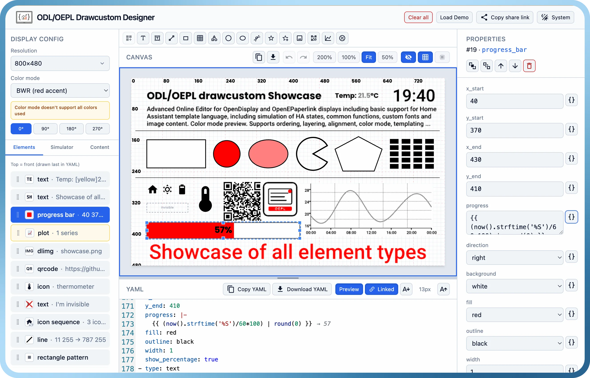

# ODL/OEPL Drawcustom Designer

**[Open the designer →](https://schlomo.github.io/odl-drawcustom-designer/)**

**Client-side only** — the app runs entirely in the browser. Designs, fonts, and images stay in local storage (IndexedDB). **Share links** embed the design in the URL hash (`#d=…`) — copied to clipboard, not uploaded anywhere.

Visual [feature-rich](#features) editor for **[OpenDisplay Language](https://opendisplay.org/protocol/open-display-language.html)** (ODL) and [OpenEPaperLink](https://github.com/openepaperlink/Home_Assistant_Integration/blob/main/docs/drawcustom/supported_types.md) (OEPL) drawcustom YAML. Paste exported element lists into Home Assistant’s **`drawcustom`** service (OpenEPaperLink or OpenDisplay custom integrations below).

Design layouts in the browser, preview them with realistic tag palettes and dithering, export HA-clean YAML or PNG, and share designs via URL. Simulate Home Assistant entity states for template preview. Add custom fonts and images to your designs.



## Home Assistant integrations (`drawcustom`)

These **custom components** (install via [HACS](https://www.hacs.xyz/)) expose a **`drawcustom`** action. Copy the designer’s YAML `payload` list into the service call.

| Integration | Service | Hardware | Install |
|-------------|---------|----------|---------|
| [**OpenEPaperLink**](https://github.com/OpenEPaperLink/Home_Assistant_Integration) | `open_epaper_link.drawcustom` | OpenEPaperLink AP and/or BLE tags ([firmware](https://github.com/OpenEPaperLink)) | [HACS: OpenEPaperLink](https://my.home-assistant.io/redirect/hacs_repository/?owner=OpenEpaperLink&repository=Home_Assistant_Integration) · [OEPL drawcustom docs](https://github.com/OpenEPaperLink/Home_Assistant_Integration/blob/main/docs/drawcustom/supported_types.md) |
| [**OpenDisplay**](https://github.com/OpenDisplay/Home_Assistant_Integration) | `opendisplay.drawcustom` | [OpenDisplay](https://github.com/OpenDisplay) boards/displays ([compatibility](https://opendisplay.org/firmware/seeed_display_compatibility.html)) | [HACS: OpenDisplay](https://my.home-assistant.io/redirect/hacs_repository/?owner=OpenDisplay&repository=Home_Assistant_Integration) · [OD drawcustom docs](https://github.com/OpenDisplay/Home_Assistant_Integration/blob/main/docs/drawcustom/supported_types.md) |

Example (OpenEPaperLink — target your display **device**, not entity):

```yaml
action: open_epaper_link.drawcustom
target:
  device_id: YOUR_DEVICE_ID
data:
  background: white
  payload:
    - type: text
      value: "Hello from the designer"
      x: 10
      y: 10
      size: 24
```

OpenDisplay uses the same payload shape with `action: opendisplay.drawcustom`.

> **Note:** The built-in [OpenDisplay core integration](https://www.home-assistant.io/integrations/opendisplay/) sends pre-rendered images via `upload_image` — it does **not** use `drawcustom`. Use the **custom** OpenDisplay integration above for YAML payloads.

## Specifications & upstream projects

| Resource | Description |
|----------|-------------|
| [OpenDisplay](https://github.com/OpenDisplay) | Open-source firmware and protocol standard for e-paper tags ([website](https://opendisplay.org/)) |
| [OpenDisplay Language (ODL)](https://opendisplay.org/protocol/open-display-language.html) | [OpenDisplay](https://github.com/OpenDisplay) spec — canonical draw payload YAML format |
| [OpenDisplay Basic Standard](https://opendisplay.org/protocol/basic-standard.html) | [OpenDisplay](https://github.com/OpenDisplay) spec — BLE/Wi‑Fi wire protocol (display announcement, image encoding); complementary to ODL |
| [OpenEPaperLink](https://github.com/OpenEPaperLink) | Open-source firmware and ecosystem for supported e-paper tags |
| [HA drawcustom — supported types](docs/spec/supported_types.md) | Vendored element reference (all 16 types) — [OpenEPaperLink upstream](https://github.com/OpenEPaperLink/Home_Assistant_Integration/blob/main/docs/drawcustom/supported_types.md) |
| [ODL gap report](docs/spec/odl-gap-report.md) | Parity audit: ODL vs vendored HA spec vs this editor |

## Features

### YAML engine & validation

- **All 16 draw element types** — `debug_grid`, `text`, `multiline`, `line`, `rectangle`, `rectangle_pattern`, `polygon`, `circle`, `ellipse`, `arc`, `icon`, `icon_sequence`, `dlimg`, `qrcode`, `plot`, `progress_bar`
- **Zod schema validation** with spec-aligned defaults and completions metadata
- **Parse / serialize round-trip** — templates and designer-only fields handled explicitly

### Visual canvas

- **Tag-faithful preview** — color modes BW, BWR, BWY, 4-color, 6-color scaffold, and RGB preview; palette clamping so named colors match what the tag can show
- **Direct manipulation** — select, drag, resize handles, keyboard nudge
- **Snap** — configurable grid snap plus edge snap to canvas bounds
- **Multi-select** — Shift+click, marquee rectangle, bulk move and nudge
- **Alignment** — align selection horizontally and vertically
- **Layer order** — bring to front, send to back, move up/down
- **Zoom** — 50%, 100%, 200%, and fit-to-panel
- **Rotation** — 0°, 90°, 180°, 270° (preview and export)
- **Designer overlays** — optional hints for hidden-on-tag elements (`visible: false`, shapes with fill or color set to `none`)
- **Dither preview** — toggle ordered dither (d=2) on the flat canvas

### YAML editor

- **CodeMirror 6** with YAML syntax and embedded **Jinja** highlighting
- **Delimiter scaffolding** — `{{ }}` and `` with HA-friendly autocomplete
- **Schema-driven completions** — element types, fields, icons, and template helpers
- **Inline diagnostics** — parse and validation errors with source ranges
- **Folded block scalars** for long single-line strings (e.g. templated multiline values)
- **Two-way coupling** — canvas edits update YAML; YAML edits update canvas and selection
- **Template preview mode** — resolve `{{ … }}` / `` on the canvas using **mock entity states** you set in the State Simulator (no live Home Assistant connection)

### Property panel

- **Schema-driven forms** for every element type, including nested plot fields
- **Universal templating** — any property can be a literal or a Jinja template string; JSON fields (`points`, `icons`, plot `data`) accept a whole-field template or structured JSON
- **Geometry lock** — drag, resize, and nudge disabled when coordinates are templated
- **Cross-cutting `visible`** on all 16 types (ODL-aligned)

### Home Assistant templates

- **State Simulator** — add mock entities and edit their state strings so template preview can resolve `states('…')`, `is_state`, and similar patterns
- **Global mock store** — persists in IndexedDB across sessions (not included in share links)
- **Nunjucks evaluator** — `states`, `is_state`, filters, and common HA patterns (see [ADR-004](docs/adr/ADR-004-template-evaluator-scope.md))
- **Entity scan** — discover entity IDs referenced in the payload

### Assets & content manager

- **Local content map** — fonts and images keyed by exact YAML path (`/local/…`, bundled fonts)
- **Upload & verify** — decode-check fonts and images before storing
- **IndexedDB persistence** — global asset store shared across designs
- **Bundled fonts** — includes `ppb.ttf` and `rbm.ttf` as default fonts for correct text rendering

### Display configuration

- **Resolution** — common tag WxH quick-picks plus custom width/height
- **Color mode** — drives accent / half_accent preview mapping
- **Rotation (0°–270°)** — maps to drawcustom **`rotate`** service option
- **Preview dither toggle** — flat vs ordered **d=2**; maps to drawcustom **`dither`** in session and share links
- **Session persistence** — display settings restored with last design

### Session, demo & sharing

- **Auto-save** — last design, undo history, and mocks restored on reload
- **Load Demo** — one-click showcase bundle in [`src/assets/showcase/`](src/assets/showcase/): `showcase.yml` (payload), `showcase.json` (canvas + State Simulator seed), `showcase.png` (bundled dlimg)
- **Share link** — `#d=eJ…<data>` URL fragment encodes name, canvas, service options (when set), and elements (pako-deflated, base64url; assets/mocks stay local)
- **Undo / redo** — 50-step history with drag coalescing

### Export

- **PNG** — copy to clipboard or download (respects rotation and color mode)
- **YAML** — copy or download HA-ready payload from the toolbar

### Home Assistant preview parity

The designer aims for a **close** match to what OEPL/OpenDisplay HA integrations render via Pillow `imagegen`, but it is **not pixel-identical** today.

| Area | Typical match | Known gaps |
|------|----------------|------------|
| **Layout** (anchors, positions) | Good for text when using bundled/custom fonts | Small (1–2 px) possible; templated values need mock states |
| **Tag palette & dither** | Color modes and `finalizeTagImageData` clamp to tag colours | Wrong-accent colours clamp to grey on BWR/BWY |
| **Text glyphs** | Readable; hard-edge filter approximates Pillow `fontmode = "1"` | Glyph edges differ (opentype.js vs Pillow/FreeType) |
| **SVG shapes & lines** | Rectangles, icons generally usable | Thin **lines** on coloured backgrounds may export as **grey** instead of black; SVG antialiasing vs Pillow integer pixels ([ADR-007](docs/adr/ADR-007-hybrid-rendering.md)) |
| **Templates** | Mock entity states in the State Simulator | Live HA evaluation can differ |
| **Assets** | Local fonts/images by YAML path | Share links do not include uploaded blobs |

Use preview and PNG export to **sanity-check** layouts before deploying to a tag; compare against a real HA render when exact appearance matters. Details: [ADR-007](docs/adr/ADR-007-hybrid-rendering.md) · [gap report](docs/spec/odl-gap-report.md).

### Preview rendering fidelity

- **OpenType** — measured text and multiline layout with ink-bound anchors and font metrics
- **MDI icons** — `@mdi/js` paths with autocomplete
- **QR codes** — live module preview
- **Plots** — axes, legends, and series from YAML `data`
- **`parse_colors`** — inline color segments in text/multiline
- **Images** — `dlimg` with local asset resolution

## Not in v1

- Embedded Home Assistant panel (load/save automation block in iframe)
- Binary OpenDisplay wire-format export
- Element copy/paste, free canvas pan, continuous zoom beyond fixed steps
- On-canvas polygon vertex editing
- Using Canvas instead of SVG for rendering for better HA visual matching

See `docs/adr/` for rationale (especially ADR-010, ADR-012).

## Embedding

The designer also ships as an **embeddable component**: a single self-contained ESM file (React and styles included) exposing `mount(container, options)`. The host application — e.g. the OpenDisplay Home Assistant integration panel — mounts the designer into a container, pushes entity states and display capabilities, and receives the drawcustom YAML payload via `onSaveRequest` when the user hits Save. Full mount API and host data contract: [`docs/embedding.md`](docs/embedding.md).

**[Live embed demo →](https://schlomo.github.io/odl-drawcustom-designer/embed/)** — a fake host page that mounts the designer, pushes warm/cold entity states and a 296×128 BWR display description, switches themes, and shows every saved payload.

Run the same demo locally:

```bash
npm run build:site && npm run preview
# open the printed URL; the demo is at /embed/ (same path as production)
```

No dedicated server needed beyond that: the demo is plain static files, so any
static file server works too (e.g. `python3 -m http.server -d dist-lib`).

## Development

Requires **Node.js ^26** (see `.nvmrc`).

**AI assistants:** read [`AGENTS.md`](AGENTS.md) before changing code (TDD, ADRs, HA parity). Also: [`CLAUDE.md`](CLAUDE.md) · [`.github/copilot-instructions.md`](.github/copilot-instructions.md).

```bash
npm install
npm run lint
npm test
npm run dev
npm run build
```

**Deployment, GitHub Pages, and build-time environment variables** (base path, legal header HTML, git metadata): [`docs/DEPLOYMENT.md`](docs/DEPLOYMENT.md).

**Embedding the designer in a host application** (mount API, host data contract, library build, demo host page): [`docs/embedding.md`](docs/embedding.md).

## Architecture

- `src/core/` — pure TypeScript (YAML, schema, renderer, templates); **no React** imports
- `src/core/brand.ts` — product slug, titles, IndexedDB name, storage key prefix
- `src/ui/` — React 19 application shell
- `src/ui/data/showcase.ts` — loads the built-in demo bundle (`src/assets/showcase/`)
- `src/storage/` — Dexie IndexedDB (assets, mocks, variables, session)
- `src/embed/` — embeddable `mount()` API + host data contract ([`docs/embedding.md`](docs/embedding.md))
- `src/assets/showcase/` — **demo bundle**: `showcase.yml` (payload), `showcase.json` (canvas + simulator seed), `showcase.png` (bundled image)
- `docs/adr/` — architecture decision records

Start with [ADR-001](docs/adr/ADR-001-core-ui-separation.md) (core/UI boundary), [ADR-007](docs/adr/ADR-007-hybrid-rendering.md) (HA preview parity), [ADR-015](docs/adr/ADR-015-showcase-demo-bundle.md) (file-based demo), and [ADR-006](docs/adr/ADR-006-ui-framework-react.md) (React shell).

## License

**ODL/OEPL Drawcustom Designer** is licensed under the **[Apache License 2.0](LICENSE)**.

Copyright © 2026 Schlomo Schapiro

Third-party and upstream attributions: [`NOTICE`](NOTICE) · [`docs/THIRD_PARTY.md`](docs/THIRD_PARTY.md) · [`docs/spec/ATTRIBUTION.md`](docs/spec/ATTRIBUTION.md)

This project is **not** affiliated with OpenEPaperLink, OpenDisplay, or Home Assistant. Upstream firmware and integrations may use **different licenses** (see third-party docs).

## 💖 Sponsorship & Credits

* **Initial Development**: Sponsored by [Tektit Consulting](https://tkt.dev/schlomo) (via [Schlomo](https://github.com/schlomo)).
