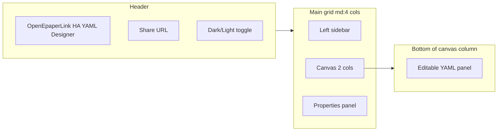
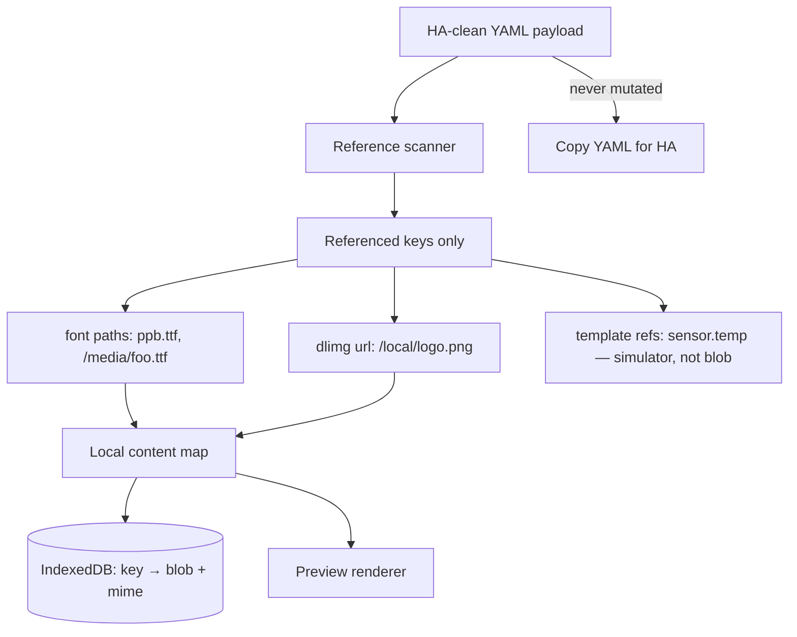
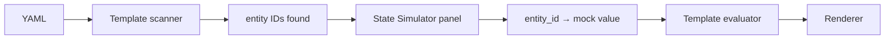
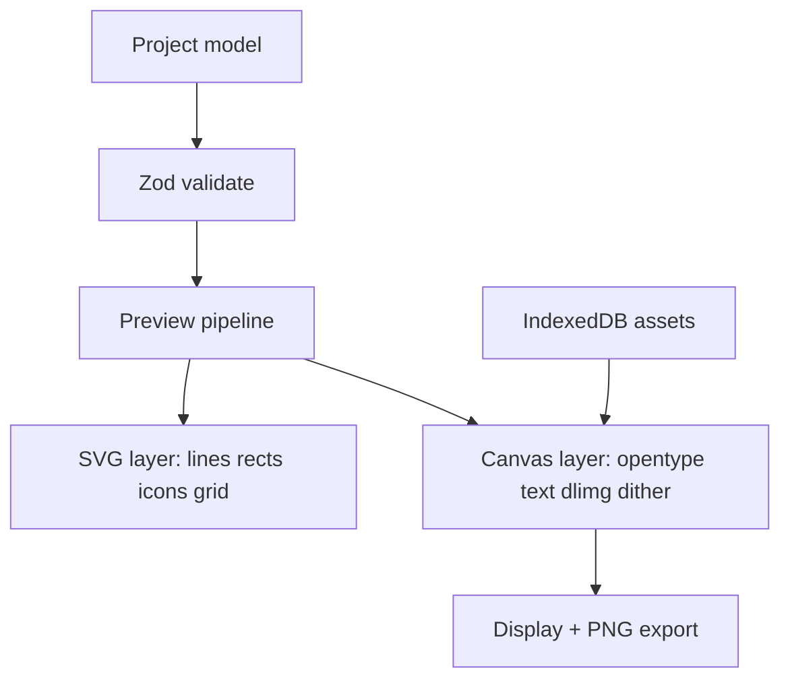
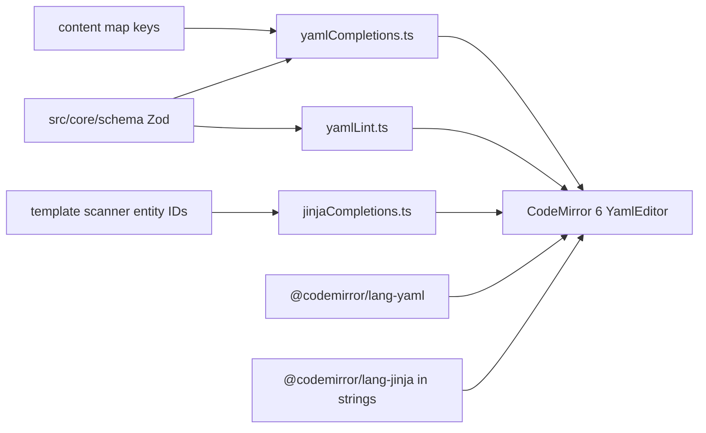
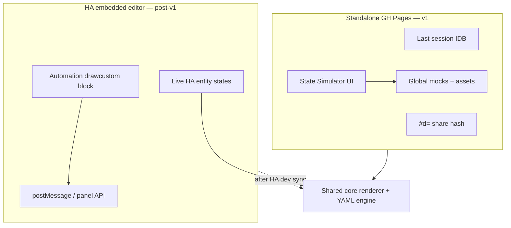
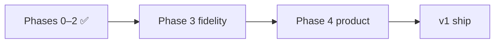
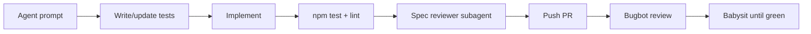

# OEPL YAML Designer — Feature Map & Build Plan

## 1. Existing reference designer analysis

Source available: minified production bundle only at `[esp32-sks-bus-doorphone/atc/oepl_yaml_designer/](esp32-sks-bus-doorphone/atc/oepl_yaml_designer/)` (React 19 + Vite build, Tailwind CDN, Pako). No TypeScript sources to publish.

### UI layout & look




| Zone              | Contents                                                                                                                                         |
| ----------------- | ------------------------------------------------------------------------------------------------------------------------------------------------ |
| **Header**        | App title, **Load Demo**, Share (copies URL), dark/light mode                                                                                    |
| **Left sidebar**  | Add Element grid (16 types), **resolution** + **color mode** dropdowns (not inch-based tag presets), rotation 0/90/180/270 — **no Load Example block** |
| **Center canvas** | E-paper preview; **top bar**: zoom 200/100/Fit/50, PNG copy/download, Clear All, Snap On/Off, coords overlay                                   |
| **Right panel**   | Context form for selected element; Delete + Bring to Front                                                                                       |
| **Bottom panel**  | Live YAML editor, Copy YAML, Parse YAML and load to canvas                                                                                       |


**Visual style:** Slate/blue Tailwind palette, card panels with shadows, compact controls, dark mode via `class` strategy. Accent preview color mapped to magenta (`#FF00FF`) — not realistic red/yellow tag simulation.

### Implemented draw types (all 16 from spec)


| Type                | Canvas preview                               | Property editor                                                         | YAML round-trip                                                                      |
| ------------------- | -------------------------------------------- | ----------------------------------------------------------------------- | ------------------------------------------------------------------------------------ |
| `text`              | Approx bounding box + SVG `<text>`           | Full (anchor, font, stroke, parse_colors, max_width, truncate, visible) | Yes                                                                                  |
| `multiline`         | Line stack                                   | delimiter, offset_y, spacing                                            | Yes                                                                                  |
| `line`              | Line + endpoint handles                      | dashed, dash/space length                                               | Yes                                                                                  |
| `rectangle`         | Rect + resize handles                        | fill, outline, radius, corners                                          | Yes                                                                                  |
| `rectangle_pattern` | Grid of rects                                | x/y size, offset, repeat counts                                         | Yes                                                                                  |
| `polygon`           | Polygon + point count editor                 | points JSON array                                                       | Yes                                                                                  |
| `circle`            | Circle                                       | radius, fill, outline                                                   | Yes                                                                                  |
| `ellipse`           | Ellipse bbox                                 | fill, outline                                                           | Yes                                                                                  |
| `arc`               | Arc / pie slice                              | start/end angle, fill vs outline                                        | Yes                                                                                  |
| `icon`              | Embedded MDI SVG paths (subset)              | value, anchor, fill                                                     | Yes                                                                                  |
| `icon_sequence`     | Icon row/col                                 | direction, spacing, icons list                                          | Yes                                                                                  |
| `dlimg`             | Placeholder rect or clipboard preview        | url, xsize/ysize, resize_method, rotate                                 | Yes (used broken `preview_data_url` YAML comment — **stripped by HA on round-trip**) |
| `qrcode`            | **Fixed decorative pattern** (not scannable) | data, boxsize, border, module_count                                     | Yes                                                                                  |
| `plot`              | **Mock** axes/legends + sine-like line       | Full nested ylegend/yaxis/xlegend/xaxis/data JSON                       | Yes                                                                                  |
| `progress_bar`      | Bar + optional % text                        | direction, background, show_percentage                                  | Yes                                                                                  |
| `debug_grid`        | Grid overlay                                 | spacing, labels, dashed                                                 | Yes                                                                                  |


### Canvas interaction features

- Click to select; drag to move; 8-handle resize for bbox elements; line endpoint handles
- Snap to configurable grid (default ~10px, persisted in `localStorage`)
- Keyboard: Delete, Ctrl/Cmd+C/V copy/paste (offset +10px), arrow-key nudge
- Bring to front (no send-to-back, no layer list)
- Template values (`{{ ... }}`) shown as `[TPL]` / `URL [TPL]`; excluded from drag math
- Percentage coords (`"50%"`) parsed/stored but not draggable when templated

### YAML engine

- Custom line parser (not full YAML lib): handles HA-style blocks, plot nested objects, icon lists, comments preserved per-element (`_yaml_comments`)
- Bidirectional sync: visual edits → auto YAML; manual YAML → explicit Import
- Serializes plot sub-objects as JSON or indented blocks; quotes strings with special chars

### Share & persistence (existing)


| Feature           | Behavior                                                                                                                                  |
| ----------------- | ----------------------------------------------------------------------------------------------------------------------------------------- |
| **Share link**    | `?design=<pako-deflate + base64>` — **payload array only** (no canvas size, name, or assets)                                              |
| **localStorage**  | Dark mode, display width (default 384), height (default 184), snapping                                                                    |
| **dlimg preview** | Clipboard paste → `preview_data_url` on element; exported as YAML comment — **does not survive HA round-trip** (HA strips unknown fields) |
| **Templates**     | Shows `[TPL]` placeholder only — no mock entity values                                                                                    |
| **No**            | Project name, edit history, font/image library, hash routing, service options                                                             |


### Known gaps vs [supported_types.md](https://github.com/OpenEPaperLink/Home_Assistant_Integration/blob/main/docs/drawcustom/supported_types.md)


| Spec feature                                                        | Existing tool                                     |
| ------------------------------------------------------------------- | ------------------------------------------------- |
| Service options: `background`, `rotate`, `dither`, `ttl`, `dry-run` | Schema ✅; UI **post-v1 (4g)** — edit in YAML for now |
| Halftone / dithered color preview                                   | Flat RGB approximations only                      |
| Hex colors (`#RGB`, `#RRGGBB`)                                      | Parsed; limited UI                                |
| `parse_colors` inline markup                                        | ✅ Rendered on text/multiline (**3e**)            |
| Text wrap / truncate / multiline `\n`                               | Not visually accurate                             |
| Real TTF fonts (`ppb.ttf`, custom paths)                            | CSS `fontFamily` string only — **no TTF loading** |
| `dlimg` from URL / HA paths / camera entities                       | Placeholder only (except clipboard preview)       |
| YAML / Jinja syntax highlighting + autocomplete                     | Plain textarea — no highlighting or completions   |
| Plot with real/sample history data                                  | Mock curve only                                   |
| QR codes                                                            | Placeholder bitmap                                |
| Plot `span_gaps`, `smooth`, `line_style`, `show_points`, etc.       | Stored in YAML; minimal preview                   |


---

## 2. Your requirements (new tool)

### Local content map (replaces YAML-comment preview hack)

**Why not embed preview data in YAML:** A prior closed-source designer stored clipboard images as `preview_data_url` and exported them as YAML comments. That fails in practice because Home Assistant strips anything it does not recognize when you paste YAML into automations/scripts — the preview is lost on the HA → designer round-trip.

**New approach — designer-only local content store:**




**Rules:**

- YAML exported for HA contains **only** valid drawcustom fields — no designer metadata, no comments for assets.
- Local map key = **exact string** from YAML (`/local/img1.png`, `ppb.ttf`, `https://example.com/x.png`).
- User uploads a file → bound to that key; renderer resolves `dlimg.url` / `font` through the map at preview time.
- Upload UI lives in **Content Manager**: lists all referenced keys, status (resolved / missing / bundled default), upload/replace/clear per key.
- Optional: import/export **asset bundle** (zip + manifest) to move substitutions between machines — separate from share link.
- Clipboard paste in Content Manager assigns blob to selected key (same UX as old tool, but storage is global per key, not per-element).

**Bundled defaults:** Ship `ppb.ttf` + `rbm.ttf` (verify license) under `public/fonts/`; map treats these keys as resolved without upload.

**Storage split (revised §7.2):** IndexedDB — global `assets`, global `mocks`, single `session` row (last design). `localStorage` — UI prefs only. No multi-project library.

### HA state simulator (template preview)

Problem: Old tool shows `[TPL]` for any `{{ ... }}` — useless for designing real dashboards.

**Design:**




- **Scan** payload for Jinja patterns: `states('sensor.x')`, `is_state('binary_sensor.door', 'on')`, `states('sensor.battery')|float`, color tags with embedded templates, etc.
- **State Simulator panel** (alongside Content Manager): table of discovered entities + editable mock values (string/number/bool); add manual entries for entities not yet referenced.
- **Evaluate** templates client-side with a **restricted, testable** evaluator (not full Jinja2 — implement the subset HA actually uses in drawcustom examples: `states`, `is_state`, `float` filter, simple `if/else`).
- Mock values persist **globally** in IndexedDB (one shared map for the HA instance — same entities across all layouts). **Excluded** from share hash; embedded HA mode uses live states instead (§7.2).
- Preview re-renders live when mock values change.
- TDD: fixture YAML files with templates + expected evaluated strings.

**Priority patterns to support (from spec):**

- `{{ states('sensor.temperature') }}`
- `{{ 'red' if is_state('binary_sensor.door', 'on') else 'black' }}`
- `{{ states('sensor.battery')|float < 20 }}` (conditionals in icon colors)
- `parse_colors` blocks with template-driven color names

### YAML + Jinja editor (syntax highlighting & autocomplete)

The bottom YAML panel is a primary editing surface — not a plain textarea. Match (and exceed) what HA Developer Tools → Template offers for editing experience.

**Stack (same family as [home-assistant/frontend](https://github.com/home-assistant/frontend)):**


| Package                                    | Role                                                     |
| ------------------------------------------ | -------------------------------------------------------- |
| **CodeMirror 6** (`EditorView` direct mount) | YAML panel — stable extensions, no `@uiw/react-codemirror` re-init churn |
| `@codemirror/lang-yaml`                    | YAML syntax highlighting                                 |
| `@codemirror/lang-jinja`                   | Jinja highlighting inside quoted YAML string values (mixed parser via `parseMixed`) |
| `@codemirror/autocomplete`                 | Completion provider API + custom Jinja delimiter scaffolding |
| `@codemirror/lint`                         | Inline diagnostics from Zod validate + yaml parse errors |


**Highlighting:**

- Full payload document: list of draw elements + service options block
- **Nested Jinja mode** inside double-quoted YAML strings (where `{{ … }}` and `` appear) — same approach HA uses for template fields
- Dark/light theme aligned with app chrome (One Dark / custom slate theme)

**Autocomplete sources (schema-driven from `src/core/schema/` + live project context):**


| Context                   | Suggestions                                                                                                         |
| ------------------------- | ------------------------------------------------------------------------------------------------------------------- |
| Top-level / list item     | `type:` values — all 16 draw types                                                                                  |
| After `type: text` (etc.) | Property keys valid for that element type                                                                           |
| Enum fields               | `color`, `fill`, `outline`, `background` — spec color aliases; `font` — bundled + content-map keys                  |
| `icon` / `icon_sequence`  | MDI icon name search (`@mdi/js` metadata)                                                                           |
| Lone `{` in a YAML value  | Delimiter choice: `{{` (expression) or `{%` (statement) — both scaffold their closing tags |
| Inside `{{ … }}`          | HA expression helpers: `states`, `is_state`, `state_attr`; filters: `float`, `int` |
| Inside ``          | Statement tags: `set`, `if`, `elif`, `else`, `endif`, `for`, `endfor` |
| Entity IDs in templates   | Entity IDs from template scanner + State Simulator mock list (when wired) |
| Service options           | `background`, `rotate`, `dither`, `ttl`, `dry-run` keys and allowed values (when modeled) |


**Lint / validation in editor:**

- Red squiggles on Zod schema violations (unknown keys, wrong types)
- Warn (not block) on missing content-map assets referenced in YAML
- Preserve template strings verbatim — autocomplete inserts must not corrupt `{{ … }}` / ``
- Unrecognized keys: squiggle on the **key**, not the value

**Jinja delimiter scaffolding (ADR-009 — validated in user testing, do not regress):**

CodeMirror’s default `{`/`}` auto-close fights Jinja. Implemented rules:

| User action | Editor result | Cursor |
|-------------|---------------|--------|
| `{` then `{` (or pick `{{`) | `{{ }}` | inside expression |
| `{` then `%` (or pick `{%`) | `` | after `{%` |
| Pick expression inside `{{ }}` | e.g. `{{ states('') }}` | inner snippets omit `}}` |
| Pick tag inside `` | e.g. `` | inner snippets omit `%}`; one leading space after `{%` |

Implementation notes:

- `closeBrackets` from basicSetup is **off** for `{`; `()`, `[]`, `'` and `"` still auto-close (`jinjaBracketHandling.ts`).
- Opening delimiters always insert the closing pair; inner completions never repeat closers.
- Expression apply pads when replacing the scaffold placeholder space so both `{{ …` and `… }}` keep single spaces.
- Autocomplete + lint tooltips use `document.body` fixed positioning; **no** global `scrollMargins` (first-line tooltips broke when margins inset the anchor).

**Bidirectional sync:** visual edits update YAML; manual YAML edits require explicit **Import** (or debounced auto-import toggle) — editor stays source of truth until user confirms parse. **Implemented:** linked YAML↔canvas coupling with optional toggle; element click scrolls/highlights YAML line.

### Share via hash (without external content)

- URL format: `https://<user>.github.io/oepl-designer/#d=<compressed>`
- Payload (JSON before compression):

```json
{
  "v": 1,
  "name": "Doorphone status",
  "canvas": { "width": 296, "height": 128, "rotation": 0, "colorMode": "bwr" },
  "service": { "background": "white", "rotate": 0, "dither": 2 },
  "elements": [ /* drawcustom payload */ ]
}
```

- Use **pako deflate** + base64url (same proven approach as existing tool, moved to hash per your preference).
- On load: restore project metadata + elements; **re-bind** assets from local IndexedDB by path — shared links work across machines but previews need re-upload of same paths.
- Show banner listing missing assets after import.

### Session persistence (replaces 20-project history)

- **One** auto-saved session in IndexedDB (`session` store): name, canvas, service options, elements, `updatedAt`.
- On app load: restore last session if present; otherwise blank or hash `#d=…` if in URL.
- **Primary portability:** Copy/download YAML, hash share link, HA automation embed — not a built-in project browser.
- Optional editable project name in header (cosmetic label for export filename / share payload only).

---

## 3. Suggested additional features

Prioritized for a “really nice” designer:

**High value**

1. **Color mode dropdown** — BW / BWR / BWY / 6-color (scaffold); maps `accent`/`half_accent` correctly (replaces separate accent toggle + inch presets).
2. **Dither preview modes** — ordered (d=2) and optional Floyd-Steinberg (d=1) on export/preview toggle so halftone colors look like the tag.
3. ~~**Service options panel**~~ — **post-v1** (§18g); same HA-integration alignment as embed — schema exists, UI deferred.
4. **Undo/redo** — 50-step stack for element + property + multi-select batch edits.
5. **Multi-select** — marquee/drag select, bulk move, raise/lower, align H/V (replaces separate layer-panel scope for v1).
6. ~~Template playground~~ → **HA State Simulator** (see §2) — first-class panel, not optional polish.
7. **Real QR rendering** — `qrcode` npm package.
8. ~~Plot sample data editor~~ — **deferred**; synthetic preview in renderer (3d) + YAML `data` field is enough.
9. `**parse_colors` renderer** — parse `[red]text[/red]` in preview.
10. **PNG export** — canvas toolbar: copy to clipboard + download PNG (dithered when §17e pipeline ready).
11. **YAML toolbar** — copy + download `.yaml` alongside existing editor.
12. **YAML + Jinja CodeMirror editor** — syntax highlighting, schema autocomplete, inline lint (see §2).

**Medium value**
13. Snap to canvas outer edges when snap on (bottom/right edge priority over grid).
14. Alignment tools for multi-selection (left/center/right, top/middle/bottom).
15. Schema-driven property forms with inline docs linking to spec anchors.
16. ~~**HA embed mode**~~ — **post-v1** (§18f); discuss contract with HA devs before implementation (ADR-010 draft).

**Cut or deferred (simplify v1)** — see §7.2 simplifications table.

17. ~~20-project LRU history~~ → last session only.
18. ~~Asset bundle zip~~, ~~PWA shell~~, ~~YAML validation summary panel~~, ~~side-by-side history diff~~ — post-v1.
19. ~~Element Ctrl+C/V copy/paste~~, ~~canvas pan/zoom~~ — post-v1 (19-10, 19-11).
20. ~~Layer panel hide/lock/duplicate~~ — defer; multi-select + raise/lower covers v1 editing.
21. ~~Plot CSV sample editor~~ — synthetic preview in renderer is enough.
22. ~~HA snippet generator~~ — superseded by HA embed load/save when feasible.

---

## 4. UI framework trade-offs (React vs simpler)

This app has two very different layers:


| Layer                                                                | Complexity                           | Framework needed?                                  |
| -------------------------------------------------------------------- | ------------------------------------ | -------------------------------------------------- |
| **Core** (yaml, schema, renderer, dither, templates, asset resolver) | High — must be correct               | **No** — pure TypeScript, TDD with Vitest          |
| **Shell** (panels, forms, canvas chrome, drag/select)                | Medium-high — lots of interactive UI | Yes, unless you accept significant manual DOM work |


The sustainable split: **~70% of the value lives in framework-agnostic core modules**. UI choice mainly affects developer ergonomics and bundle size, not whether the designer works.

### Option A: React (+ Vite + TypeScript)


| Pros                                                                     | Cons                                                                |
| ------------------------------------------------------------------------ | ------------------------------------------------------------------- |
| Richest ecosystem for complex editors (CodeMirror bindings, dnd, forms)  | Largest runtime (~40–50 KB gzip react+react-dom)                    |
| `@testing-library/react` for component tests                             | More boilerplate (hooks, context, memo)                             |
| Same patterns as the reference designer — easy to compare feature parity | Easy to accidentally put logic in components (fight with TDD goals) |
| Huge hiring/docs surface                                                 | Slower initial render on low-end mobile                             |


**Best when:** you want fastest path to a polished multi-panel editor and may extend UI often.

### Option B: Preact (+ Vite + TypeScript)


| Pros                                                  | Cons                                              |
| ----------------------------------------------------- | ------------------------------------------------- |
| React-compatible API, **~4 KB** runtime               | Slightly fewer libraries target Preact explicitly |
| Can use `preact/compat` if a React-only dep is needed | Same component-model complexity as React          |
| Same Testing Library patterns                         | Niche — fewer Stack Overflow answers              |


**Best when:** you want React ergonomics with smaller GH Pages payload.

### Option C: Vanilla TypeScript (+ Vite, no UI framework)


| Pros                                                   | Cons                                                                 |
| ------------------------------------------------------ | -------------------------------------------------------------------- |
| Smallest bundle — only your code + Tailwind            | **Property panel, layer list, content manager = lots of manual DOM** |
| No virtual DOM abstraction — direct canvas integration | Undo/redo + form binding becomes custom infrastructure               |
| Forces core/UI separation (good for TDD)               | Harder to keep UI consistent as features grow                        |
| No framework upgrade churn                             | Reinventing patterns (state subscriptions, keyed lists)              |


**Best when:** bundle size is paramount and you accept slower UI feature velocity.

### Option D: Svelte (+ Vite)


| Pros                                        | Cons                                       |
| ------------------------------------------- | ------------------------------------------ |
| Less boilerplate than React for forms/lists | Different paradigm — not React-compatible  |
| Small runtime, compile-time reactivity      | Canvas/editor ecosystem smaller than React |
| Nice scoped CSS                             | Team familiarity variable                  |


**Best when:** you like Svelte and want lean components without React's weight.

### Recommendation for AI-based development (locked)

**Use React 19 + Vite + TypeScript** for the UI shell. You won't be coding yourself — the agent will — and that changes the calculus:


| Factor                       | Why React wins for AI development                                                                                                                         |
| ---------------------------- | --------------------------------------------------------------------------------------------------------------------------------------------------------- |
| **Training data**            | React is the most common UI framework in public code; agents produce correct components, hooks, and patterns far more reliably than Preact/Svelte/vanilla |
| **Library compatibility**    | CodeMirror, Testing Library, dnd-kit, Radix/shadcn patterns — all React-first; fewer compat hacks                                                         |
| **Reference implementation** | The reference designer is React — agent can diff behavior against a known working UI                                                                      |
| **Debugging**                | When something breaks, error messages and Stack Overflow coverage help the agent fix it faster                                                            |
| **Consistency**              | Schema-driven forms, property panels, modals — repetitive UI patterns React handles with predictable structure the agent can replicate                    |


**What does *not* change:** the **core layer stays pure TypeScript** (no React imports). That is where TDD matters most and where AI also works well (isolated functions, golden tests). The agent builds core first, then wires React components as thin adapters.

**Why not the alternatives for your case:**

- **Preact** — agent sometimes emits React-only APIs (`StrictMode`, specific hook deps); small savings (~40 KB) not worth friction for a desktop designer tool
- **Vanilla TS** — agent must hand-write hundreds of DOM update paths; high bug rate, inconsistent patterns across panels, slower iteration when you ask for new features
- **Svelte** — less training data; agent more likely to hallucinate syntax or mix React patterns

**Bundle size:** irrelevant for this use case. Target users open a designer in a desktop browser; 45 KB gzip React is fine on GH Pages.

**Guardrail for AI quality:** enforce `src/core/` has zero React imports (ESLint rule or path alias boundary). UI components only call core via typed functions. This keeps the "AI writes UI quickly, AI tests core rigorously" split clean.

**Phase 0 spike:** reduced to a **half-day sanity check** (one canvas interaction + one property form in React) — not a framework bake-off. Proceed unless it reveals a blocker.

**Decision recorded as ADR-006:** React for UI shell; core remains framework-agnostic.

---

## 5. Development approach: TDD + architecture docs

### TDD workflow

```
Red → Green → Refactor
```

**Test layers (CI must pass all before deploy):**


| Layer                        | Tool                 | What to test                                          |
| ---------------------------- | -------------------- | ----------------------------------------------------- |
| YAML parse/serialize         | Vitest               | Golden files from spec; round-trip equality           |
| Schema validation            | Vitest               | Invalid payloads rejected with clear errors           |
| Schema completion metadata   | Vitest               | All 16 types + enums exported for editor autocomplete |
| Template scanner + evaluator | Vitest               | `states`, `is_state`, conditionals, filters           |
| Content map resolver         | Vitest               | Key lookup, missing asset, bundled fallback           |
| Color/dither pipeline        | Vitest               | Pixel samples or checksums for known inputs           |
| Renderer                     | Vitest + canvas mock | Each element type against fixture PNG hash (optional) |
| UI smoke                     | Playwright           | Load app, add element, edit property, copy YAML       |


**Rule:** No feature merges without tests in the **core** layer first; UI tests follow for wiring.

### Architecture Decision Records (ADRs)

Maintain `docs/adr/` in repo (for future-you and contributors):


| ADR     | Topic                                                                             |
| ------- | --------------------------------------------------------------------------------- |
| ADR-001 | Core/UI separation — pure TS modules, no framework in renderer                    |
| ADR-002 | Local content map vs YAML-embedded preview (reject HA comments)                   |
| ADR-003 | IndexedDB schema (global assets, mocks, session) — revised §18a                  |
| ADR-010 | HA embed mode (standalone vs panel, load/save drawcustom)                         |
| ADR-011 | Behavior-test policy — core spec outcomes, UI user-visible wiring (§17g ✅) |
| ADR-004 | Template evaluator scope (subset of Jinja, not full engine)                       |
| ADR-005 | Share hash format and excluded data                                               |
| ADR-012 | OpenDisplay Language alignment + cross-cutting element fields (§18j)              |
| ADR-006 | UI framework: **React** for shell (AI-maintainability); core stays framework-free |
| ADR-007 | Hybrid SVG + Canvas rendering                                                     |
| ADR-008 | TDD policy and CI gates                                                           |
| ADR-009 | YamlEditor: CodeMirror 6 mount, Jinja delimiter scaffolding, tooltip/bracket UX |


Each ADR: context, decision, consequences, alternatives considered.

---

## 6. Recommended tooling & repo setup

New repo/directory: `**oepl-designer/`** at workspace root (greenfield — directory does not exist yet).


| Layer       | Choice                                                                                                                                        | Rationale                                                                                                                                         |
| ----------- | --------------------------------------------------------------------------------------------------------------------------------------------- | ------------------------------------------------------------------------------------------------------------------------------------------------- |
| Framework   | **React 19 + Vite + TypeScript**                                                                                                              | Best AI codegen reliability; matches reference designer patterns; see §4                                                                          |
| Styling     | **Tailwind CSS v4** (build-time)                                                                                                              | Match existing look; no CDN dependency in prod                                                                                                    |
| State       | **Zustand** + immer                                                                                                                           | Project, selection, history, UI prefs; simple API for AI to extend                                                                                |
| YAML        | **yaml** (eemeli)                                                                                                                             | Robust parse/stringify; comment preservation strategy documented                                                                                  |
| Schema      | **Zod** types generated from spec                                                                                                             | Single source of truth for forms + validation                                                                                                     |
| Fonts       | **opentype.js**                                                                                                                               | Load TTF from IndexedDB; metrics for anchor/wrap                                                                                                  |
| Canvas      | **Hybrid SVG + Canvas**                                                                                                                       | SVG shapes/icons; Canvas for text, images, dither compositing                                                                                     |
| Icons       | **@mdi/js**                                                                                                                                   | Full MDI library, tree-shaken                                                                                                                     |
| QR          | **qrcode**                                                                                                                                    | Real scannable codes                                                                                                                              |
| Compression | **pako**                                                                                                                                      | Share hash (proven)                                                                                                                               |
| Asset DB    | **Dexie** (IndexedDB)                                                                                                                         | Fonts/images; history snapshots                                                                                                                   |
| Editor      | **CodeMirror 6** (`@uiw/react-codemirror`, `@codemirror/lang-yaml`, `@codemirror/lang-jinja`, `@codemirror/autocomplete`, `@codemirror/lint`) | YAML panel: syntax highlight, embedded Jinja in strings, schema + HA template autocomplete, inline diagnostics — mirrors HA frontend editor stack |
| Tests       | **Vitest** (TDD, core-first) + **Playwright**                                                                                                 | Golden YAML fixtures; CI gate before deploy                                                                                                       |
| CI/CD       | **GitHub Actions** → `gh-pages`                                                                                                               | `peaceiris/actions-gh-pages` or native GHA pages deploy                                                                                           |


### Key files to create

```
oepl-designer/
  .github/workflows/deploy.yml   # npm test && npm run build
  docs/adr/                      # architecture decision records
  package.json
  vite.config.ts                 # base: '/oepl-designer/'
  src/
    core/                        # NO UI imports — TDD first
      schema/elements.ts
      yaml/{parse,serialize,validate}.ts
      templates/{scan,evaluate}.ts
      assets/{scanner,resolver}.ts
      renderer/{canvas,colors,dither,text,shapes,...}.ts
    storage/{db,history,preferences}.ts
    ui/                          # React shell only — thin adapters over core
      App.tsx
      components/{Canvas,PropertyPanel,YamlPanel,ContentManager,StateSimulator,...}
    ui/editor/                   # CodeMirror setup (UI only — completion data from core/schema)
      YamlEditor.tsx             # EditorView mount, external value sync, theme/fontSize
      yamlEditorExtensions.ts    # extension bundle + keymaps
      yamlEditorSetup.ts         # basicSetup options (autocomplete/closeBrackets off — custom)
      yamlLanguage.ts            # lang-yaml + jinja mixed parser in string literals
      yamlCompletions.ts         # schema-driven property/type completions
      yamlCompletionSource.ts    # override providers, insert-from for type:/enum lines
      jinjaCompletions.ts        # delimiter + expression + tag completions
      jinjaBracketHandling.ts    # Jinja-aware delimiter scaffolding; ()/[] close only
      jinjaContext.ts            # inside-template / lone-{ / value-context detection
      yamlLint.ts                # Zod validate → @codemirror/lint
      yamlIssueRanges.ts         # key vs value squiggle ranges for Zod issues
      yamlTheme.ts               # slate theme, tooltip parent
      locateElementInYaml.ts     # canvas selection → YAML line
      yamlElementsSync.ts        # linked mode element list sync
  tests/
    core/                        # golden YAML, template eval, renderer
    fixtures/                    # spec examples from supported_types.md
    e2e/                         # Playwright
  public/fonts/
```

### GitHub Pages setup

1. Repo `oepl-designer` on GitHub; enable Pages from Actions.
2. `vite.config.ts`: `base: process.env.GITHUB_ACTIONS ? '/oepl-designer/' : '/'` for local dev.
3. Workflow: `npm ci` → `npm test` (must pass) → `npm run build` → deploy `dist/`.
4. README: link to live demo, spec reference, asset substitution workflow.

### Rendering architecture (sustainable)




- Keep **rendering logic pure** (no React in renderer) → testable against golden YAML fixtures from spec examples.
- Property UI **generated from schema** → adding a new spec field is one schema edit, not N form edits; same schema feeds YAML autocomplete.

### CodeMirror editor architecture




- **Phase 1 dependency:** autocomplete and lint require Zod schemas + validate — implement completion provider interface in core (`src/core/schema/completions.ts`) as pure data; UI wires it into CodeMirror.
- **Phase 2 deliverable:** replace placeholder YAML textarea with full `YamlEditor` component.

---

## 7. Implementation phases

### Progress tracker (updated 2026-06-06)

| Phase | Status | Commit | Tests | Notes |
|-------|--------|--------|-------|-------|
| **0** Bootstrap | ✅ Done | `133e960` | — | ADRs, rules, agents, spec vendored |
| **1a** YAML + schema | ✅ Done | `8f6cc3d` | 33 | 16 Zod types, fixtures, completions, HA-clean export |
| **1b–1d** Core | ✅ Done | `a56eee6` | 108 | Templates, assets, renderer stubs (16/16) |
| **2a–2c** Shell + YamlEditor | ✅ Done | `84d2164` | 220 (27 files) | Stabilize, editor, layout |
| **2d** Content + templates | ✅ Done | `95ebf75` | +39 | Content Manager, State Simulator, template preview |
| **2e** Canvas + forms | ✅ Done | `b559f08` | 325 (45 files) | Phase **2 complete** |
| **3a** IndexedDB | ✅ Done | `9d58839` | 357 (49 files) | Dexie assets + mocks + project stub |
| **3b** opentype text | ✅ Done | `23d12b5` | 427 (64 files) | Layout, anchors, wrap/truncate, multiline, bidi/RTL, glyph draw |
| **3c** MDI icons | ✅ Done | `7deb2fd` | 480 (72 files) | `@mdi/js` paths, icon autocomplete, validation, canvas UX polish |
| **3d** QR + plot | ✅ Done | `3b75953` | 500 (77 files) | `qrcode` package, plot axes/legends/series, **19-5** nested fields, SE resize |
| **3e** parse_colors + dither | ✅ Done | `ce99de5` | 522 (80 files) | Inline color segments, ordered d=2, flat/dither canvas toggle |
| **3f** Canvas polish | ✅ Done | `1b629ff` | 557 (85 files) | Drag overlay, pointer capture, interaction tests, sidebar previews |
| **3g** Arch + quality | ✅ Done | `e8ff378` | — | ADR-011, `docs/testing.md`, audit report, core barrel ESLint |
| **4a** Storage reshape | ✅ Done | `5ad7e6f` | 593 (91 files) | Dexie v3, global mocks, `session` row, `appBootstrap`, auto-save |
| **4b** Export + share | ✅ Done | `0bac3b6` | 636 (97 files) | Zoom, PNG/YAML export, `#d=pako` share, missing-asset banner |
| **4c** Multi-select | ✅ Done | `adb3988` | 661 (102 files) | Marquee, Shift+click, bulk drag/nudge/layer, align toolbar |
| **4d** Undo/redo | ✅ Done | `fc35ccd` | 708 (118 files) | 50-step stack, drag coalesce, session-persisted history, toolbar chrome |
| **4e** Edge snap | ✅ Done | `f07f004` | 724 (119 files) | `snapBoundsToCanvas`, drag/resize/nudge, border guides |
| **4i** Display config | ⬜ **Next** | — | — | Resolution + color mode dropdowns (§18i) |
| **4j** ODL + `visible` | ⬜ Pending | — | — | Cross-cutting fields, ADR-012, gap report (§18j) |
| **4m** Demo overlay | ⬜ Pending | — | — | `debug_grid` `visible: false` (§18m) |
| **4k** Load Demo | ⬜ Pending | — | — | Header button; drop Load Example (§18k) |
| **4r** Rebrand | ⬜ Pending | — | — | Owner decision §7.5 (§18r) |
| **4h** Ship | ⬜ Pending | — | — | GH Pages + smoke (§18h) |
| **4f** HA embed | ⏸ **Post-v1** | — | — | HA dev sync; ADR-010 draft (§18f) |
| **4g** Service options | ⏸ **Post-v1** | — | — | Schema only until HA alignment (§18g) |

**Current repo health:** `npm test` → **724 passed** (119 files) · `npm run lint` → **clean** · last commit `69d69c9`

**Next:** Phase **4i** — display config (§18i). **4f** HA embed + **4g** service options **post-v1** — coordinate with HA devs first.

### Phase 0 — Bootstrap + ADRs ✅

- ADR-001 through ADR-009 drafted (ADR-006 locks React; ADR-009 YamlEditor UX)
- **`docs/spec/supported_types.md` vendored from upstream GitHub**
- Vitest harness + one golden YAML round-trip test
- Vite + React scaffold with ESLint rule: `src/core/` must not import React
- Half-day sanity check: canvas placeholder + one property form wired to core

### Phase 1 — Core (TDD) ✅ complete (`a56eee6`)

- ✅ Schema + YAML parse/serialize/validate (all 16 types) — tests from spec fixtures
- ✅ **`src/core/schema/completions.ts`** — completion metadata for editor
- ✅ Template scanner + evaluator (`src/core/templates/` — Nunjucks + HA mock context; ADR-004)
- ✅ Content map resolver (`src/core/assets/` — sync resolver hydrated from IndexedDB via `src/storage/`)
- ✅ Renderer stubs — **all 16 types** in `src/core/renderer/`; exhaustive `switch` in `renderElement`
- ✅ `tests/core/renderer/render-element.test.ts` — every spec fixture renders without error

**Stub vs fidelity (Phase 3 upgrades):** line/rectangle/circle are real SVG; text/multiline + icon/icon_sequence + qrcode/plot are real (**3b**–**3d**); dlimg remains `-stub` with bounds/placeholders only.

### Phase 2a — Stabilize before commit (§11d) ✅ (`84d2164`)

Quality gate — no new features. All items delivered and committed.

- ✅ `npm run lint` clean (fix `YamlEditor.tsx` ref-during-render violations)
- ✅ CI: add `npm run lint` to `.github/workflows/deploy.yml` (ADR-008)
- ✅ Remove Phase 0 dead code: `src/core/elements/text.ts`, `TextPropertyForm.tsx`, exports, tests
- ✅ Remove unused `@uiw/react-codemirror` from `package.json` (ADR-009 uses direct `EditorView` mount)
- ✅ Consolidate trivial UI helper tests (`shouldShowActiveLineHighlight`, `shouldReportYamlCursorPosition`, `shouldMoveCursorOnLinkedScroll`, `shouldApplyExternalYamlSync`) into one file
- ✅ Slim renderer tests: keep exhaustiveness sweep + behavior tests (colors, coords, visibility); drop redundant per-type stub snapshots where the sweep already covers them
- ✅ Property panel label: read-only dump (not schema-driven forms yet) — document honestly in README

**Explicitly deferred (do not implement in 2a):**

| Item | Target phase | Why |
|------|--------------|-----|
| Template eval → canvas preview | **2d** (with State Simulator UI) | Feature wiring, not stabilization |
| Content Manager + State Simulator panels | **2d** §16c | First Phase 2 remainder chunk |
| Canvas drag/resize/snap/keyboard | **2e** §16d | Interaction layer |
| Schema-driven editable property forms | **2e** §16d | Replaces read-only `PropertyPanel` |
| Add Element grid + Load Example dropdown | **2e** §16d | Sidebar parity |
| Playwright e2e smoke | **4** (or late 2e) | ADR-008 allows after core wiring |
| Rich spec fixtures (plot legends, icon_sequence, …) | **3** | Needed for fidelity tests, not commit gate |
| `parse_colors` renderer pipeline | **3/4** | ADR-004 post-processing |
| Replace stub snapshots with PNG/geometry tests | **3** | When stubs become real renderers |

### Phase 2c — UI shell commit (§11c) ✅ (`84d2164`)

Committed: layout, canvas, YamlEditor, stabilization fixes, ADR-009, `elementTemplates.ts`, bundled fonts in `public/fonts/`.

### Phase 2d — Content Manager + State Simulator (§16c) ✅ (`95ebf75`)

- ✅ `ContentManager.tsx` — `scanPayloadForAssets`, upload/clear, resolved / bundled / missing badges
- ✅ `StateSimulator.tsx` — scanned entity IDs, editable mock values, manual add/remove
- ✅ `applyTemplateContextToPayload` (`src/core/templates/preview.ts`) — deep-copy preview with evaluated templates
- ✅ Canvas uses `previewElements`; YAML panel keeps raw template strings
- ✅ Mock states persist in `localStorage` (`mockStates.ts`); auto-seed scanned entities as `unknown`
- ✅ Asset upload validation (`validateAssetUpload.ts`) — reject font/image mismatches
- ✅ Canvas draws uploaded dlimg + loaded font faces (`load-asset-images.ts`, `load-font-faces.ts`); sample payload includes template text + dlimg

### Phase 2e — Canvas interaction + property forms (§16d) ✅

**Reference editing baseline complete.** Phase 2 (UI parity for designing) is **complete**.

- ✅ `DesignerCanvas.tsx` — drag, 8-handle resize, line endpoints, circle radius; snap toggle + grid overlay (`snapGrid.ts` → `localStorage`)
- ✅ Keyboard: Delete/Backspace, arrow nudge (Shift = 10px); snap-aware step
- ✅ `ElementPropertyForm.tsx` + `property-field-meta.ts` + `propertyMetadata.ts` — schema-driven forms (enum/boolean/json/template/font/image fields)
- ✅ `ElementToolbar.tsx` — Add Element for all 16 types via `createElementFromTemplate`
- ✅ `example-designs.ts` — Load Example: sample dashboard + 16 minimal one-type designs
- ✅ `ElementList.tsx` — drag-reorder layers; PropertyPanel: bring to front, send to back, move up/down
- ✅ Canvas chrome: Clear all, mouse coordinates overlay
- ✅ `element-geometry.ts`, `canvas-hit-test.ts`, `draw-order.ts`, `selection-remap.ts` — pure UI libs with tests
- ✅ Resizable property panel width (`useResizablePanelWidth`)
- ⬜ Deferred post-v1: Ctrl+C/V copy/paste (19-10); free pan/continuous zoom (19-11). Fixed zoom → **4b**.

**Committed:** §19 review complete (2026-06-07). Fixes: lint (`ha-datetime.ts`, `DesignerCanvas.tsx` deps), keyboard nudge guard + safe `translateElement`, `resolveDirection` for templated direction fields.

### §19 follow-up — deferred 2e review tasks

From §19 critical review (2026-06-07). Not blocking §11f; scheduled in Phases **3f**, **4**, or post-v1.

| ID | Task | Phase | Key files |
|----|------|-------|-----------|
| **19-1** | Canvas drag performance — avoid full re-render on every `pointermove`; drag overlay or memoized per-index layers | **3f** ✅ | `DesignerCanvas.tsx`, `CanvasElementSlot.tsx` |
| **19-2** | Explicit `releasePointerCapture` on drag end / `lostpointercapture` | **3f** ✅ | `DesignerCanvas.tsx` |
| **19-3** | Numeric string coords (`"50"`) — align `isInteractiveCoordinate` with core `resolveX`/`resolveY` | **3b** ✅ | `element-geometry.ts` |
| **19-4** | Percentage coord drag (`"50%"`) when position is not templated | **3b** ✅ | `element-geometry.ts`, `canvas-interaction.test.ts` |
| **19-5** | Plot nested sub-object property fields (e.g. `yaxis.smooth`) beyond top-level JSON blobs | **3d** ✅ | `ElementPropertyForm.tsx`, `propertyMetadata.ts` |
| **19-6** | Canvas interaction unit tests — line endpoints, circle radius, bounds resize, nudge guard | **3f** ✅ | `tests/ui/lib/canvas-interaction.test.ts` |
| **19-7** | Property form tests — JSON blur/revert, enum↔template toggle, font/image upload paths | **post-v1** | `ElementPropertyForm.tsx`, Testing Library |
| **19-8** | JSON property field invalid-on-blur UX (inline error or revert to last valid) | **post-v1** | `ElementPropertyForm.tsx` |
| **19-9** | Refactor `useProjectState` — batch selection remap with element mutations; `dispatchHistory` + undo/redo stack | **4d** ✅ | `useProjectState.ts`, `edit-history.ts` |
| **19-10** | Element copy/paste (Ctrl+C/V, +10px offset) | **post-v1** | `DesignerCanvas.tsx`, `useProjectState.ts` |
| **19-11** | Free pan + continuous zoom (SVG viewBox) — fixed 50/100/200/Fit is **4b**, not this | **post-v1** | `DesignerCanvas.tsx` |
| **19-12a** | **Polygon vertex editor** — canvas handles per point, add/remove vertices; today `points` is JSON textarea only | **post-v1** | `DesignerCanvas.tsx`, `element-geometry.ts`, `ElementPropertyForm.tsx` |
| **19-12b** | Arc angle handles on canvas | **post-v1** | `DesignerCanvas.tsx`, `element-geometry.ts` |
| **19-13** | `moveElementInArray` guard when `toIndex >= length` | **3f** ✅ | `element-geometry.ts` |

### Phase 3a — IndexedDB storage (§17a) ✅ (`9d58839`)

- ✅ `src/storage/` — Dexie `OeplDatabase`: `assets`, `mocks`, `projects` stores (ADR-003)
- ✅ `hydrateContentMapFromStorage` — loads blobs into sync `src/core/assets/resolver.ts`
- ✅ `persistAsset` / `removePersistedAsset` — Content Manager upload/clear survives reload
- ✅ Per-`projectId` mock states in IndexedDB; `getOrCreateActiveProjectId()` in `localStorage`
- ✅ Legacy global `localStorage` mock migration (`MOCK_STATES_MIGRATED_KEY`)
- ✅ `useProjectState` — hydrate on mount; persist mocks after hydration
- ✅ `tests/storage/assets.test.ts`, `tests/storage/mocks.test.ts`

**Superseded by §7.2 / §18a:** mocks and assets become global; per-`projectId` mocks and `projects` store removed in Dexie v2 (no migration).

### Phase 3b — opentype text fidelity (§17b) ✅ (`23d12b5`)

- ✅ `opentype.js` + `src/core/renderer/fonts.ts` registry; `load-opentype-fonts.ts` (bundled + IndexedDB)
- ✅ `text-layout.ts` — wrap (`max_width`), truncate, line spacing, multiline delimiter stack
- ✅ `text.ts` / `multiline.ts` — opentype metrics, anchors (`anchors.ts`), `drawLines` on primitives
- ✅ `draw-canvas-stubs.ts` — `computeOpentypeGlyphPositions` path drawing (fallback CSS if font missing)
- ✅ Bidi/RTL helpers (`bidi-text.ts`, `opentype-glyphs.ts`, `glyph-coverage.ts`)
- ✅ `DesignerCanvas` / `CanvasElementLayer` — opentype font map wired to canvas draw
- ✅ §19 **19-3**, **19-4** — `isInteractiveCoordinate` for numeric strings + percentage coords
- ✅ Tests: `text-layout`, `text-anchor`, `bidi-text`, `rtl-text`, `glyph-coverage`, `load-opentype-fonts`, `stub-preview`

**Note:** Primitive kind remains `text-stub` / `multiline-stub` (carries `drawLines`); rename optional later.

### Phase 3c — MDI icons (§17c) ✅ (`7deb2fd`)

- ✅ `@mdi/js` + `src/core/renderer/mdi-icons.ts` — `resolveMdiPath`, `isKnownMdiIconName`
- ✅ `icon.ts` / `icon-sequence.ts` — primitives `kind: 'icon'` / `kind: 'icon_sequence'` with real SVG paths
- ✅ `src/core/schema/iconName.ts` — Zod validation for unknown icon names (templates exempt)
- ✅ `SvgPrimitive.tsx` — MDI path rendering on SVG layer (ADR-007)
- ✅ `mdi-icon-names.ts` + `IconNamePropertyField` in `ElementPropertyForm.tsx` — search-as-you-type
- ✅ YAML icon autocomplete in `yamlCompletions.ts`
- ✅ Tests: `mdi-icons`, `icon`, `icon-sequence`, `mdi-icon-names`
- ✅ Bonus UX (same commit): canvas YAML error banner; polygon YAML linking (`yamlLinkedElement.ts`); property-panel color picker fixes; `icon_sequence` resize by direction (`canvas-resize-handles.ts`)

### Phase 3d — QR + plot preview (§17d) ✅ (`3b75953`)

- ✅ `qrcode` npm package + `qr-modules.ts` — real module grid; honors `boxsize`, `border`, colors
- ✅ `qrcode.ts` — primitive `kind: 'qrcode'` (replaces `qrcode-stub`)
- ✅ `plot.ts` + `plot-sample-data.ts` — axes, legends, grid, series lines; synthetic sample when `data` present
- ✅ `draw-canvas-stubs.ts` — canvas draw for QR modules and plot series/axes
- ✅ §19 **19-5** — `PLOT_NESTED_FIELDS` + structured plot sub-object fields in `propertyMetadata.ts` / `ElementPropertyForm.tsx`
- ✅ `tests/fixtures/spec/plot-qrcode-rich.yaml` — rich golden fixture from spec
- ✅ Tests: `qrcode`, `plot`, `plot-sample-data`, `plot-property-metadata`, `arc-geometry`
- ✅ Bonus UX (same commit): qrcode SE resize handle; spec-aligned arc geometry (`arc-geometry.ts`)

### Phase 3e — parse_colors + dither (§17e) ✅ (`ce99de5`)

- ✅ `parse-colors.ts` — `[color]…[/color]` segment parser; `stripColorMarkup` for layout metrics
- ✅ `text-color-lines.ts` — colored line segments on text/multiline primitives
- ✅ `text.ts` / `multiline.ts` — `parse_colors` wired into renderer when enabled
- ✅ `dither.ts` — ordered Bayer d=2; halftone + accent-aware patterns
- ✅ `draw-canvas-stubs.ts` — multi-color glyph draw + dithered fill paths
- ✅ `previewDitherMode` on canvas (flat vs d=2 toggle in `DesignerCanvas`)
- ✅ Fixture `parse-colors-text.yaml`; tests: `parse-colors`, `parse-colors-render`, `dither`
- **Note:** `palette.ts` / 6-color scaffold deferred to **§18i**; accent via existing `accentMode`

### Phase 3f — Canvas interaction polish (§17f) ✅ (`1b629ff`)

- ✅ §19 **19-1** — drag overlay via `CanvasElementSlot`; base layer hidden during drag
- ✅ §19 **19-2** — `releasePointerCapture` on drag end
- ✅ §19 **19-6** — extended `canvas-interaction.test.ts` (resize, nudge, line/circle)
- ✅ §19 **19-13** — `moveElementInArray` bounds guard + tests
- ✅ Anchor-opposite resize handles (`canvas-resize-handles.ts`, `anchors.ts`)
- ✅ `font-layout-token.ts` — text relayout after async font load
- ✅ Sidebar element list thumbnails (`ElementListThumbnail`, `element-list-row.ts`)
- ✅ YAML editor scroll stability (`yamlEditorScroll.ts`, linked vs non-linked selection)
- ✅ Tests: `canvas-keyboard`, `element-list-row`, `yaml-editor-scroll`, `anchors`

### Phase 3 — Fidelity (upgrade stubs → real tag preview)

**Biggest user-visible gap after 2e.** Core renderer stubs become honest e-paper preview.

| Area | Current (post-2d) | Phase 3 target |
|------|-------------------|----------------|
| Text | ✅ opentype + parse_colors segments (**3b**, **3e**) | — |
| Icons | ✅ real MDI paths (**3c**) | — |
| QR | ✅ scannable module grid (**3d**) | — |
| Plot | ✅ axes, legends, series (**3d**) | parse_colors in plot labels optional post-v1 |
| `parse_colors` | ✅ text/multiline canvas (**3e**) | — |
| Dither / color mode | ✅ flat vs d=2 toggle (**3e**) | Color mode dropdown + 6-color scaffold (**4i**) |
| dlimg | Uploaded images draw; no resize_method | Full resize/rotate preview per spec |
| Assets / mocks | ✅ global assets + mocks + session (**4a**) | — |
| Canvas interaction | ✅ drag overlay + tests (**3f**) | — |
| Coordinates | ✅ numeric strings + `"N%"` drag (**3b**) | — |
| Tests | 16 minimal fixtures + exhaustiveness sweep | Rich fixtures from spec; geometry/PNG hash tests |

**Suggested Phase 3 chunks (one agent session each):**

- **3a** — IndexedDB (`src/storage/`) ✅ **`9d58839`**
- **3b** — opentype text + multiline ✅ **`23d12b5`**
- **3c** — MDI icons + icon_sequence ✅ **`7deb2fd`**
- **3d** — QR + plot preview; **19-5** plot nested property fields ✅ **`3b75953`**
- **3e** — parse_colors + dither pipeline ✅ **`ce99de5`**
- **3f** — Canvas interaction follow-ups (§19) ✅ **`1b629ff`**
- **3g** — Architecture + quality gate ✅ **`e8ff378`**

### Phase 3g — Architecture + quality gate (§17g) ✅ (`e8ff378`)

- ✅ ADR-001–010 audit; **ADR-011** behavior-test policy
- ✅ `docs/testing.md` + `docs/reviews/architecture-audit-2026-06-08.md`
- ✅ Core barrel: UI imports via `src/core/index.ts`; ESLint `no-restricted-imports`
- ✅ Drag defers YAML panel updates; external YAML sync preserves scroll
- ✅ Test consolidation per ADR-011 (behavior over implementation detail)

### Phase 4a — Storage reshape (§18a) ✅ (`5ad7e6f`)

- ✅ Dexie **v3** (v2 drops legacy `mocks`/`projects`; v3 adds global `mocks` + `session`)
- ✅ `ensureDbReady()` — wipe + reopen on upgrade errors (no data migration)
- ✅ Global `mocks` keyed by `entityId`; removed `projectId.ts`, `projects.ts`
- ✅ `session.ts` — single row `current`; debounced auto-save from `useProjectState`
- ✅ `loadAppBootstrap()` — hydrate assets + session + mocks on app load
- ✅ Legacy `localStorage` mock migration → global IndexedDB
- ✅ Tests: `session.test.ts`, `db-upgrade.test.ts`, updated `mocks.test.ts`
- ✅ Bonus (same work): showcase bundled image, template preview toggle, hidden-element hints, richer sample dashboard
- ✅ ADR-003 revised for v3 schema (committed with `5ad7e6f`)

### Phase 4 — Product polish + v1 ship criteria (revised 2026-06)

**Closes the product loop** — export, session restore, editing power, display config, ship. HA embed + service options UI are **post-v1** (owner sync with HA devs before implementation).

| Chunk | Feature | Notes |
|-------|---------|--------|
| **4a** | **Storage reshape** | ✅ Dexie **v3**: global `assets`, global `mocks`, single `session` row. Dropped `projects` + per-`projectId` mocks. `ensureDbReady` wipe-on-upgrade. |
| **4b** | **Canvas + YAML bars** | ✅ Zoom **200/100/Fit/50**, PNG copy/download, YAML copy/download, header **Share** `#d=pako`, hash bootstrap, missing-asset banner (`0bac3b6`). |
| **4i** | **Display config** | Drop inch-based tag presets. **Resolution** dropdown (common WxH quick-picks + Custom → W/H inputs). **Color mode** dropdown (BW, BWR, BWY; scaffold **6-color** palette in types/renderer). |
| **4c** | **Multi-select** | ✅ Marquee, Shift+click, bulk drag/nudge/layer, align toolbar, shared property form (`adb3988`). |
| **4d** | **Undo/redo** | ✅ 50-step stack, drag coalesce, session-persisted `editHistory`, toolbar chrome (`fc35ccd`). |
| **4e** | **Edge snap** | ✅ `snapBoundsToCanvas` + guides; drag, resize, multi-select nudge (`f07f004`). |
| **4f** | **HA embed prep** | ⏸ **Post-v1** — dual runtime / panel iframe; load-save `drawcustom`; live HA states. **Blocked:** discuss contract with HA devs before coding (ADR-010 draft only). |
| **4g** | **Service options** | ⏸ **Post-v1** — `background`, `rotate`, `dither`, `ttl`, `dry-run` UI; schema exists; defer until HA integration alignment. |
| **4h** | **Ship** | GH Pages deploy; optional single Playwright smoke (load + add element). |
| **4j** | **ODL alignment** | OpenDisplay Language + Basic Standard future-proofing: cross-cutting element fields (`visible` on all types), spec audit table, ADR-012, color-scheme enum maps to §18i. |
| **4k** | **Load Demo UX** | Remove sidebar Load Example dropdown + `example-designs.ts` catalog; one **Load Demo** button in header loads curated showcase dashboard (confirm/replace if session dirty). **Prerequisite:** **4m** demo YAML fixed. |
| **4m** | **Demo visible refactor** | Showcase: `debug_grid` → `visible: false` (designer overlay); arc keeps legitimate `fill: none` + outline — not an invisibility stand-in. Fix `fill_none` hint false positives if needed. |
| **4r** | **Rebrand** | Product + repo naming per §7.5 (decision pending — lean **odl-designer**). UI title, README, GH Pages path optional. |

**Explicitly cut from v1** (see §7.2): 20-project library, inch-based tag preset list, asset bundle zip, PWA, validation summary panel, history diff, element copy/paste, free pan/continuous zoom, layer hide/lock/duplicate panel, Floyd-Steinberg dither, property-form test suite (19-7/19-8), **HA embed (4f)**, **service options UI (4g)**.

### 7.2 Simplifications (2026-06 plan revision)

| Was planned | Decision | Rationale |
|-------------|----------|-----------|
| 20-project LRU + searchable history | **Cut** | YAML + hash share are primary; one last-session restore is enough |
| `projects` IndexedDB store | **Cut** | Single `session` blob replaces library |
| Per-project mocks + migration | **Cut** | Global mocks; bump Dexie version, wipe dev data |
| Asset bundle zip import/export | **Defer post-v1** | Upload per key in Content Manager suffices |
| PWA / offline shell | **Defer post-v1** | GH Pages + browser cache enough for v1 |
| YAML validation summary panel | **Defer** | CodeMirror inline lint already covers this |
| Side-by-side YAML history diff | **Defer post-v1** | No history library to diff |
| Element Ctrl+C/V (19-10) | **Defer post-v1** | Multi-select bulk move covers main workflow |
| Inch-based tag size presets (~34) | **Cut** | Resolution WxH + color mode are what matter (e.g. 7.5" → 800×480 custom) |
| Canvas pan + continuous zoom (19-11) | **Defer post-v1** | Fixed zoom 50/100/200/Fit in canvas bar is enough for v1 |
| Fixed canvas zoom 50/100/200/Fit | **Promote to v1** | **4b** — buttons in canvas top bar |
| Display: resolution + color mode dropdowns | **Promote to v1** | **4i** — replaces tag preset panel |
| Layer panel hide/lock/duplicate | **Defer** | `visible` in property form; multi-select z-order |
| Plot CSV / sample data editor | **Defer** | Renderer synthetic data + YAML `data` field enough |
| Floyd-Steinberg dither (d=1) | **Defer** | Ordered d=2 only for v1 |
| Property form tests + JSON blur UX (19-7/19-8) | **Defer post-v1** | Not blocking ship |
| HA automation snippet generator | **Replace (post-v1)** | HA embed load/save after HA dev agreement — not v1 |
| Multi-select + alignment | **Promote to v1** | Was post-v1; now **4c** |
| Canvas edge snap | **Promote to v1** | Was post-v1; now **4e** |
| PNG + YAML toolbar export | **Promote to v1** | **4b** |
| Load Example dropdown (17 designs) | **Cut** | One **Load Demo** in header (**4k**); per-type samples were dev fixtures, not a product feature |
| Product rebrand (`oepl-designer` → …) | **Decide in 4r** | See §7.5 — lean **odl-designer** |
| HA embed / panel iframe (4f) | **Defer post-v1** | Owner to align with HA devs on message contract before implementation; ADR-010 remains draft |
| Service options UI (4g) | **Defer post-v1** | Same HA-integration alignment as 4f; Zod schema + YAML edit path exists today |

**Runtime modes (4f — post-v1):** Standalone v1 ships with State Simulator + global mocks. Embedded HA editor + service-options panel deferred until contract agreed with HA maintainers.



### 7.3 Display config + color modes (revised 2026-06)

**Problem:** Inch-based tag presets (e.g. `7.5" BWR`) mislead — the same physical size can be 800×480, 880×528, etc. Preset labels are not used downstream except to set `width`/`height` and accent.

**Replace sidebar "Tag preset" with two controls:**

| Control | Options | Behavior |
|---------|---------|----------|
| **Resolution** | **Quick-picks** (common OEPL WxH) + **Custom** | Quick-pick sets W/H; Custom shows W/H number inputs for non-standard sizes (e.g. 800×480 on a 7.5" panel) |
| **Color mode** | `BW`, `BWR` (red accent), `BWY` (yellow accent), `6-color` (scaffold) | Drives preview palette + `accent`/`half_accent` mapping; persisted in session |

**Resolution quick-picks (v1 starter list — dimensions only, deduped from old inch catalog):**

`152×152`, `200×200`, `212×104`, `250×122`, `296×128`, `296×152`, `296×160`, `360×184`, `384×168`, `384×184`, `400×300`, `600×448`, `640×384`, `640×960`, `800×480`, `880×528`, `960×672`, `168×384` — plus **Custom** at the bottom. Labels in UI are exactly `W×H` (no inch text). List can grow if spec adds common sizes; not tied to color mode.

**6-color ESL (plan ahead, v1 scaffold):**

- Add `TagColorMode` in core (e.g. `bw` \| `bwr` \| `bwy` \| `six`) — supersedes bare `AccentMode` where mode implies accent
- v1: render + dither paths accept `six` with a **placeholder 6-palette** (black, white, red, yellow + 2 TBD from hardware spec when vendored); map unknown colors gracefully
- §17e dither: implement 4-color (BW/BWR/BWY) first; structure `palette.ts` so 6-color is additive, not a rewrite
- Drop `display-presets.ts` inch catalog; keep resolution quick-picks as a short flat list (dimensions only, no quote sizes)

**Canvas zoom (v1, not 19-11):**

- Top canvas bar buttons: **200%**, **100%**, **Fit**, **50%**
- CSS/transform scale of preview viewport; **Fit** scales to available panel width/height
- No scrollable pan canvas in v1 — large resolutions (800×480) need zoom-out to edit comfortably

### 7.4 OpenDisplay protocol alignment (2026-06)

[OpenDisplay Language (ODL)](https://opendisplay.org/protocol/open-display-language.html) is the canonical future name/format for what Home Assistant and OEPL today call **`drawcustom`** payload YAML. The [OpenDisplay Basic Standard](https://opendisplay.org/protocol/basic-standard.html) defines the **wire protocol** (BLE/Wi‑Fi packets, display announcement, image encoding) — complementary to ODL, not a replacement for the YAML editor model.

**Editor strategy:** Treat ODL as the **forward-looking spec**; keep HA-clean YAML export compatible with today's `drawcustom` service while aligning schema, renderer, and property forms with ODL so the same payloads work when integrations rename or dual-publish.

| Layer | ODL / drawcustom (YAML) | Basic Standard (binary) | Our editor today |
|-------|-------------------------|-------------------------|------------------|
| **Payload** | Ordered list of 16 draw types | Raw encoded pixels in packet 0x82 | ✅ Same 16 types in Zod + renderer |
| **Service options** | `background`, `rotate`, `dither`, `ttl`, `dry-run` | N/A (server poll interval, refresh type) | Schema ✅; UI **post-v1 (4g)** |
| **Colors in YAML** | Named + halftone + accent + hex | `colour_scheme` enum 0x00–0x04 on announcement | Preview accent + d=2 ✅; mode dropdown **4i** |
| **Templates** | Jinja when used with HA | N/A | ✅ Nunjucks preview (ADR-004) |
| **Share / session** | N/A | N/A | Hash + session **4b** / **4a** ✅ |

**ODL draw types:** All 16 names match our vendored [`docs/spec/supported_types.md`](docs/spec/supported_types.md) (debug_grid through progress_bar). Service option and dither tables match.

**Basic Standard → display config (§18i):** Map announcement `colour_scheme` to editor color mode:

| `colour_scheme` | Basic Standard | Editor `TagColorMode` (4i) |
|-----------------|----------------|------------------------------|
| `0x00` | Monochrome B/W | `bw` |
| `0x01` | B/W + Red | `bwr` |
| `0x02` | B/W + Yellow | `bwy` |
| `0x03` | B/W + Red + Yellow | 4-color (extend palette) |
| `0x04` | 6-color | `six` (scaffold) |

Rotation in announcement (0/90/180/270) aligns with existing canvas rotation control.

**Cross-cutting element fields — known gaps (fix in §18j):**

ODL documents `visible` on most types; neither ODL nor our upstream spec table lists it for **`debug_grid`**, **`polygon`**, or **`arc`**, but other types treat it as a universal optional field. Our implementation is **inconsistent**:

| Type | ODL `visible` doc | Our Zod schema | Renderer `isVisible` | Property form / completions |
|------|-------------------|----------------|----------------------|----------------------------|
| debug_grid | ❌ not listed | ❌ | ❌ | ❌ |
| polygon | ❌ not listed | ❌ | ❌ | ❌ |
| arc | ❌ not listed | ❌ | ❌ | ❌ |
| other 13 types | ✅ | ✅ | ✅ | ✅ |

**§18j decision:** Add `visible` (template-capable, same as other types) to **all 16** draw types — schema, renderer, hit-test/hidden hints, property panel, and completions — so designer behavior matches user expectation and ODL can adopt the field without a breaking editor change. Track upstream ODL WIP for when official docs add it to polygon/arc/debug_grid.

**Showcase demo bug (fix in §18m, soon after §18j):** `sample-elements.ts` uses `fill: none` on the **arc** (outline-only pie slice — correct on-tag geometry). Our `hidden-on-tag` / hint layer treats **any** `fill: none` as “invisible on tag,” which is wrong when **outline/stroke still renders**. The demo should not rely on that hack: assign the **designer-only overlay** role to **`debug_grid` with `visible: false`** once schema supports it. The arc stays a normal visible outline arc.

**Other ODL notes (no v1 blockers):**

- `multiline.parse_colors` — supported in our schema; not yet in ODL tables — keep (OEPL parity).
- `icon.color` vs `fill` — we accept both in schema; ODL documents `fill` — export HA-clean with canonical key.
- Wire-format image export (encode to Basic Standard bitplanes) — **post-v1**; §18j only documents the mapping hook in ADR-012.

**Spec maintenance:** Continue vendoring `supported_types.md` from OEPL upstream; add periodic diff against [ODL spec URL](https://opendisplay.org/protocol/open-display-language.html) (WIP — expect churn). **ADR-012** (draft in §18j) records dual-spec strategy and extension rules.

### 7.5 Product naming (rebrand — decision pending)

**Context:** Repo and UI still say `oepl-designer` / "OpenEPaperLink HA YAML Designer". OpenDisplay Language is the canonical forward name for the YAML payload (§7.4). Users today discover the tool via HA **`drawcustom`** service docs.

**Candidates:**

| Slug / repo | Pros | Cons |
|-------------|------|------|
| **`odl-designer`** | Matches OpenDisplay / ODL direction; not tied to one integration; pairs with §7.4 and §18j | Less obvious to HA users searching "drawcustom"; ODL spec still WIP |
| **`drawcustom-designer`** | Immediate HA discoverability; matches current service name in automations | Feels legacy when ODL rename lands; narrow if tool serves non-HA OpenDisplay senders |

**Recommendation (lean): `odl-designer`**

- **Product title:** "ODL Designer" (or "OpenDisplay Language Designer" in formal docs).
- **Tagline (keep drawcustom discoverability):** e.g. *Visual editor for OpenDisplay Language YAML — Home Assistant `drawcustom` compatible.*
- **Repo rename:** Optional for v1 — can rebrand UI/README first; migrate GitHub repo + `VITE_BASE_PATH` / Pages URL when ready (**4r**). Avoid maintaining two public names long term.
- **Do not** use `oepl-designer` in user-facing copy after rebrand (keep only in git history / redirects).

**Decision needed from you before 4r:** confirm slug, whether to rename GitHub repo, and whether GH Pages moves from `/oepl-designer/` to `/odl-designer/`.

### 7.1 After Phase 2e — remaining feature map

Once **2e** is committed, **Phase 2 is complete**. **v1** still requires Phases **3 + 4** plus deploy.



**Phase 2 complete:**

- Visual editing: add, move, resize, snap, layer reorder, schema property forms
- YamlEditor + YAML↔canvas coupling
- Content Manager + State Simulator + template preview
- Resolution + color mode + rotation, theme (presets → simplified in **4i**)

**Already done (no further work for v1 unless noted):**

- 16 draw types in schema + YAML engine + renderer stubs
- YamlEditor (highlight, autocomplete, Jinja scaffolding, lint)
- Content Manager + State Simulator + live template preview on canvas
- Display config (to simplify in **4i**), rotation, dark/light theme
- HA-clean YAML export; bundled fonts in `public/fonts/`

**Post-v1 / nice-to-have:**

- **19-12a** Polygon vertex editing on canvas (post-v1 — JSON `points` textarea today)
- **19-12b** Arc angle handles on canvas
- **19-10** Element copy/paste; **19-11** free pan + continuous zoom (fixed 50/100/200/Fit is v1 **4b**)
- Snap to other elements' edges (beyond canvas bounds)
- Distribute / match-size alignment; layer hide/lock/duplicate panel
- Asset bundle zip; PWA shell; YAML validation summary; history diff
- **19-7/19-8** property form tests + JSON blur UX
- Floyd-Steinberg dither; dlimg full resize/rotate preview

**Recommended order:** **3g** (arch/quality gate) → **§18a–i** → **§18j** → **§18m** (demo YAML) → **§18h** (ship).

**Rationale for 3g before 4:** Phase 4 is the largest state-management churn since 2e. Undo, session persistence, and global mocks need trustworthy behavior tests and up-to-date ADRs — not more implementation-detail coverage.

**Rationale for 4j before 4h:** Ship gate (§8) should include ODL-ready cross-cutting fields and a documented spec alignment strategy — avoids v1 payloads that silently ignore `visible` on polygon/arc/debug_grid.

---

## 8. Parity checklist (must pass before calling v1 complete)

Track status against §7.1. **Phase 2e** covers several editing items; **Phases 3–4** cover the rest.

| Requirement | Status | Phase |
|-------------|--------|-------|
| All 16 draw types add/edit/render/export per spec | 🟡 dlimg stub only; rest real (**3b**–**3e**) | 3b–3e |
| Percentage coordinates + anchors (Pillow set) | ✅ Drag + resolve + opentype anchors (**3b**) | 3b |
| All color aliases including hex, halftone shortcuts, accent | 🟡 Dither d=2 ✅ (**3e**); color mode dropdown **4i** | 3e–4i |
| Plot nested objects round-trip | ✅ YAML engine | — |
| Template strings preserved verbatim in HA export | ✅ | — |
| Local content map by exact YAML path (no embedding) | ✅ IndexedDB + hydrate | 3a |
| HA state simulator evaluates templates for preview | ✅ | 2d |
| YAML editor: highlight, autocomplete, Jinja scaffolding, lint | ✅ | 2b |
| Schema-driven property forms (all types) | ✅ | 2e |
| Canvas drag/resize/snap/keyboard | ✅ perf overlay **3f** | 2e–3f |
| Add Element + Load Example | ✅ sidebar dropdown today → **cut in 4k** | 2e / **4k** |
| Load Demo (single header button) | ⬜ **4k** | 4 |
| Product rebrand (odl-designer) | ⬜ decision **§7.5** / **4r** | 4 |
| Multi-select, bulk move, align H/V | ✅ (**4c**) | 4 |
| Canvas zoom 200/100/Fit/50 | ✅ (**4b**) | 4 |
| Canvas PNG copy + download | ✅ (**4b**) | 4 |
| Resolution + color mode (not inch presets) | ⬜ **4i** | 4 |
| YAML copy + download (toolbar) | ✅ (**4b**) | 4 |
| Undo/redo (50 steps) | ✅ (**4d**) | 4 |
| Last-session restore on load | ✅ (**4a**) | 4a |
| Global assets + mocks (not per project) | ✅ (**4a**) | 4a |
| Canvas edge snap (bottom/right priority) | ✅ (**4e**) | 4 |
| Share link restores name + canvas + elements (not assets/mocks) | ✅ (**4b**) | 4 |
| HA embed: load/save drawcustom + live states | ⏸ **post-v1** (4f) | — |
| Service options UI (`background`, `rotate`, `dither`, …) | ⏸ **post-v1** (schema only) | — |
| Cross-cutting ODL fields (`visible` on all 16 types) | ⬜ **4j** | 4 |
| Showcase demo uses `visible: false` for overlay (not `fill: none` hack) | ⬜ **4m** | 4 |
| OpenDisplay Language schema parity audit | ⬜ **4j** | 4 |
| Real QR, plot, icons, parse_colors in preview | ✅ (**3c**–**3e**) | 3 |
| Core test suite passes in CI | ✅ lint + test in workflow | — |
| Tests assert behavior not implementation (ADR-011) | ✅ (**3g**) | 3g |
| ADRs current vs code; core/ui boundary verified | ✅ (**3g**) | 3g |
| ADRs document major decisions | ✅ ADR-001–010; ADR-011 in **3g** | — |
| GH Pages deploy from clean source repo | ⬜ No remote yet | 4 |

---

## 9. Cursor execution playbook (how to build this with AI)

You won't code yourself — Cursor is the team. This section maps plan phases to Cursor features.

### Setup once (before Phase 0)


| Artifact                             | Purpose                                                          |
| ------------------------------------ | ---------------------------------------------------------------- |
| `.cursor/rules/core-boundary.mdc`    | `src/core/` must not import React; TDD required for core changes |
| `.cursor/rules/yaml-spec.mdc`        | Link to supported_types.md; HA-clean export rules                |
| `.cursor/agents/core-implementer.md` | Subagent: writes pure TS + Vitest only                           |
| `.cursor/agents/ui-wirer.md`         | Subagent: React shell, calls core APIs                           |
| `.cursor/agents/spec-reviewer.md`    | Subagent: diff vs supported_types.md                             |
| `docs/PLAN.md`                       | **Canonical plan in repo** — agent prompts: §11 (commits), §16 (Phase 2), §17 (Phase 3), §18 (Phase 4), §19 (review) |
| `docs/spec/supported_types.md`       | Vendored drawcustom spec — element types and fields                       |
| OpenDisplay Language (external)      | Canonical future spec — [opendisplay.org/protocol/open-display-language.html](https://opendisplay.org/protocol/open-display-language.html); diff in **§18j** |
| `docs/adr/`                          | Architecture decisions the agent must read before big changes             |
| `tests/fixtures/`                    | Golden YAML from spec — agent's source of truth                           |


Commit rules and subagents to the repo so every agent session inherits them.

### Which Cursor mode for what


| Task                                                  | Mode / feature               | Why                                                             |
| ----------------------------------------------------- | ---------------------------- | --------------------------------------------------------------- |
| Architecture, feature map, trade-offs                 | **Plan mode** (this chat)    | Read-only exploration; produces plan you approve                |
| Scaffold repo, implement phase                        | **Agent mode**               | Full edit + terminal access                                     |
| "Does this match the spec?"                           | **Ask mode**                 | Read-only review without accidental edits                       |
| Visual spec review (element matrix, parity checklist) | **Canvas**                   | Rich layout for reviewing status tables                         |
| Complex algorithm (dither, template eval)             | **Best-of-N** (`/best-of-n`) | Same prompt → multiple models in isolated worktrees → pick best |
| Long-running phase while you sleep                    | **Cloud Agent**              | VM runs tests/build without your laptop                         |
| PR open → green CI → merge                            | **Bugbot + babysit skill**   | Auto-review comments; agent fixes CI loop                       |


### Agent workspace (all phases after Phase 0)

| Setting | Value |
|---------|--------|
| **Workspace root** | `oepl-designer/` (this repo — not parent `src/`) |
| **Plan file** | `docs/PLAN.md` — read relevant § before every task |
| **Spec file** | `docs/spec/supported_types.md` |
| **Do not use** | `~/.cursor/plans/…` — outside repo; may be unreadable |

**Standard opener for every Agent chat:**

> Read `docs/PLAN.md` §[N] and `docs/adr/ADR-00X`. Spec: `docs/spec/supported_types.md`. Follow `.cursor/rules/`. Workspace is this repo root.

### Phase-by-phase Cursor workflow

**Phase 0 — Bootstrap** ✅ complete (see §11 for commit prompt if not yet committed)

**Phase 1 — Core (highest quality leverage)**

Use **parallel local agents** on independent modules (each in its own worktree if using Cursor 3 `/worktree`):


| Agent session | Scope                        | Acceptance                                               |
| ------------- | ---------------------------- | -------------------------------------------------------- |
| A             | `yaml/` parse + serialize    | Golden fixtures round-trip                               |
| A2            | `schema/` + `completions.ts` | Completion metadata covers all 16 types; Vitest snapshot |
| B             | `templates/` scan + evaluate | Template test matrix passes                              |
| C             | `assets/` scanner + resolver | Key lookup tests                                         |
| D             | `renderer/` per element type | One test file per type                                   |


Prompt pattern for each:

> Read `docs/PLAN.md` §7 Phase 1. Implement `src/core/yaml/parse.ts`. TDD: fixtures in `tests/fixtures/spec/`. No React. Match `docs/spec/supported_types.md`. Run `npm test` before finishing.

**When to use Best-of-N:** dither pipeline, template evaluator, text layout with opentype — problems where approach isn't obvious. Prompt:

> `/best-of-n Implement ordered dither (d=2) for 4-color e-paper palette in src/core/renderer/dither.ts with Vitest pixel tests`

Compare outputs side-by-side; merge the winner or ask agent to combine best parts.

**Phase 2–4 — UI**

- Phase **4a–4e** ✅ through `f07f004`. **Current work:** **§18i** → **§18j** → **§18m/k/r** → **§18h**. **§18f** + **§18g** post-v1 (HA dev sync).
- One agent session per §17 subsection to avoid context bloat.
- After each chunk: invoke **spec-reviewer** (`.cursor/agents/spec-reviewer.md`) against `docs/spec/supported_types.md` and §8.
- Use **split-to-prs** when a session exceeds ~500 lines — e.g. §17a storage PR, §17b text PR, etc.

### Quality gates (non-negotiable)




Every merge requires: tests green, no React in core (lint), HA-clean YAML export unchanged.

**Phase 3g gate (before Phase 4):** ADR audit complete; `docs/testing.md` published; architecture audit report; tests favor spec/user-visible behavior per ADR-011. Phase 4 agents read `docs/testing.md` before storage/undo work.

### Prompting patterns that work for you

**Good** (bounded, testable):

> Add `rectangle_pattern` renderer. Tests first in `tests/core/renderer/rectangle-pattern.test.ts`. Use fixture `tests/fixtures/elements/rectangle-pattern.yaml`. Core only.

**Bad** (too broad):

> Build the whole designer UI.

**Good** (references plan):

> Read `docs/PLAN.md` §2. Implement Content Manager (local content map). IndexedDB via Dexie. UI in `src/ui/components/ContentManager/`.

### Cloud Agents (optional, high value)

Use when:

- Phase 1 core modules need 2+ hours of uninterrupted work
- You want a PR opened while away from desk
- CI/debug loop on GitHub (`@cursor` on PR)

Setup: configure `.cursor/environment.json` with `npm ci`, Node version, `npm test` as verify command. Cloud agent clones repo, implements, runs tests, opens PR.

### Automations (ongoing maintenance)

After v1 ships, Cursor Automations can:

- Nightly: run full test suite on main, open issue if red
- On PR: run parity checklist agent against changed renderer files
- Weekly: diff supported_types.md upstream for spec drift

Use the **automate** skill when ready to configure these.

### Session hygiene (since you don't code)

1. **One phase or module per chat** — long chats degrade quality
2. **Workspace:** repo root `oepl-designer/`; **plan:** always `docs/PLAN.md`
3. **Start each chat with**: "Read `docs/PLAN.md` §X and ADR-00Y. Current phase: …"
4. **End each chat with**: "Run tests, summarize what's done, copy next prompt from `docs/PLAN.md` §17–§18 (or §11 for commits)"
5. **Don't merge without green CI** — use babysit skill on the PR

### Suggested PR sequence (split-to-prs)

1. Scaffold + ADRs + CI
2. YAML engine + fixtures
3. Template evaluator
4. Content map + IndexedDB
5. Renderer (shapes)
6. Renderer (text/fonts)
7. Renderer (icons, dlimg, qrcode, plot)
8. React shell + canvas
9. **YamlEditor** — CodeMirror highlighting, YAML + Jinja autocomplete, lint
10. Content Manager + State Simulator ✅
11. Canvas interaction + property forms (2e)
12. Renderer fidelity (Phase 3 — split PRs per §7 **3a–3f**, prompts in §17)
13. Share/history/service options/export (Phase 4)

Each PR ≤ ~500 lines of meaningful diff → easier for you to spot-check in GitHub UI even without coding.

---

## 10. Phase 0 — ✅ complete (committed `133e960`)

---

## 11. Phase 0 commit prompt — ✅ done (`133e960` + plan vendor `833d1f8`)

---

## 11b. Commit Phase 1b–1d prompt — ✅ done (`a56eee6`)

<!-- prompt archived — phase complete -->

---

## 11d. Phase 2a — Stabilization prompt ✅ (included in `84d2164`)

**Delivered:** lint clean, CI lint step, dead code removed, `@uiw/react-codemirror` dropped, renderer tests slimmed to 4 files (sweep + colors + line + visibility), UI helper tests consolidated.

<!-- prompt archived — phase complete -->

---

## 11e. Commit Phase 2d prompt ✅ (`95ebf75`)

<!-- prompt archived — phase complete -->

---

## 11f. Commit Phase 2e prompt ✅

**Delivered.** Pre-flight passed 2026-06-07 (`npm run lint && npm test && npm run build`).

```
Read docs/PLAN.md §7 Phase 2e and §7.1.

Pre-flight (all must pass):
  npm run lint && npm test && npm run build

Fix any BLOCKER/SHOULD FIX findings from §19 before committing.

Commit Phase 2e work:
- src/ui/components/DesignerCanvas.tsx, ElementPropertyForm.tsx, ElementToolbar.tsx, ElementList.tsx
- src/ui/lib/element-geometry.ts, canvas-hit-test.ts, snap-to-grid.ts, property-field-meta.ts, draw-order.ts, dlimg-resize.ts
- src/core/schema/propertyMetadata.ts
- tests/ui/lib/canvas-interaction.test.ts and related UI tests
- docs/PLAN.md, README.md

Message: "Phase 2e: canvas interaction and schema-driven property forms"

Update README — Phase 2 complete; next Phase 3 per §7.1.

Do not push unless I ask.
```

---

## 11h. Commit Phase 3b prompt ✅ (`23d12b5`)

<!-- prompt archived — phase complete -->

---

## 11i. Commit Phase 3c prompt ✅ (`7deb2fd`)

<!-- prompt archived — phase complete -->

---

## 11j. Commit Phase 3d prompt ✅ (`3b75953`)

<!-- prompt archived — phase complete -->

---

## 11k. Commit Phase 3e prompt ✅ (`ce99de5`)

<!-- prompt archived — phase complete -->

---

## 11l. Commit Phase 3f prompt ✅ (`1b629ff`)

<!-- prompt archived — phase complete -->

---

## 11m. Commit Phase 3g prompt ✅ (`e8ff378`)

<!-- prompt archived — phase complete -->

---

## 11n. Commit Phase 4a prompt ✅ (`5ad7e6f`)

Delivered 2026-06-08. Dexie v3, global mocks, session restore, app bootstrap, showcase UX.

<!-- prompt archived — phase complete -->

---

## 11o. Commit Phase 4b prompt ✅ (`0bac3b6`)

Delivered 2026-06-08. Share hash, export bars, canvas zoom, missing-asset banner.

<!-- prompt archived — phase complete -->

---

## 11p. Commit Phase 4c prompt ✅ (`adb3988`)

Delivered 2026-06-08. Multi-select, marquee, align, bulk layer ops, toolbar polish.

<!-- prompt archived — phase complete -->

---

## 11q. Commit Phase 4d prompt ✅ (`fc35ccd`)

Delivered 2026-06-09. Edit history, undo/redo, toolbar chrome (ADR-013), session persistence.

<!-- prompt archived — phase complete -->

---

## 11r. Commit Phase 4e prompt ✅ (`f07f004`)

Delivered 2026-06-09. Canvas edge snap, border guides, nudge batch snap.

<!-- prompt archived — phase complete -->

---

## 11s. Commit Phase 4i prompt ⬜

```
Commit Phase 4i after owner verification.

- Code commit: display config (resolution + color mode), remove inch presets
- Docs commit: PLAN §7 tracker + §18i ✅, README Next → §18j, repo health counts

Do not push unless I ask.
```

---

## 11c. Commit Phase 2 (partial) prompt ✅ (`84d2164`)

Commit message used: `Phase 2a complete (YAML Editor)` — includes stabilization + UI shell + YamlEditor.

<!-- prompt archived — phase complete -->

---

## 12. Phase 1a — YAML schema + engine ✅ (committed `8f6cc3d`)

**Workspace:** `oepl-designer/` · **Done** — see §7 progress tracker

<!-- prompt archived — phase complete -->

---

## 13. Phase 1b — Template scanner + evaluator ✅

**After Phase 1a.** ✅ Delivered (`a56eee6`):

- `src/core/templates/` — `scanPayloadForTemplates`, `evaluateTemplate` (Nunjucks + Jinja compat)
- `states`, `is_state`, `|float`, conditionals — all plan §2 priority patterns tested
- Nested plot field scanning; entity ID deduplication
- ADR-004 updated to document Nunjucks choice vs custom parser

<!-- prompt archived — phase complete -->

---

## 14. Phase 1c — Asset scanner + content map resolver ✅

**After Phase 1a.** ✅ Delivered (`a56eee6`):

- `src/core/assets/scanner.ts` — fonts on text/multiline/plot/progress_bar/debug_grid + dlimg URLs
- `src/core/assets/resolver.ts` — in-memory map; `bundled` status for ppb.ttf/rbm.ttf
- Skips template strings in font/url fields
- **Bundled fonts:** `public/fonts/ppb.ttf`, `rbm.ttf` present (committed `84d2164`); resolver still uses logical `bundled` status until opentype Phase 3

<!-- prompt archived — phase complete -->

---

## 15. Phase 1d — Renderer skeleton ✅

**Delivered (`a56eee6`, §15b completed):**

| Type | Layer | Renderer | Quality |
|------|-------|----------|---------|
| `debug_grid` | svg | `debug-grid-stub` | Grid placeholder |
| `text` | canvas | `text-stub` | Estimated bounds |
| `multiline` | canvas | `multiline-stub` | Line stack bounds |
| `line` | svg | `line` | Full geometry |
| `rectangle` | svg | `rect` | Fill, outline, radius |
| `rectangle_pattern` | svg | `rectangle-pattern-stub` | Repeat grid |
| `polygon` | svg | `polygon` | Points path |
| `circle` | svg | `circle` | Full geometry |
| `ellipse` | svg | `ellipse` | Full geometry |
| `arc` | svg | `arc` | Arc path |
| `icon` | svg | `icon` | Real MDI path (**3c** `7deb2fd`) |
| `icon_sequence` | svg | `icon_sequence` | Real MDI paths + layout (**3c**) |
| `dlimg` | canvas | `dlimg-stub` | Box + url metadata |
| `qrcode` | canvas | `qrcode` | Real module grid (**3d** `3b75953`) |
| `plot` | canvas | `plot` | Axes, legends, series (**3d**) |
| `progress_bar` | svg | `progress-bar-stub` | Bar + fill ratio |

Shared: `colors.ts`, `coordinates.ts`, `bounds.ts`, `text-metrics.ts`, `visibility.ts`

- `renderElement` — exhaustive switch over all 16 types (TypeScript `never` exhaustiveness)
- `renderPayload` — renders all elements (no skip list)
- **4 renderer test files** (exhaustiveness sweep + colors + line coords + visibility) after stabilization slim-down

<!-- prompt archived — phase complete -->

---

## 15b. Phase 1d completion ✅

§15b prompt executed — all 12 remaining types added with per-type tests.

<!-- prompt archived — phase complete -->

---

## 16. Phase 2 — starter prompts ✅ complete

Phases 2a–2e delivered and committed. Phase 2 prompts archived below. **Next chapter:** §17 (Phase 3 fidelity).

### §16a — App layout + canvas shell ✅ (`84d2164`)

<!-- prompt archived — phase complete -->

### §16b — YamlEditor (CodeMirror) ✅ (`84d2164`)

Delivered — see §2 *Jinja delimiter scaffolding* for behavior contract validated in testing.

Key files: `src/ui/editor/YamlEditor.tsx`, `jinjaCompletions.ts`, `jinjaBracketHandling.ts`

<!-- prompt archived — phase complete -->

### §16c — Content Manager + State Simulator (Phase 2d) ✅ (`95ebf75`)

Delivered — see §7 Phase 2d checklist.

Key files: `ContentManager.tsx`, `StateSimulator.tsx`, `src/core/templates/preview.ts`, `mockStates.ts`

<!-- prompt archived — phase complete -->

### §16d — Canvas interaction + property forms (Phase 2e) ✅

Delivered — see §7 Phase 2e checklist. Key files: `DesignerCanvas.tsx`, `ElementPropertyForm.tsx`, `element-geometry.ts`, `property-field-meta.ts`.

§19 critical review complete (2026-06-07) — see §19 summary.

<!-- prompt archived — phase complete -->

### §16 — YamlEditor prompt (detail) ✅

- ✅ `src/ui/editor/YamlEditor.tsx`: CodeMirror 6, lang-yaml, lang-jinja mixed parser
- ✅ Autocomplete from `src/core/schema/completions.ts`; Jinja HA helpers + `{%` statement tags
- ✅ Inline lint via `validatePayload`; slate theme; tooltips on `document.body`
- ✅ `tests/ui/editor/` — completions, lint ranges, delimiter scaffolding, integration
- **Regression guardrails from user testing:** delimiter auto-close; no stray `}` from closeBrackets; spaces inside `{{ }}` and `` after autocomplete; first-list-item tooltips (no scrollMargins)

<!-- prompt archived — phase complete -->

---

## 17. Phase 3 — fidelity prompts

**§17f** ✅ (`1b629ff`). **§17g** ✅ (`e8ff378`). **§18a** ✅ (`5ad7e6f`). **§18b** ✅ (`0bac3b6`). **§18c** ✅ (`adb3988`). **§18d** ✅ (`fc35ccd`). **§18e** ✅ (`f07f004`). **Next: §18i** (display config). **§18f** HA embed + **§18g** service options → post-v1 (HA dev discussion).

**Plan cross-reference map:**

| Section | Contents |
|---------|----------|
| **§2** | Local content map, HA simulator, YamlEditor — requirements Phase 3 must preserve |
| **§7** | Phase 3a–3f chunk list, fidelity table, §19 follow-up task IDs |
| **§7.1** | Post–Phase 2 roadmap; v1 still needs §17 + §18 |
| **§8** | Parity checklist — preview fidelity rows completed in this chapter |
| **§11f** | Phase 2e commit ✅ — prerequisite done |
| **§19** | Phase 2e review; task IDs **19-1** … **19-13** referenced in §17b/§17d/§17f; arch gate §17g |

**Every session — standard opener:**

> Workspace: `oepl-designer/` repo root. Read the subsection prompt below plus `docs/PLAN.md` §7 Phase 3. Follow `.cursor/rules/` (core in `src/core/` — no React). Spec: `docs/spec/supported_types.md`. ADRs listed per prompt.

**Gate before finishing any §17 chunk:**

```bash
npm run lint && npm test && npm run build
```

Do not commit unless I ask. End with: "Next prompt: docs/PLAN.md §17b" (or the next letter in sequence).

---

### §17a — IndexedDB storage (Phase 3a) ✅ (`9d58839`)

Delivered — see §7 Phase 3a checklist.

Key files: `src/storage/db.ts`, `assets.ts`, `mocks.ts`, `projectId.ts`; `hydrateContentMapFromStorage`; `tests/storage/`

<!-- prompt archived — phase complete -->

### §17b — opentype text fidelity (Phase 3b) ✅ (`23d12b5`)

Delivered — see §7 Phase 3b checklist.

Key files: `text-layout.ts`, `fonts.ts`, `opentype-glyphs.ts`, `load-opentype-fonts.ts`, `draw-canvas-stubs.ts`

<!-- prompt archived — phase complete -->

### §17c — MDI icons (Phase 3c) ✅ (`7deb2fd`)

Delivered — see §7 Phase 3c checklist.

Key files: `mdi-icons.ts`, `icon.ts`, `icon-sequence.ts`, `mdi-icon-names.ts`, `iconName.ts`, `SvgPrimitive.tsx`, `ElementPropertyForm.tsx`

<!-- prompt archived — phase complete -->

---

### §17d — QR + plot preview (Phase 3d) ✅ (`3b75953`)

Delivered — see §7 Phase 3d checklist.

Key files: `qr-modules.ts`, `qrcode.ts`, `plot.ts`, `plot-sample-data.ts`, `propertyMetadata.ts`, `draw-canvas-stubs.ts`, `plot-qrcode-rich.yaml`

<!-- prompt archived — phase complete -->

---

### §17e — parse_colors + dither (Phase 3e) ✅ (`ce99de5`)

Delivered — see §7 Phase 3e checklist.

Key files: `parse-colors.ts`, `text-color-lines.ts`, `dither.ts`, `draw-canvas-stubs.ts`, `parse-colors-text.yaml`

<!-- prompt archived — phase complete -->

---

### §17f — Canvas interaction follow-ups (Phase 3f) ✅ (`1b629ff`)

Delivered — see §7 Phase 3f checklist.

Key files: `DesignerCanvas.tsx`, `CanvasElementSlot.tsx`, `canvas-resize-handles.ts`, `element-list-row.ts`, `yamlEditorScroll.ts`

<!-- prompt archived — phase complete -->

---

### §17g — Architecture + quality gate (Phase 3g) ✅ (`e8ff378`)

Delivered — see §7 Phase 3g checklist.

Key files: `docs/testing.md`, `docs/adr/ADR-011-behavior-test-policy.md`, `docs/reviews/architecture-audit-2026-06-08.md`, `src/core/index.ts`, `eslint.config.js`

<!-- prompt archived — phase complete -->

---

## 18. Phase 4 — product polish prompts ⬜ after Phase 4a

**Revised 2026-06.** One agent session per subsection. Read §7.2 simplifications first — do not implement cut features. **Prerequisite:** §17g ✅; **§18a–e** ✅ through `f07f004`.

### v1 execution queue (owner-approved 2026-06)

| Step | Phase | §18 | Blocker / note |
|------|-------|-----|----------------|
| **1 — now** | 4i | §18i | Resolution + color mode; drop inch presets |
| 2 | 4j | §18j | ODL alignment; `visible` on all 16 types |
| 3 | 4m | §18m | Showcase demo overlay fix (**after 4j**) |
| 4 | 4k | §18k | Load Demo header button (**after 4m**) |
| 5 | 4r | §18r | Rebrand — **owner confirms slug** (§7.5) |
| 6 | 4h | §18h | GH Pages deploy + smoke |

**Post-v1 (do not schedule before ship):** §18f HA embed · §18g service options UI — both blocked on HA dev / integration alignment.

**Completed:** §18a → §18b → §18c → §18d → §18e.

### §18a — Storage reshape (Phase 4a) ✅ (`5ad7e6f`)

Delivered — see §7 Phase 4a checklist.

Key files: `src/storage/db.ts`, `session.ts`, `mocks.ts`, `appBootstrap.ts`, `useProjectState.ts`; removed `projectId.ts`, `projects.ts`

<!-- prompt archived — phase complete -->

### §18b — Canvas + YAML bars + hash share ✅ (`0bac3b6`)

Delivered — see §7 Phase 4b. Key files: `src/share/`, `canvas-png-export.ts`, `canvas-zoom.ts`, `ExportActionButton.tsx`, `shareHashNavigation.ts`, `missing-asset-messages.ts`.

<!-- prompt archived — phase complete -->

### §18c — Multi-select + alignment ✅ (`adb3988`)

Delivered — see §7 Phase 4c. Key files: `align-elements.ts`, `marquee-selection.ts`, `CanvasSelectionToolbar.tsx`, `SharedPropertyForm.tsx`, `useProjectState.ts` (`selectedIndices`).

<!-- prompt archived — phase complete -->

### §18d — Undo/redo (50 steps) ✅ (`fc35ccd`)

Delivered — see §7 Phase 4d. Key files: `edit-history.ts`, `useProjectState.ts`, `undo-keyboard.ts`, `CanvasHeaderToolbar.tsx`, ADR-003 session `editHistory` fields.

<!-- prompt archived — phase complete -->

### §18e — Canvas edge snap ✅ (`f07f004`)

- `snapBoundsToCanvas`, `snapPointToCanvas` in `src/ui/lib/snap-to-grid.ts`
- Wired: `DesignerCanvas` drag/resize; `nudgeElementsAtIndices` batch (union bounds for multi-select)
- Drag-time border guide overlays (rose dashed lines)
- Tests: `tests/ui/lib/canvas-edge-snap.test.ts`

<!-- prompt archived — phase complete -->

### §18f — HA embed preparation ⏸ **Post-v1**

**Deferred 2026-06** — implement only after owner discusses embed contract with Home Assistant / OpenEPaperLink maintainers. **ADR-010** stays draft; do not build iframe/postMessage bridge until requirements are agreed.

```
Execute Phase 4f (post-v1) — dual runtime for Home Assistant embedding.

Prerequisite: HA dev alignment on INIT/SAVE message contract and auth model.

Read ADR-010 (docs/adr/ADR-010-ha-embed-mode.md) — update with agreed contract before coding.

Runtime detection:
- Standalone (default): current app + State Simulator + global mocks
- Embedded: ?embed=1 or postMessage handshake from parent frame

Embedded contract (finalize with HA devs):
- Parent → designer: INIT with drawcustom payload (elements, canvas, service)
- Designer → parent: SAVE with HA-clean YAML / payload on explicit Save
- Live states: REST/websocket from HA host; document CORS/auth limits

Deliverables:
- src/ui/embed/ — detectRuntime(), postMessage bridge, types
- Dev mock parent + tests

Out of scope until post-v1: HA custom panel PR, production auth.

Next (v1 path): docs/PLAN.md §18i
```

### §18g — Service options panel ⏸ **Post-v1**

**Deferred 2026-06** — same rationale as §18f: align with Home Assistant / OpenEPaperLink integration before building UI. Zod schema + session/share persistence already exist (`src/core/schema/service.ts`); users can edit the service block in YAML until panel ships.

```
Execute Phase 4g (post-v1) — service options UI.

Prerequisite: owner confirms field set + UX with HA integration maintainers.

- Panel or header section for background, rotate, dither, ttl, dry-run
- Round-trip to YAML service block; schema already in core
- Persist in session snapshot + share hash payload

Next: docs/PLAN.md §18i (v1 path continues without this chunk)
```

### §18h — Deploy + smoke

```
Execute Phase 4h — v1 ship gate.

Prerequisite: §18j ODL alignment complete (§8 parity rows for cross-cutting fields).

- Push remote; GH Pages workflow
- Optional: one Playwright smoke (app loads, add rectangle)
- Verify §8 parity checklist

Do not push unless I ask.
```

### §18i — Display config simplify + 6-color scaffold ⬜ **Next**

```
Execute Phase 4i — resolution + color mode per docs/PLAN.md §7.3 and §7.4.

Workspace: oepl-designer/ repo root. Follow .cursor/rules/ (no React in src/core/).
Read: §7.3 (resolution quick-picks, color modes), §7.4 (colour_scheme table), ADR-006.

## Problem
Sidebar "Tag preset" uses ~34 inch-based labels (display-presets.ts). Same physical tag can be
multiple WxH values; color (BWR/BWY) is conflated with resolution. Replace with two independent controls.

## UI (Sidebar.tsx — Display config section)
1. **Resolution** dropdown:
   - Options: WxH quick-picks from §7.3 (labels exactly "W×H", no inch text), plus **Custom** last
   - Quick-pick list: 152×152, 200×200, 212×104, 250×122, 296×128, 296×152, 296×160, 360×184,
     384×168, 384×184, 400×300, 600×448, 640×384, 640×960, 800×480, 880×528, 960×672, 168×384
   - Selecting a quick-pick sets canvas width/height (undoable via existing history)
   - **Custom**: show W/H number inputs (always visible or only when Custom selected — pick cleaner UX)
   - Default resolution: 384×184 (current default preset)

2. **Color mode** dropdown: BW · BWR (red accent) · BWY (yellow accent) · 6-color
   - 6-color: show muted "preview limited" hint in sidebar (scaffold only)
   - Replaces implicit accent from old BWR/BWY preset pairs

3. Keep rotation 0/90/180/270 buttons unchanged.

4. Remove: Tag preset `<select>`, DISPLAY_PRESETS inch catalog, applyPreset(presetId) flow.

## Core / data model
- Add TagColorMode in src/core/ (`bw` | `bwr` | `bwy` | `six`)
- Add src/core/display/palette.ts (or renderer/palette.ts): 4-color palettes + 6-color scaffold
- Add colour_scheme enum helpers per §7.4 (0x00→bw, 0x01→bwr, 0x02→bwy, 0x03→4-color, 0x04→six)
- DisplayConfig / SessionCanvas: prefer `colorMode: TagColorMode` over bare `accentMode`
  - Migrate parse paths: legacy `accentMode` red→bwr, yellow→bwy; share hash `accent` field backward-compat
- RenderContext: pass colorMode; derive accent for mapColor/dither:
  - BW: accent/half_accent/red/yellow preview as black/gray (monochrome tag)
  - BWR/BWY: current behavior via accent mapping
  - six: scaffold hook; unknown colors map gracefully
- Update mapColor + dither.ts (halftone pairs) to respect colorMode

## Files (expected touch)
- DELETE or replace: src/ui/data/display-presets.ts → resolution quick-picks module
- src/ui/preferences/displayConfig.ts, src/storage/session.ts, src/storage/types.ts
- src/ui/hooks/useProjectState.ts (applyResolution, setColorMode; remove applyPreset)
- src/ui/components/Sidebar.tsx, src/ui/App.tsx
- src/share/types.ts + hash parse (optional colorMode on share; keep accent for v1 links)
- src/core/renderer/colors.ts, dither.ts, types.ts; core barrel export
- tests: display-config.test.ts, resolution-picks.test.ts, colors.test.ts (BW mode), session migration

## Acceptance
- npm run lint && npm test && npm run build — all green
- No inch strings in sidebar resolution UI
- Session restore + share hash round-trip canvas size + color mode
- Undo/redo captures resolution/color changes
- Test count increases; no regression in existing renderer tests

## Out of scope
- Exact 6-color hardware palette (placeholder only)
- Service options panel (4g post-v1)
- HA embed (4f post-v1)

Do not commit unless I ask. End with: "Next prompt: docs/PLAN.md §18j"
```

### §18j — OpenDisplay Language alignment + cross-cutting fields

Read **§7.4**, [ODL spec](https://opendisplay.org/protocol/open-display-language.html), [Basic Standard](https://opendisplay.org/protocol/basic-standard.html) (color schemes only), and `docs/spec/supported_types.md`.

```
Execute Phase 4j — future-proof language/schema parity with OpenDisplay Language.

Deliverables:

1. ADR-012 — ODL vs drawcustom strategy:
   - Editor targets ODL element + service semantics; export remains HA drawcustom-compatible
   - Basic Standard colour_scheme ↔ TagColorMode mapping (reference §7.4 table)
   - Extension rules for new ODL fields; post-v1 wire-format export note

2. Cross-cutting `visible` on ALL 16 types:
   - Zod: add visibleSchema to debug_grid, polygon, arc in elements.ts
   - Renderer: isVisible() guard in debug-grid.ts, polygon.ts, arc.ts
   - completions.ts PROPERTIES_BY_TYPE: add visible to debug_grid, polygon, arc
   - Property panel: visible toggle appears for every element type (getVisibleProperties)
   - Canvas: hidden-element hints + hit-test skip when visible false
   - Tests: visibility.test.ts sweep all DRAW_ELEMENT_TYPES; fixture YAML per type

3. Spec audit artifact — docs/spec/odl-gap-report.md (or section in ADR-012):
   - Table: each draw type × documented ODL fields vs our schema vs renderer vs property UI
   - Flag intentional deltas (multiline.parse_colors, icon color alias)
   - Note ODL WIP status; no auto-sync of supported_types.md until upstream stabilizes

4. Optional small core helper:
   - CROSS_CUTTING_ELEMENT_FIELDS = ['visible'] — single list used by schema generator
     or propertyMetadata to prevent future drift (only if it reduces duplication cleanly)

Out of scope: encode canvas to Basic Standard binary packets; ODL rebrand in UI strings only if trivial.

Pre-flight: npm run lint && npm test && npm run build

Next: docs/PLAN.md §18m
```

### §18m — Showcase demo: `visible: false` overlay (not `fill: none`)

**Prerequisite:** §18j (`visible` on `debug_grid` at minimum).

**Problem:** `src/ui/data/sample-elements.ts` showcase arc uses `fill: none` + `outline: black` as a **valid outline-only arc**. `hidden-on-tag.ts` / `hidden-element-hints.ts` treat any `fill: none` as tag-invisible, which is wrong when stroke still draws on the tag. The demo should not rely on that hack: assign the **designer-only overlay** to **`debug_grid` with `visible: false`**. The arc stays a normal visible outline arc.

```
Execute Phase 4m — refactor showcase demo invisibility model.

sample-elements.ts:
- debug_grid: add visible: false (designer overlay; ghost hint when "Invisible" toggle on)
- arc: keep fill: none + outline — normal arc geometry, NOT invisibility

hidden-on-tag / hints (minimal fix if still wrong after demo change):
- Do NOT treat fill: none on arc/polygon/rectangle as tag-invisible when outline/stroke would still render
- Keep fill: none → invisible semantics for icon / icon_sequence (spec: no fill on tag)
- Keep templated fill: none after preview (existing tests)

Tests:
- sample-elements: debug_grid has visible false; arc still renders outline on canvas
- hidden-element-hints: arc with fill none + outline does NOT get fill_none ghost reason
- bootstrap / showcase tests updated

Do before §18k Load Demo so the one demo payload is correct.

Next: docs/PLAN.md §18k
```

### §18k — Load Demo (replace Load Example)

```
Execute Phase 4k — simplify onboarding to one demo.

Remove:
- Sidebar "Load example" `<select>` block (Sidebar.tsx)
- EXAMPLE_DESIGNS catalog in example-designs.ts (17 entries: sample dashboard + 16 one-type stubs)
- loadExample(exampleId) API — replace with loadDemo() loading one curated design

Add:
- Header bar: single "Load Demo" button (next to Share / theme)
- Loads SAMPLE_ELEMENTS + SAMPLE_CANVAS showcase dashboard (refactored per §18m)
- Confirm dialog if current session has unsaved-looking edits (elements.length > 0 and user changed since load)

Keep:
- Add Element grid for creating from scratch
- Last-session restore unchanged (demo is explicit user action, not auto on every visit)

Tests: header button loads demo; sidebar no longer renders example dropdown; confirm when dirty.

Next: docs/PLAN.md §18r or §18h
```

### §18r — Product rebrand

Read **§7.5**. Do not execute until slug confirmed with project owner.

```
Execute Phase 4r — rebrand after decision.

Default assumption (if owner confirms §7.5 recommendation):
- Product title: "ODL Designer"
- Tagline mentions drawcustom compatibility for HA users
- package.json name, index.html title, App.tsx header, README, PLAN frontmatter name
- Optional: GitHub repo rename oepl-designer → odl-designer + VITE_BASE_PATH / Pages base path
- ADR-013 or section in ADR-012: naming rationale

Out of scope without explicit ask: redirect domain, npm publish, OpenDisplay org listing.

Next: docs/PLAN.md §18h
```

---

## 19. Phase 2e — critical code review prompt

**Run before §11f commit.** ✅ Completed 2026-06-07. Blockers fixed; lint/test/build green.

### Review summary (2026-06-07)

| Severity | Count | Fixed |
|----------|-------|-------|
| BLOCKER | 4 | 4 |
| SHOULD FIX | 6 | 0 (deferred) |
| NIT | 5 | — |

**Blockers fixed:** `ha-datetime.ts` control-regex lint; `DesignerCanvas.tsx` spurious hook dep; keyboard nudge corrupting templated coords (`nudgeElement` + `translateElement` guards); `resolveDirection` build break for templated `direction` on icon_sequence/progress_bar.

**Deferred (non-blocking for §11f):** scheduled as **§19 follow-up** tasks in Phases 3f, 4, and post-v1 (see table above §7 Phase 3).

<!-- Original review prompt archived below -->

```
Critical code review — Phase 2e (canvas interaction + property forms).

Workspace: oepl-designer/ repo root.
Read docs/PLAN.md §7 Phase 2e, §8 parity checklist, docs/adr/ADR-001 (core boundary), ADR-006, ADR-009.

Scope (prioritize bugs and regressions over style):
- src/ui/components/DesignerCanvas.tsx — pointer capture, drag/resize, snap, keyboard, selection sync
- src/ui/lib/element-geometry.ts, canvas-hit-test.ts, snap-to-grid.ts, selection-remap.ts, draw-order.ts
- src/ui/components/ElementPropertyForm.tsx, property-field-meta.ts
- src/core/schema/propertyMetadata.ts — form fields match Zod schema / supported_types.md
- src/ui/hooks/useProjectState.ts — element mutations, YAML round-trip, selection remap after reorder/delete
- src/ui/editor/yamlElementsSync.ts — visual edits vs YAML coupling still correct
- Template-templated coordinates: isElementDraggable rules vs user expectations

Review checklist:
1. **Correctness** — drag/resize math for all 16 types; line endpoints; circle radius; dlimg bounds; layer order matches render order
2. **YAML sync** — property edits and canvas moves update elements; coupled YAML panel stays consistent; HA-clean export unchanged
3. **Edge cases** — empty payload, delete selected, reorder while selected, snap off/on, rotation, percentage coords, template strings in position fields
4. **Core boundary** — no business logic leaked into components that belongs in src/core/
5. **Security** — font/image upload paths in property form; no XSS via template preview text on canvas
6. **Performance** — DesignerCanvas re-renders, asset/font reload on drag
7. **Tests** — gaps in canvas-interaction.test.ts; missing coverage for resize handles or property form
8. **Lint/CI** — npm run lint must pass (known: ha-datetime.ts no-control-regex, DesignerCanvas hook deps)
9. **Spec drift** — compare propertyMetadata visible fields vs docs/spec/supported_types.md per type

Deliverable:
- Severity-ranked findings: BLOCKER / SHOULD FIX / NIT
- For each BLOCKER/SHOULD FIX: file path, issue, suggested fix
- Confirm npm test && npm run lint && npm run build after fixes
- Do NOT commit unless I ask. After clean review: docs/PLAN.md §11f
```

Use **Ask mode** or a dedicated review Agent chat. For spec coverage, invoke `.cursor/agents/spec-reviewer.md`.

---

## 19-12. Post-v1 canvas geometry editors

### §19-12a — Polygon vertex editor (tracked task)

**Status:** post-v1 · **Not started**

Today polygons are edited via JSON `points` textarea in `ElementPropertyForm.tsx` (`property-field-meta.ts` → `kind: json`). Canvas supports whole-shape drag only (`translateElement` in `element-geometry.ts`).

```
Execute post-v1 polygon vertex editor.

Goals:
- When a polygon is selected, show draggable handles at each vertex on the canvas overlay SVG
- Drag handle updates that point in element.points; snap grid applies per-point when enabled
- Double-click edge or modifier+click to insert vertex; Delete/Backspace on selected vertex removes it (min 3 points)
- Property panel JSON textarea remains as advanced fallback

Key files: DesignerCanvas.tsx, element-geometry.ts (new vertex hit-test + mutate helpers), canvas-hit-test.ts

Tests: element-geometry vertex ops; canvas-interaction drag/add/remove (Vitest + pointer simulation)

Out of scope: arc handles (§19-12b)
```