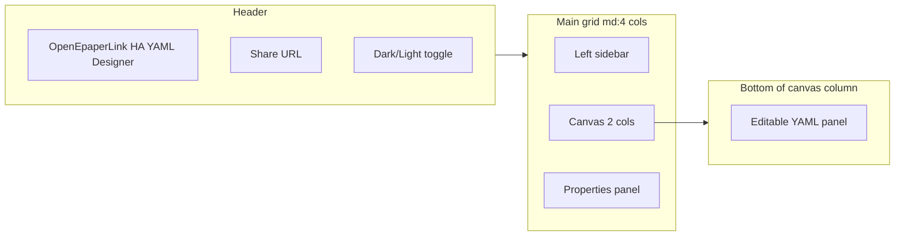
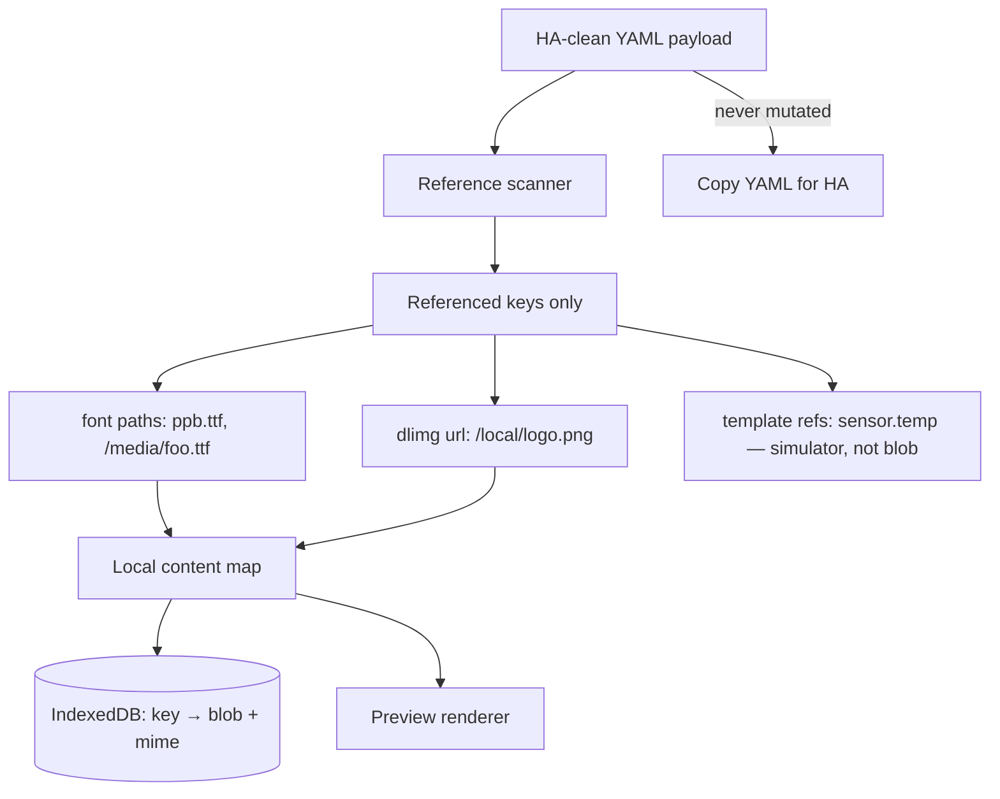
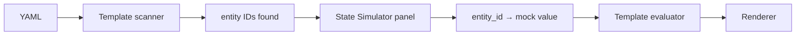
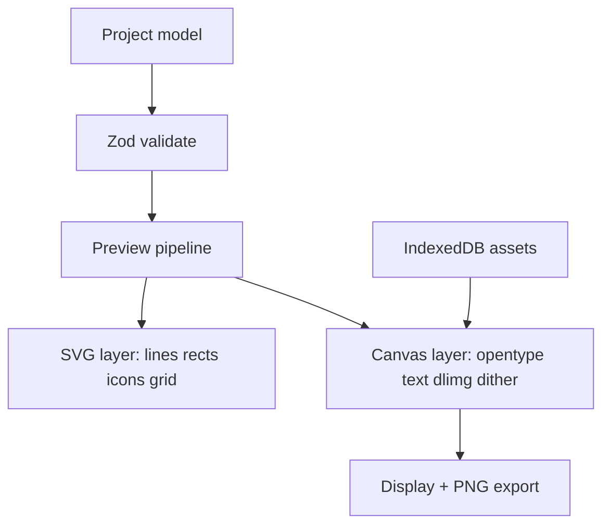
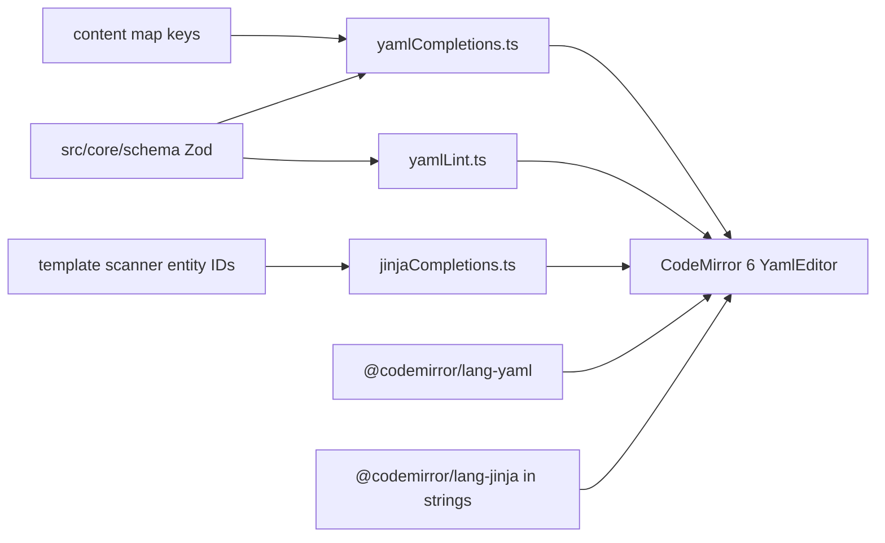
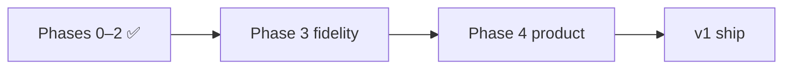
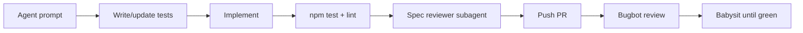

# OEPL YAML Designer — Feature Map & Build Plan

## 1. Existing reference designer analysis

Source available: minified production bundle only at `[esp32-sks-bus-doorphone/atc/oepl_yaml_designer/](esp32-sks-bus-doorphone/atc/oepl_yaml_designer/)` (React 19 + Vite build, Tailwind CDN, Pako). No TypeScript sources to publish.

### UI layout & look




| Zone              | Contents                                                                                                                                         |
| ----------------- | ------------------------------------------------------------------------------------------------------------------------------------------------ |
| **Header**        | App title, Share button (copies URL), dark/light mode                                                                                            |
| **Left sidebar**  | Load Example dropdown (17 designs), Add Element icon grid (16 types), Display Config (34 tag presets + custom W/H, visual rotation 0/90/180/270) |
| **Center canvas** | White e-paper preview on slate background, mouse coordinates overlay, Clear All, Snap On/Off, pan/zoom via SVG viewBox                           |
| **Right panel**   | Context form for selected element; Delete + Bring to Front                                                                                       |
| **Bottom panel**  | Live YAML editor, Copy YAML, Parse YAML and load to canvas                                                                                       |


**Visual style:** Slate/blue Tailwind palette, card panels with shadows, compact controls, dark mode via `class` strategy. Accent preview color mapped to magenta (`#FF00FF`) — not realistic red/yellow tag simulation.

### Implemented draw types (all 16 from spec)


| Type                | Canvas preview                               | Property editor                                                         | YAML round-trip                                                                      |
| ------------------- | -------------------------------------------- | ----------------------------------------------------------------------- | ------------------------------------------------------------------------------------ |
| `text`              | Approx bounding box + SVG `<text>`           | Full (anchor, font, stroke, parse_colors, max_width, truncate, visible) | Yes                                                                                  |
| `multiline`         | Line stack                                   | delimiter, offset_y, spacing                                            | Yes                                                                                  |
| `line`              | Line + endpoint handles                      | dashed, dash/space length                                               | Yes                                                                                  |
| `rectangle`         | Rect + resize handles                        | fill, outline, radius, corners                                          | Yes                                                                                  |
| `rectangle_pattern` | Grid of rects                                | x/y size, offset, repeat counts                                         | Yes                                                                                  |
| `polygon`           | Polygon + point count editor                 | points JSON array                                                       | Yes                                                                                  |
| `circle`            | Circle                                       | radius, fill, outline                                                   | Yes                                                                                  |
| `ellipse`           | Ellipse bbox                                 | fill, outline                                                           | Yes                                                                                  |
| `arc`               | Arc / pie slice                              | start/end angle, fill vs outline                                        | Yes                                                                                  |
| `icon`              | Embedded MDI SVG paths (subset)              | value, anchor, fill                                                     | Yes                                                                                  |
| `icon_sequence`     | Icon row/col                                 | direction, spacing, icons list                                          | Yes                                                                                  |
| `dlimg`             | Placeholder rect or clipboard preview        | url, xsize/ysize, resize_method, rotate                                 | Yes (used broken `preview_data_url` YAML comment — **stripped by HA on round-trip**) |
| `qrcode`            | **Fixed decorative pattern** (not scannable) | data, boxsize, border, module_count                                     | Yes                                                                                  |
| `plot`              | **Mock** axes/legends + sine-like line       | Full nested ylegend/yaxis/xlegend/xaxis/data JSON                       | Yes                                                                                  |
| `progress_bar`      | Bar + optional % text                        | direction, background, show_percentage                                  | Yes                                                                                  |
| `debug_grid`        | Grid overlay                                 | spacing, labels, dashed                                                 | Yes                                                                                  |


### Canvas interaction features

- Click to select; drag to move; 8-handle resize for bbox elements; line endpoint handles
- Snap to configurable grid (default ~10px, persisted in `localStorage`)
- Keyboard: Delete, Ctrl/Cmd+C/V copy/paste (offset +10px), arrow-key nudge
- Bring to front (no send-to-back, no layer list)
- Template values (`{{ ... }}`) shown as `[TPL]` / `URL [TPL]`; excluded from drag math
- Percentage coords (`"50%"`) parsed/stored but not draggable when templated

### YAML engine

- Custom line parser (not full YAML lib): handles HA-style blocks, plot nested objects, icon lists, comments preserved per-element (`_yaml_comments`)
- Bidirectional sync: visual edits → auto YAML; manual YAML → explicit Import
- Serializes plot sub-objects as JSON or indented blocks; quotes strings with special chars

### Share & persistence (existing)


| Feature           | Behavior                                                                                                                                  |
| ----------------- | ----------------------------------------------------------------------------------------------------------------------------------------- |
| **Share link**    | `?design=<pako-deflate + base64>` — **payload array only** (no canvas size, name, or assets)                                              |
| **localStorage**  | Dark mode, display width (default 384), height (default 184), snapping                                                                    |
| **dlimg preview** | Clipboard paste → `preview_data_url` on element; exported as YAML comment — **does not survive HA round-trip** (HA strips unknown fields) |
| **Templates**     | Shows `[TPL]` placeholder only — no mock entity values                                                                                    |
| **No**            | Project name, edit history, font/image library, hash routing, service options                                                             |


### Known gaps vs [supported_types.md](https://github.com/OpenEPaperLink/Home_Assistant_Integration/blob/main/docs/drawcustom/supported_types.md)


| Spec feature                                                        | Existing tool                                     |
| ------------------------------------------------------------------- | ------------------------------------------------- |
| Service options: `background`, `rotate`, `dither`, `ttl`, `dry-run` | Not modeled                                       |
| Halftone / dithered color preview                                   | Flat RGB approximations only                      |
| Hex colors (`#RGB`, `#RRGGBB`)                                      | Parsed; limited UI                                |
| `parse_colors` inline markup                                        | Editor toggle only; **not rendered**              |
| Text wrap / truncate / multiline `\n`                               | Not visually accurate                             |
| Real TTF fonts (`ppb.ttf`, custom paths)                            | CSS `fontFamily` string only — **no TTF loading** |
| `dlimg` from URL / HA paths / camera entities                       | Placeholder only (except clipboard preview)       |
| YAML / Jinja syntax highlighting + autocomplete                     | Plain textarea — no highlighting or completions   |
| Plot with real/sample history data                                  | Mock curve only                                   |
| QR codes                                                            | Placeholder bitmap                                |
| Plot `span_gaps`, `smooth`, `line_style`, `show_points`, etc.       | Stored in YAML; minimal preview                   |


---

## 2. Your requirements (new tool)

### Local content map (replaces YAML-comment preview hack)

**Why not embed preview data in YAML:** A prior closed-source designer stored clipboard images as `preview_data_url` and exported them as YAML comments. That fails in practice because Home Assistant strips anything it does not recognize when you paste YAML into automations/scripts — the preview is lost on the HA → designer round-trip.

**New approach — designer-only local content store:**




**Rules:**

- YAML exported for HA contains **only** valid drawcustom fields — no designer metadata, no comments for assets.
- Local map key = **exact string** from YAML (`/local/img1.png`, `ppb.ttf`, `https://example.com/x.png`).
- User uploads a file → bound to that key; renderer resolves `dlimg.url` / `font` through the map at preview time.
- Upload UI lives in **Content Manager**: lists all referenced keys, status (resolved / missing / bundled default), upload/replace/clear per key.
- Optional: import/export **asset bundle** (zip + manifest) to move substitutions between machines — separate from share link.
- Clipboard paste in Content Manager assigns blob to selected key (same UX as old tool, but storage is global per key, not per-element).

**Bundled defaults:** Ship `ppb.ttf` + `rbm.ttf` (verify license) under `public/fonts/`; map treats these keys as resolved without upload.

**Storage split:** IndexedDB (Dexie) for blobs + project snapshots; `localStorage` for prefs and history index.

### HA state simulator (template preview)

Problem: Old tool shows `[TPL]` for any `{{ ... }}` — useless for designing real dashboards.

**Design:**




- **Scan** payload for Jinja patterns: `states('sensor.x')`, `is_state('binary_sensor.door', 'on')`, `states('sensor.battery')|float`, color tags with embedded templates, etc.
- **State Simulator panel** (alongside Content Manager): table of discovered entities + editable mock values (string/number/bool); add manual entries for entities not yet referenced.
- **Evaluate** templates client-side with a **restricted, testable** evaluator (not full Jinja2 — implement the subset HA actually uses in drawcustom examples: `states`, `is_state`, `float` filter, simple `if/else`).
- Mock values persist **per project** in IndexedDB (included in project snapshot, **excluded** from share hash unless we add optional `mocks` in hash later — default: exclude, user re-enters mocks after opening shared link).
- Preview re-renders live when mock values change.
- TDD: fixture YAML files with templates + expected evaluated strings.

**Priority patterns to support (from spec):**

- `{{ states('sensor.temperature') }}`
- `{{ 'red' if is_state('binary_sensor.door', 'on') else 'black' }}`
- `{{ states('sensor.battery')|float < 20 }}` (conditionals in icon colors)
- `parse_colors` blocks with template-driven color names

### YAML + Jinja editor (syntax highlighting & autocomplete)

The bottom YAML panel is a primary editing surface — not a plain textarea. Match (and exceed) what HA Developer Tools → Template offers for editing experience.

**Stack (same family as [home-assistant/frontend](https://github.com/home-assistant/frontend)):**


| Package                                    | Role                                                     |
| ------------------------------------------ | -------------------------------------------------------- |
| **CodeMirror 6** (`EditorView` direct mount) | YAML panel — stable extensions, no `@uiw/react-codemirror` re-init churn |
| `@codemirror/lang-yaml`                    | YAML syntax highlighting                                 |
| `@codemirror/lang-jinja`                   | Jinja highlighting inside quoted YAML string values (mixed parser via `parseMixed`) |
| `@codemirror/autocomplete`                 | Completion provider API + custom Jinja delimiter scaffolding |
| `@codemirror/lint`                         | Inline diagnostics from Zod validate + yaml parse errors |


**Highlighting:**

- Full payload document: list of draw elements + service options block
- **Nested Jinja mode** inside double-quoted YAML strings (where `{{ … }}` and `` appear) — same approach HA uses for template fields
- Dark/light theme aligned with app chrome (One Dark / custom slate theme)

**Autocomplete sources (schema-driven from `src/core/schema/` + live project context):**


| Context                   | Suggestions                                                                                                         |
| ------------------------- | ------------------------------------------------------------------------------------------------------------------- |
| Top-level / list item     | `type:` values — all 16 draw types                                                                                  |
| After `type: text` (etc.) | Property keys valid for that element type                                                                           |
| Enum fields               | `color`, `fill`, `outline`, `background` — spec color aliases; `font` — bundled + content-map keys                  |
| `icon` / `icon_sequence`  | MDI icon name search (`@mdi/js` metadata)                                                                           |
| Lone `{` in a YAML value  | Delimiter choice: `{{` (expression) or `{%` (statement) — both scaffold their closing tags |
| Inside `{{ … }}`          | HA expression helpers: `states`, `is_state`, `state_attr`; filters: `float`, `int` |
| Inside ``          | Statement tags: `set`, `if`, `elif`, `else`, `endif`, `for`, `endfor` |
| Entity IDs in templates   | Entity IDs from template scanner + State Simulator mock list (when wired) |
| Service options           | `background`, `rotate`, `dither`, `ttl`, `dry-run` keys and allowed values (when modeled) |


**Lint / validation in editor:**

- Red squiggles on Zod schema violations (unknown keys, wrong types)
- Warn (not block) on missing content-map assets referenced in YAML
- Preserve template strings verbatim — autocomplete inserts must not corrupt `{{ … }}` / ``
- Unrecognized keys: squiggle on the **key**, not the value

**Jinja delimiter scaffolding (ADR-009 — validated in user testing, do not regress):**

CodeMirror’s default `{`/`}` auto-close fights Jinja. Implemented rules:

| User action | Editor result | Cursor |
|-------------|---------------|--------|
| `{` then `{` (or pick `{{`) | `{{ }}` | inside expression |
| `{` then `%` (or pick `{%`) | `` | after `{%` |
| Pick expression inside `{{ }}` | e.g. `{{ states('') }}` | inner snippets omit `}}` |
| Pick tag inside `` | e.g. `` | inner snippets omit `%}`; one leading space after `{%` |

Implementation notes:

- `closeBrackets` from basicSetup is **off** for `{`; `()`, `[]`, `'` and `"` still auto-close (`jinjaBracketHandling.ts`).
- Opening delimiters always insert the closing pair; inner completions never repeat closers.
- Expression apply pads when replacing the scaffold placeholder space so both `{{ …` and `… }}` keep single spaces.
- Autocomplete + lint tooltips use `document.body` fixed positioning; **no** global `scrollMargins` (first-line tooltips broke when margins inset the anchor).

**Bidirectional sync:** visual edits update YAML; manual YAML edits require explicit **Import** (or debounced auto-import toggle) — editor stays source of truth until user confirms parse. **Implemented:** linked YAML↔canvas coupling with optional toggle; element click scrolls/highlights YAML line.

### Share via hash (without external content)

- URL format: `https://<user>.github.io/oepl-designer/#d=<compressed>`
- Payload (JSON before compression):

```json
{
  "v": 1,
  "name": "Doorphone status",
  "canvas": { "width": 296, "height": 128, "rotation": 0, "accent": "red" },
  "service": { "background": "white", "rotate": 0, "dither": 2 },
  "elements": [ /* drawcustom payload */ ]
}
```

- Use **pako deflate** + base64url (same proven approach as existing tool, moved to hash per your preference).
- On load: restore project metadata + elements; **re-bind** assets from local IndexedDB by path — shared links work across machines but previews need re-upload of same paths.
- Show banner listing missing assets after import.

### Edit history (20 projects)

- `localStorage` record: `{ id, name, updatedAt, canvas, elementCount, hashSnippet }` — **not** full YAML × 20 (size limit).
- Full snapshot in IndexedDB keyed by `id` (LRU eviction at 20).
- Header: project name field + Recent projects dropdown/modal.

---

## 3. Suggested additional features

Prioritized for a “really nice” designer:

**High value**

1. **Accent tag toggle** — preview as red-tag vs yellow-tag (maps `accent`/`half_accent` correctly).
2. **Dither preview modes** — ordered (d=2) and optional Floyd-Steinberg (d=1) on export/preview toggle so halftone colors look like the tag.
3. **Service options panel** — `background`, `rotate`, `dither` with note that rotate in service vs visual canvas rotation are distinct (keep existing tool’s helpful note).
4. **Undo/redo** — element + property changes (zustand temporal or custom stack).
5. **Layer panel** — reorder, hide (`visible`), lock, duplicate; replaces “bring to front only”.
6. ~~Template playground~~ → **HA State Simulator** (see §2) — first-class panel, not optional polish.
7. **Real QR rendering** — `qrcode` npm package.
8. **Plot sample data editor** — CSV paste or synthetic generator; preview `span_gaps`, `smooth`, step lines.
9. `**parse_colors` renderer** — parse `[red]text[/red]` in preview.
10. **PNG export** — dithered preview matching tag output (for sharing layouts without HA).
11. **YAML + Jinja CodeMirror editor** — syntax highlighting, schema autocomplete, inline lint (see §2).

**Medium value**
12. Alignment tools (left/center/right, distribute, match size).
13. Snap to canvas center/edges and other elements.
14. Schema-driven property forms with inline docs linking to spec anchors.
15. YAML validation panel (errors/warnings before copy) — complements inline CodeMirror lint.
16. Import/export **asset bundle** (zip of substitutions + manifest) — separate from share link; for moving between your machines.
17. PWA + offline shell (design without network after first load).

**Lower priority / later** — tracked in §7.1 post-v1 list; do not block v1.

18. Multi-select and group move.
19. HA automation snippet generator wrapping payload in `open_epaper_link.drawcustom` service call.
20. Side-by-side diff of YAML versions from history.

---

## 4. UI framework trade-offs (React vs simpler)

This app has two very different layers:


| Layer                                                                | Complexity                           | Framework needed?                                  |
| -------------------------------------------------------------------- | ------------------------------------ | -------------------------------------------------- |
| **Core** (yaml, schema, renderer, dither, templates, asset resolver) | High — must be correct               | **No** — pure TypeScript, TDD with Vitest          |
| **Shell** (panels, forms, canvas chrome, drag/select)                | Medium-high — lots of interactive UI | Yes, unless you accept significant manual DOM work |


The sustainable split: **~70% of the value lives in framework-agnostic core modules**. UI choice mainly affects developer ergonomics and bundle size, not whether the designer works.

### Option A: React (+ Vite + TypeScript)


| Pros                                                                     | Cons                                                                |
| ------------------------------------------------------------------------ | ------------------------------------------------------------------- |
| Richest ecosystem for complex editors (CodeMirror bindings, dnd, forms)  | Largest runtime (~40–50 KB gzip react+react-dom)                    |
| `@testing-library/react` for component tests                             | More boilerplate (hooks, context, memo)                             |
| Same patterns as the reference designer — easy to compare feature parity | Easy to accidentally put logic in components (fight with TDD goals) |
| Huge hiring/docs surface                                                 | Slower initial render on low-end mobile                             |


**Best when:** you want fastest path to a polished multi-panel editor and may extend UI often.

### Option B: Preact (+ Vite + TypeScript)


| Pros                                                  | Cons                                              |
| ----------------------------------------------------- | ------------------------------------------------- |
| React-compatible API, **~4 KB** runtime               | Slightly fewer libraries target Preact explicitly |
| Can use `preact/compat` if a React-only dep is needed | Same component-model complexity as React          |
| Same Testing Library patterns                         | Niche — fewer Stack Overflow answers              |


**Best when:** you want React ergonomics with smaller GH Pages payload.

### Option C: Vanilla TypeScript (+ Vite, no UI framework)


| Pros                                                   | Cons                                                                 |
| ------------------------------------------------------ | -------------------------------------------------------------------- |
| Smallest bundle — only your code + Tailwind            | **Property panel, layer list, content manager = lots of manual DOM** |
| No virtual DOM abstraction — direct canvas integration | Undo/redo + form binding becomes custom infrastructure               |
| Forces core/UI separation (good for TDD)               | Harder to keep UI consistent as features grow                        |
| No framework upgrade churn                             | Reinventing patterns (state subscriptions, keyed lists)              |


**Best when:** bundle size is paramount and you accept slower UI feature velocity.

### Option D: Svelte (+ Vite)


| Pros                                        | Cons                                       |
| ------------------------------------------- | ------------------------------------------ |
| Less boilerplate than React for forms/lists | Different paradigm — not React-compatible  |
| Small runtime, compile-time reactivity      | Canvas/editor ecosystem smaller than React |
| Nice scoped CSS                             | Team familiarity variable                  |


**Best when:** you like Svelte and want lean components without React's weight.

### Recommendation for AI-based development (locked)

**Use React 19 + Vite + TypeScript** for the UI shell. You won't be coding yourself — the agent will — and that changes the calculus:


| Factor                       | Why React wins for AI development                                                                                                                         |
| ---------------------------- | --------------------------------------------------------------------------------------------------------------------------------------------------------- |
| **Training data**            | React is the most common UI framework in public code; agents produce correct components, hooks, and patterns far more reliably than Preact/Svelte/vanilla |
| **Library compatibility**    | CodeMirror, Testing Library, dnd-kit, Radix/shadcn patterns — all React-first; fewer compat hacks                                                         |
| **Reference implementation** | The reference designer is React — agent can diff behavior against a known working UI                                                                      |
| **Debugging**                | When something breaks, error messages and Stack Overflow coverage help the agent fix it faster                                                            |
| **Consistency**              | Schema-driven forms, property panels, modals — repetitive UI patterns React handles with predictable structure the agent can replicate                    |


**What does *not* change:** the **core layer stays pure TypeScript** (no React imports). That is where TDD matters most and where AI also works well (isolated functions, golden tests). The agent builds core first, then wires React components as thin adapters.

**Why not the alternatives for your case:**

- **Preact** — agent sometimes emits React-only APIs (`StrictMode`, specific hook deps); small savings (~40 KB) not worth friction for a desktop designer tool
- **Vanilla TS** — agent must hand-write hundreds of DOM update paths; high bug rate, inconsistent patterns across panels, slower iteration when you ask for new features
- **Svelte** — less training data; agent more likely to hallucinate syntax or mix React patterns

**Bundle size:** irrelevant for this use case. Target users open a designer in a desktop browser; 45 KB gzip React is fine on GH Pages.

**Guardrail for AI quality:** enforce `src/core/` has zero React imports (ESLint rule or path alias boundary). UI components only call core via typed functions. This keeps the "AI writes UI quickly, AI tests core rigorously" split clean.

**Phase 0 spike:** reduced to a **half-day sanity check** (one canvas interaction + one property form in React) — not a framework bake-off. Proceed unless it reveals a blocker.

**Decision recorded as ADR-006:** React for UI shell; core remains framework-agnostic.

---

## 5. Development approach: TDD + architecture docs

### TDD workflow

```
Red → Green → Refactor
```

**Test layers (CI must pass all before deploy):**


| Layer                        | Tool                 | What to test                                          |
| ---------------------------- | -------------------- | ----------------------------------------------------- |
| YAML parse/serialize         | Vitest               | Golden files from spec; round-trip equality           |
| Schema validation            | Vitest               | Invalid payloads rejected with clear errors           |
| Schema completion metadata   | Vitest               | All 16 types + enums exported for editor autocomplete |
| Template scanner + evaluator | Vitest               | `states`, `is_state`, conditionals, filters           |
| Content map resolver         | Vitest               | Key lookup, missing asset, bundled fallback           |
| Color/dither pipeline        | Vitest               | Pixel samples or checksums for known inputs           |
| Renderer                     | Vitest + canvas mock | Each element type against fixture PNG hash (optional) |
| UI smoke                     | Playwright           | Load app, add element, edit property, copy YAML       |


**Rule:** No feature merges without tests in the **core** layer first; UI tests follow for wiring.

### Architecture Decision Records (ADRs)

Maintain `docs/adr/` in repo (for future-you and contributors):


| ADR     | Topic                                                                             |
| ------- | --------------------------------------------------------------------------------- |
| ADR-001 | Core/UI separation — pure TS modules, no framework in renderer                    |
| ADR-002 | Local content map vs YAML-embedded preview (reject HA comments)                   |
| ADR-003 | IndexedDB schema (assets, projects, mocks)                                        |
| ADR-004 | Template evaluator scope (subset of Jinja, not full engine)                       |
| ADR-005 | Share hash format and excluded data                                               |
| ADR-006 | UI framework: **React** for shell (AI-maintainability); core stays framework-free |
| ADR-007 | Hybrid SVG + Canvas rendering                                                     |
| ADR-008 | TDD policy and CI gates                                                           |
| ADR-009 | YamlEditor: CodeMirror 6 mount, Jinja delimiter scaffolding, tooltip/bracket UX |


Each ADR: context, decision, consequences, alternatives considered.

---

## 6. Recommended tooling & repo setup

New repo/directory: `**oepl-designer/`** at workspace root (greenfield — directory does not exist yet).


| Layer       | Choice                                                                                                                                        | Rationale                                                                                                                                         |
| ----------- | --------------------------------------------------------------------------------------------------------------------------------------------- | ------------------------------------------------------------------------------------------------------------------------------------------------- |
| Framework   | **React 19 + Vite + TypeScript**                                                                                                              | Best AI codegen reliability; matches reference designer patterns; see §4                                                                          |
| Styling     | **Tailwind CSS v4** (build-time)                                                                                                              | Match existing look; no CDN dependency in prod                                                                                                    |
| State       | **Zustand** + immer                                                                                                                           | Project, selection, history, UI prefs; simple API for AI to extend                                                                                |
| YAML        | **yaml** (eemeli)                                                                                                                             | Robust parse/stringify; comment preservation strategy documented                                                                                  |
| Schema      | **Zod** types generated from spec                                                                                                             | Single source of truth for forms + validation                                                                                                     |
| Fonts       | **opentype.js**                                                                                                                               | Load TTF from IndexedDB; metrics for anchor/wrap                                                                                                  |
| Canvas      | **Hybrid SVG + Canvas**                                                                                                                       | SVG shapes/icons; Canvas for text, images, dither compositing                                                                                     |
| Icons       | **@mdi/js**                                                                                                                                   | Full MDI library, tree-shaken                                                                                                                     |
| QR          | **qrcode**                                                                                                                                    | Real scannable codes                                                                                                                              |
| Compression | **pako**                                                                                                                                      | Share hash (proven)                                                                                                                               |
| Asset DB    | **Dexie** (IndexedDB)                                                                                                                         | Fonts/images; history snapshots                                                                                                                   |
| Editor      | **CodeMirror 6** (`@uiw/react-codemirror`, `@codemirror/lang-yaml`, `@codemirror/lang-jinja`, `@codemirror/autocomplete`, `@codemirror/lint`) | YAML panel: syntax highlight, embedded Jinja in strings, schema + HA template autocomplete, inline diagnostics — mirrors HA frontend editor stack |
| Tests       | **Vitest** (TDD, core-first) + **Playwright**                                                                                                 | Golden YAML fixtures; CI gate before deploy                                                                                                       |
| CI/CD       | **GitHub Actions** → `gh-pages`                                                                                                               | `peaceiris/actions-gh-pages` or native GHA pages deploy                                                                                           |


### Key files to create

```
oepl-designer/
  .github/workflows/deploy.yml   # npm test && npm run build
  docs/adr/                      # architecture decision records
  package.json
  vite.config.ts                 # base: '/oepl-designer/'
  src/
    core/                        # NO UI imports — TDD first
      schema/elements.ts
      yaml/{parse,serialize,validate}.ts
      templates/{scan,evaluate}.ts
      assets/{scanner,resolver}.ts
      renderer/{canvas,colors,dither,text,shapes,...}.ts
    storage/{db,history,preferences}.ts
    ui/                          # React shell only — thin adapters over core
      App.tsx
      components/{Canvas,PropertyPanel,YamlPanel,ContentManager,StateSimulator,...}
    ui/editor/                   # CodeMirror setup (UI only — completion data from core/schema)
      YamlEditor.tsx             # EditorView mount, external value sync, theme/fontSize
      yamlEditorExtensions.ts    # extension bundle + keymaps
      yamlEditorSetup.ts         # basicSetup options (autocomplete/closeBrackets off — custom)
      yamlLanguage.ts            # lang-yaml + jinja mixed parser in string literals
      yamlCompletions.ts         # schema-driven property/type completions
      yamlCompletionSource.ts    # override providers, insert-from for type:/enum lines
      jinjaCompletions.ts        # delimiter + expression + tag completions
      jinjaBracketHandling.ts    # Jinja-aware delimiter scaffolding; ()/[] close only
      jinjaContext.ts            # inside-template / lone-{ / value-context detection
      yamlLint.ts                # Zod validate → @codemirror/lint
      yamlIssueRanges.ts         # key vs value squiggle ranges for Zod issues
      yamlTheme.ts               # slate theme, tooltip parent
      locateElementInYaml.ts     # canvas selection → YAML line
      yamlElementsSync.ts        # linked mode element list sync
  tests/
    core/                        # golden YAML, template eval, renderer
    fixtures/                    # spec examples from supported_types.md
    e2e/                         # Playwright
  public/fonts/
```

### GitHub Pages setup

1. Repo `oepl-designer` on GitHub; enable Pages from Actions.
2. `vite.config.ts`: `base: process.env.GITHUB_ACTIONS ? '/oepl-designer/' : '/'` for local dev.
3. Workflow: `npm ci` → `npm test` (must pass) → `npm run build` → deploy `dist/`.
4. README: link to live demo, spec reference, asset substitution workflow.

### Rendering architecture (sustainable)




- Keep **rendering logic pure** (no React in renderer) → testable against golden YAML fixtures from spec examples.
- Property UI **generated from schema** → adding a new spec field is one schema edit, not N form edits; same schema feeds YAML autocomplete.

### CodeMirror editor architecture




- **Phase 1 dependency:** autocomplete and lint require Zod schemas + validate — implement completion provider interface in core (`src/core/schema/completions.ts`) as pure data; UI wires it into CodeMirror.
- **Phase 2 deliverable:** replace placeholder YAML textarea with full `YamlEditor` component.

---

## 7. Implementation phases

### Progress tracker (updated 2026-06-06)

| Phase | Status | Commit | Tests | Notes |
|-------|--------|--------|-------|-------|
| **0** Bootstrap | ✅ Done | `133e960` | — | ADRs, rules, agents, spec vendored |
| **1a** YAML + schema | ✅ Done | `8f6cc3d` | 33 | 16 Zod types, fixtures, completions, HA-clean export |
| **1b–1d** Core | ✅ Done | `a56eee6` | 108 | Templates, assets, renderer stubs (16/16) |
| **2a–2c** Shell + YamlEditor | ✅ Done | `84d2164` | 220 (27 files) | Stabilize, editor, layout |
| **2d** Content + templates | ✅ Done | `95ebf75` | +39 | Content Manager, State Simulator, template preview |
| **2e** Canvas + forms | ✅ Done | `b559f08` | 325 (45 files) | Phase **2 complete** |
| **3a** IndexedDB | ✅ Done | `9d58839` | 357 (49 files) | Dexie assets + mocks + project stub |
| **3b** opentype text | ✅ Done | `23d12b5` | 427 (64 files) | Layout, anchors, wrap/truncate, multiline, bidi/RTL, glyph draw |
| **3c** MDI icons | ✅ Done | `7deb2fd` | 480 (72 files) | `@mdi/js` paths, icon autocomplete, validation, canvas UX polish |
| **3d–3f** Fidelity | ⬜ **Next** | — | — | QR, plot, parse_colors, dither, canvas perf (§17d–§17f) |
| **4** Polish | ⬜ After 3 | — | — | Share, history, service options, undo/layers, PNG, e2e, deploy (§18) |

**Current repo health:** `npm test` → **480 passed** (72 files) · `npm run lint` → **clean** · last commit `7deb2fd`

**Next:** Phase **3d** — QR + plot (§17d).

### Phase 0 — Bootstrap + ADRs ✅

- ADR-001 through ADR-009 drafted (ADR-006 locks React; ADR-009 YamlEditor UX)
- **`docs/spec/supported_types.md` vendored from upstream GitHub**
- Vitest harness + one golden YAML round-trip test
- Vite + React scaffold with ESLint rule: `src/core/` must not import React
- Half-day sanity check: canvas placeholder + one property form wired to core

### Phase 1 — Core (TDD) ✅ complete (`a56eee6`)

- ✅ Schema + YAML parse/serialize/validate (all 16 types) — tests from spec fixtures
- ✅ **`src/core/schema/completions.ts`** — completion metadata for editor
- ✅ Template scanner + evaluator (`src/core/templates/` — Nunjucks + HA mock context; ADR-004)
- ✅ Content map resolver (`src/core/assets/` — sync resolver hydrated from IndexedDB via `src/storage/`)
- ✅ Renderer stubs — **all 16 types** in `src/core/renderer/`; exhaustive `switch` in `renderElement`
- ✅ `tests/core/renderer/render-element.test.ts` — every spec fixture renders without error

**Stub vs fidelity (Phase 3 upgrades):** line/rectangle/circle are real SVG; text/multiline + icon/icon_sequence are real (**3b**, **3c**); dlimg/qrcode/plot remain `-stub` primitives with bounds/placeholders only.

### Phase 2a — Stabilize before commit (§11d) ✅ (`84d2164`)

Quality gate — no new features. All items delivered and committed.

- ✅ `npm run lint` clean (fix `YamlEditor.tsx` ref-during-render violations)
- ✅ CI: add `npm run lint` to `.github/workflows/deploy.yml` (ADR-008)
- ✅ Remove Phase 0 dead code: `src/core/elements/text.ts`, `TextPropertyForm.tsx`, exports, tests
- ✅ Remove unused `@uiw/react-codemirror` from `package.json` (ADR-009 uses direct `EditorView` mount)
- ✅ Consolidate trivial UI helper tests (`shouldShowActiveLineHighlight`, `shouldReportYamlCursorPosition`, `shouldMoveCursorOnLinkedScroll`, `shouldApplyExternalYamlSync`) into one file
- ✅ Slim renderer tests: keep exhaustiveness sweep + behavior tests (colors, coords, visibility); drop redundant per-type stub snapshots where the sweep already covers them
- ✅ Property panel label: read-only dump (not schema-driven forms yet) — document honestly in README

**Explicitly deferred (do not implement in 2a):**

| Item | Target phase | Why |
|------|--------------|-----|
| Template eval → canvas preview | **2d** (with State Simulator UI) | Feature wiring, not stabilization |
| Content Manager + State Simulator panels | **2d** §16c | First Phase 2 remainder chunk |
| Canvas drag/resize/snap/keyboard | **2e** §16d | Interaction layer |
| Schema-driven editable property forms | **2e** §16d | Replaces read-only `PropertyPanel` |
| Add Element grid + Load Example dropdown | **2e** §16d | Sidebar parity |
| Playwright e2e smoke | **4** (or late 2e) | ADR-008 allows after core wiring |
| Rich spec fixtures (plot legends, icon_sequence, …) | **3** | Needed for fidelity tests, not commit gate |
| `parse_colors` renderer pipeline | **3/4** | ADR-004 post-processing |
| Replace stub snapshots with PNG/geometry tests | **3** | When stubs become real renderers |

### Phase 2c — UI shell commit (§11c) ✅ (`84d2164`)

Committed: layout, canvas, YamlEditor, stabilization fixes, ADR-009, `elementTemplates.ts`, bundled fonts in `public/fonts/`.

### Phase 2d — Content Manager + State Simulator (§16c) ✅ (`95ebf75`)

- ✅ `ContentManager.tsx` — `scanPayloadForAssets`, upload/clear, resolved / bundled / missing badges
- ✅ `StateSimulator.tsx` — scanned entity IDs, editable mock values, manual add/remove
- ✅ `applyTemplateContextToPayload` (`src/core/templates/preview.ts`) — deep-copy preview with evaluated templates
- ✅ Canvas uses `previewElements`; YAML panel keeps raw template strings
- ✅ Mock states persist in `localStorage` (`mockStates.ts`); auto-seed scanned entities as `unknown`
- ✅ Asset upload validation (`validateAssetUpload.ts`) — reject font/image mismatches
- ✅ Canvas draws uploaded dlimg + loaded font faces (`load-asset-images.ts`, `load-font-faces.ts`); sample payload includes template text + dlimg

### Phase 2e — Canvas interaction + property forms (§16d) ✅

**Reference editing baseline complete.** Phase 2 (UI parity for designing) is **complete**.

- ✅ `DesignerCanvas.tsx` — drag, 8-handle resize, line endpoints, circle radius; snap toggle + grid overlay (`snapGrid.ts` → `localStorage`)
- ✅ Keyboard: Delete/Backspace, arrow nudge (Shift = 10px); snap-aware step
- ✅ `ElementPropertyForm.tsx` + `property-field-meta.ts` + `propertyMetadata.ts` — schema-driven forms (enum/boolean/json/template/font/image fields)
- ✅ `ElementToolbar.tsx` — Add Element for all 16 types via `createElementFromTemplate`
- ✅ `example-designs.ts` — Load Example: sample dashboard + 16 minimal one-type designs
- ✅ `ElementList.tsx` — drag-reorder layers; PropertyPanel: bring to front, send to back, move up/down
- ✅ Canvas chrome: Clear all, mouse coordinates overlay
- ✅ `element-geometry.ts`, `canvas-hit-test.ts`, `draw-order.ts`, `selection-remap.ts` — pure UI libs with tests
- ✅ Resizable property panel width (`useResizablePanelWidth`)
- ⬜ Deferred: Ctrl+C/V copy/paste elements; pan/zoom viewBox

**Committed:** §19 review complete (2026-06-07). Fixes: lint (`ha-datetime.ts`, `DesignerCanvas.tsx` deps), keyboard nudge guard + safe `translateElement`, `resolveDirection` for templated direction fields.

### §19 follow-up — deferred 2e review tasks

From §19 critical review (2026-06-07). Not blocking §11f; scheduled in Phases **3f**, **4**, or post-v1.

| ID | Task | Phase | Key files |
|----|------|-------|-----------|
| **19-1** | Canvas drag performance — avoid full re-render on every `pointermove`; drag overlay or memoized per-index layers | **3f** | `DesignerCanvas.tsx`, `CanvasElementLayer.tsx` |
| **19-2** | Explicit `releasePointerCapture` on drag end / `lostpointercapture` | **3f** | `DesignerCanvas.tsx` |
| **19-3** | Numeric string coords (`"50"`) — align `isInteractiveCoordinate` with core `resolveX`/`resolveY` | **3b** ✅ | `element-geometry.ts` |
| **19-4** | Percentage coord drag (`"50%"`) when position is not templated | **3b** ✅ | `element-geometry.ts`, `canvas-interaction.test.ts` |
| **19-5** | Plot nested sub-object property fields (e.g. `yaxis.smooth`) beyond top-level JSON blobs | **3d** | `ElementPropertyForm.tsx`, `propertyMetadata.ts` |
| **19-6** | Canvas interaction unit tests — line endpoints, circle radius, bounds resize, nudge guard | **3f** | `tests/ui/lib/canvas-interaction.test.ts` |
| **19-7** | Property form tests — JSON blur/revert, enum↔template toggle, font/image upload paths | **4** | `ElementPropertyForm.tsx`, Testing Library |
| **19-8** | JSON property field invalid-on-blur UX (inline error or revert to last valid) | **4** | `ElementPropertyForm.tsx` |
| **19-9** | Refactor `useProjectState` — batch selection remap with element mutations (`useReducer` or paired updates); **partial:** `applyLayerMove` + ADR-009 selection-stability rules | **4** | `useProjectState.ts` — pair with undo/redo |
| **19-10** | Element copy/paste (Ctrl+C/V, +10px offset) | **4** | `DesignerCanvas.tsx`, `useProjectState.ts` |
| **19-11** | Canvas pan/zoom (SVG viewBox) | **4** | `DesignerCanvas.tsx` |
| **19-12** | Arc angle handles; polygon vertex handles on canvas | **post-v1** | `DesignerCanvas.tsx`, `element-geometry.ts` |
| **19-13** | `moveElementInArray` guard when `toIndex >= length` | **3f** | `element-geometry.ts` |

### Phase 3a — IndexedDB storage (§17a) ✅ (`9d58839`)

- ✅ `src/storage/` — Dexie `OeplDatabase`: `assets`, `mocks`, `projects` stores (ADR-003)
- ✅ `hydrateContentMapFromStorage` — loads blobs into sync `src/core/assets/resolver.ts`
- ✅ `persistAsset` / `removePersistedAsset` — Content Manager upload/clear survives reload
- ✅ Per-`projectId` mock states in IndexedDB; `getOrCreateActiveProjectId()` in `localStorage`
- ✅ Legacy global `localStorage` mock migration (`MOCK_STATES_MIGRATED_KEY`)
- ✅ `useProjectState` — hydrate on mount; persist mocks after hydration
- ✅ `tests/storage/assets.test.ts`, `tests/storage/mocks.test.ts`

**Phase 4 note:** plan may simplify to a **global mock store** (§7 Phase 4) — one HA instance, shared entity map like assets.

### Phase 3b — opentype text fidelity (§17b) ✅ (`23d12b5`)

- ✅ `opentype.js` + `src/core/renderer/fonts.ts` registry; `load-opentype-fonts.ts` (bundled + IndexedDB)
- ✅ `text-layout.ts` — wrap (`max_width`), truncate, line spacing, multiline delimiter stack
- ✅ `text.ts` / `multiline.ts` — opentype metrics, anchors (`anchors.ts`), `drawLines` on primitives
- ✅ `draw-canvas-stubs.ts` — `computeOpentypeGlyphPositions` path drawing (fallback CSS if font missing)
- ✅ Bidi/RTL helpers (`bidi-text.ts`, `opentype-glyphs.ts`, `glyph-coverage.ts`)
- ✅ `DesignerCanvas` / `CanvasElementLayer` — opentype font map wired to canvas draw
- ✅ §19 **19-3**, **19-4** — `isInteractiveCoordinate` for numeric strings + percentage coords
- ✅ Tests: `text-layout`, `text-anchor`, `bidi-text`, `rtl-text`, `glyph-coverage`, `load-opentype-fonts`, `stub-preview`

**Note:** Primitive kind remains `text-stub` / `multiline-stub` (carries `drawLines`); rename optional later.

### Phase 3c — MDI icons (§17c) ✅ (`7deb2fd`)

- ✅ `@mdi/js` + `src/core/renderer/mdi-icons.ts` — `resolveMdiPath`, `isKnownMdiIconName`
- ✅ `icon.ts` / `icon-sequence.ts` — primitives `kind: 'icon'` / `kind: 'icon_sequence'` with real SVG paths
- ✅ `src/core/schema/iconName.ts` — Zod validation for unknown icon names (templates exempt)
- ✅ `SvgPrimitive.tsx` — MDI path rendering on SVG layer (ADR-007)
- ✅ `mdi-icon-names.ts` + `IconNamePropertyField` in `ElementPropertyForm.tsx` — search-as-you-type
- ✅ YAML icon autocomplete in `yamlCompletions.ts`
- ✅ Tests: `mdi-icons`, `icon`, `icon-sequence`, `mdi-icon-names`
- ✅ Bonus UX (same commit): canvas YAML error banner; polygon YAML linking (`yamlLinkedElement.ts`); property-panel color picker fixes; `icon_sequence` resize by direction (`canvas-resize-handles.ts`)

### Phase 3 — Fidelity (upgrade stubs → real tag preview)

**Biggest user-visible gap after 2e.** Core renderer stubs become honest e-paper preview.

| Area | Current (post-2d) | Phase 3 target |
|------|-------------------|----------------|
| Text | ✅ opentype layout + glyph draw (**3b**) | parse_colors segments (§17e) |
| Icons | ✅ real MDI paths (**3c**) | — |
| QR | Decorative grid | Scannable via `qrcode` package |
| Plot | Placeholder area | Axes, legends, sample/synthetic data, `span_gaps`, `smooth`, line styles; **19-5** nested plot property fields |
| `parse_colors` | Not rendered | Parse `[red]…[/red]` markup in preview (ADR-004) |
| Dither / accent | Flat RGB | Ordered dither (d=2), optional Floyd-Steinberg; red vs yellow accent toggle |
| dlimg | Uploaded images draw; no resize_method | Full resize/rotate preview per spec |
| Assets / mocks | ✅ IndexedDB + sync resolver hydrate (**3a**) | Global mock simplification optional in **4** |
| Canvas interaction | Full re-render on drag | **19-1** drag overlay / memo; **19-2** pointer capture; **19-6** interaction tests |
| Coordinates | ✅ numeric strings + `"N%"` drag (**3b**) | — |
| Tests | 16 minimal fixtures + exhaustiveness sweep | Rich fixtures from spec; geometry/PNG hash tests |

**Suggested Phase 3 chunks (one agent session each):**

- **3a** — IndexedDB (`src/storage/`) ✅ **`9d58839`**
- **3b** — opentype text + multiline ✅ **`23d12b5`**
- **3c** — MDI icons + icon_sequence ✅ **`7deb2fd`**
- **3d** — QR + plot preview; **19-5** plot nested property fields
- **3e** — parse_colors + dither pipeline (Best-of-N candidate)
- **3f** — Canvas interaction follow-ups (§19): **19-1** drag perf, **19-2** pointer capture, **19-6** interaction tests, **19-13** array bounds guard

### Phase 4 — Product polish + v1 ship criteria

**Closes the product loop** — share, history, service options, export. Required for §8 v1.

| Feature | Notes |
|---------|--------|
| **Share link** | Header Share button; `#d=pako…` restores name + canvas + elements; excludes assets/mocks (ADR-005) |
| **20-project history** | Named projects, LRU eviction, searchable; index in `localStorage`, snapshots in IndexedDB |
| **Global mock store** | Simplify mocks like assets: one HA instance → one shared mock map in IndexedDB (not per `projectId`); migrate existing rows; optional per-project overrides only if scenario testing needs them (see §18 note) |
| **Project name** | Editable field in header |
| **Service options panel** | `background`, `rotate`, `dither`, `ttl`, `dry-run` — schema exists; needs UI + YAML block |
| **Undo/redo** | Element + property changes (zustand temporal or custom stack); **19-9** refactor `useProjectState` selection batching |
| **Layer panel** | Reorder, hide (`visible`), lock, duplicate — beyond 2e bring-to-front |
| **PNG export** | Dithered preview matching tag output |
| **Header chrome** | Copy YAML button; missing-assets banner after share import |
| **Element copy/paste** | **19-10** Ctrl/Cmd+C/V with +10px offset |
| **Canvas pan/zoom** | **19-11** viewBox pan/zoom on canvas chrome |
| **Property form UX** | **19-7** form tests; **19-8** JSON invalid-on-blur feedback |
| **Playwright e2e** | Smoke: load app, add element, drag, edit property, edit YAML (**19-6**, **19-7**) |
| **GH Pages** | Push to remote; workflow already runs lint/test/build |

**Reference UI gaps (optional in 4):** clipboard paste in Content Manager, asset bundle zip import/export (§3 #16).

**Storage simplification (Phase 4, with history):** Phase 3a stores mocks per `projectId` (ADR-003). Typical use is one HA instance and many tag layouts — same entity states everywhere, like asset paths. Phase 4 should migrate to a **global mock store** (one map keyed by `entity_id`) and treat per-project mock snapshots as optional overrides only when restoring history or testing divergent scenarios.

### 7.1 After Phase 2e — remaining feature map

Once **2e** is committed, **Phase 2 is complete**. **v1** still requires Phases **3 + 4** plus deploy.



**Phase 2 complete:**

- Visual editing: add, move, resize, snap, layer reorder, schema property forms
- YamlEditor + YAML↔canvas coupling
- Content Manager + State Simulator + template preview
- Display presets, rotation, theme

**Already done (no further work for v1 unless noted):**

- 16 draw types in schema + YAML engine + renderer stubs
- YamlEditor (highlight, autocomplete, Jinja scaffolding, lint)
- Content Manager + State Simulator + live template preview on canvas
- Display presets (~30 tag sizes), rotation, dark/light theme
- HA-clean YAML export; bundled fonts in `public/fonts/`

**Post-v1 / nice-to-have (§3 — defer until after v1):**

- **19-12** Arc angle handles; polygon vertex editing on canvas
- Alignment tools (center, distribute, match size)
- Snap to canvas center/edges and other elements
- Validation summary panel (beyond inline lint)
- PWA / offline shell
- Multi-select + group move
- HA automation snippet generator (`open_epaper_link.drawcustom` wrapper)
- Side-by-side YAML diff from history

**Recommended order:** **3d** (§17d) → §17e–§17f → Phase 4 (§18) → push for GH Pages.

---

## 8. Parity checklist (must pass before calling v1 complete)

Track status against §7.1. **Phase 2e** covers several editing items; **Phases 3–4** cover the rest.

| Requirement | Status | Phase |
|-------------|--------|-------|
| All 16 draw types add/edit/render/export per spec | 🟡 Text/multiline + icons real; QR/plot/parse_colors Phase 3d–3e | 3b–3e |
| Percentage coordinates + anchors (Pillow set) | ✅ Drag + resolve + opentype anchors (**3b**) | 3b |
| All color aliases including hex, halftone shortcuts, accent | 🟡 Flat preview; dither Phase 3/4 | 3–4 |
| Plot nested objects round-trip | ✅ YAML engine | — |
| Template strings preserved verbatim in HA export | ✅ | — |
| Local content map by exact YAML path (no embedding) | ✅ IndexedDB + hydrate | 3a |
| HA state simulator evaluates templates for preview | ✅ | 2d |
| YAML editor: highlight, autocomplete, Jinja scaffolding, lint | ✅ | 2b |
| Schema-driven property forms (all types) | ✅ | 2e |
| Canvas drag/resize/snap/keyboard | ✅ | 2e |
| Add Element + Load Example | ✅ | 2e |
| Element copy/paste (Ctrl+C/V) | ⬜ **19-10** | 4 |
| Share link restores name + canvas + elements (not assets/mocks) | ⬜ | 4 |
| 20-project history with searchable names | ⬜ | 4 |
| Service options UI (`background`, `rotate`, `dither`, …) | ⬜ Schema only | 4 |
| Real QR, plot, icons, parse_colors in preview | 🟡 Icons ✅; QR/plot/parse_colors Phase 3d–3e | 3 |
| Core test suite passes in CI | ✅ lint + test in workflow | — |
| ADRs document major decisions | ✅ ADR-001–009 | — |
| GH Pages deploy from clean source repo | ⬜ No remote yet | 4 |

---

## 9. Cursor execution playbook (how to build this with AI)

You won't code yourself — Cursor is the team. This section maps plan phases to Cursor features.

### Setup once (before Phase 0)


| Artifact                             | Purpose                                                          |
| ------------------------------------ | ---------------------------------------------------------------- |
| `.cursor/rules/core-boundary.mdc`    | `src/core/` must not import React; TDD required for core changes |
| `.cursor/rules/yaml-spec.mdc`        | Link to supported_types.md; HA-clean export rules                |
| `.cursor/agents/core-implementer.md` | Subagent: writes pure TS + Vitest only                           |
| `.cursor/agents/ui-wirer.md`         | Subagent: React shell, calls core APIs                           |
| `.cursor/agents/spec-reviewer.md`    | Subagent: diff vs supported_types.md                             |
| `docs/PLAN.md`                       | **Canonical plan in repo** — agent prompts: §11 (commits), §16 (Phase 2), §17 (Phase 3), §18 (Phase 4), §19 (review) |
| `docs/spec/supported_types.md`       | Vendored drawcustom spec — element types and fields                       |
| `docs/adr/`                          | Architecture decisions the agent must read before big changes             |
| `tests/fixtures/`                    | Golden YAML from spec — agent's source of truth                           |


Commit rules and subagents to the repo so every agent session inherits them.

### Which Cursor mode for what


| Task                                                  | Mode / feature               | Why                                                             |
| ----------------------------------------------------- | ---------------------------- | --------------------------------------------------------------- |
| Architecture, feature map, trade-offs                 | **Plan mode** (this chat)    | Read-only exploration; produces plan you approve                |
| Scaffold repo, implement phase                        | **Agent mode**               | Full edit + terminal access                                     |
| "Does this match the spec?"                           | **Ask mode**                 | Read-only review without accidental edits                       |
| Visual spec review (element matrix, parity checklist) | **Canvas**                   | Rich layout for reviewing status tables                         |
| Complex algorithm (dither, template eval)             | **Best-of-N** (`/best-of-n`) | Same prompt → multiple models in isolated worktrees → pick best |
| Long-running phase while you sleep                    | **Cloud Agent**              | VM runs tests/build without your laptop                         |
| PR open → green CI → merge                            | **Bugbot + babysit skill**   | Auto-review comments; agent fixes CI loop                       |


### Agent workspace (all phases after Phase 0)

| Setting | Value |
|---------|--------|
| **Workspace root** | `oepl-designer/` (this repo — not parent `src/`) |
| **Plan file** | `docs/PLAN.md` — read relevant § before every task |
| **Spec file** | `docs/spec/supported_types.md` |
| **Do not use** | `~/.cursor/plans/…` — outside repo; may be unreadable |

**Standard opener for every Agent chat:**

> Read `docs/PLAN.md` §[N] and `docs/adr/ADR-00X`. Spec: `docs/spec/supported_types.md`. Follow `.cursor/rules/`. Workspace is this repo root.

### Phase-by-phase Cursor workflow

**Phase 0 — Bootstrap** ✅ complete (see §11 for commit prompt if not yet committed)

**Phase 1 — Core (highest quality leverage)**

Use **parallel local agents** on independent modules (each in its own worktree if using Cursor 3 `/worktree`):


| Agent session | Scope                        | Acceptance                                               |
| ------------- | ---------------------------- | -------------------------------------------------------- |
| A             | `yaml/` parse + serialize    | Golden fixtures round-trip                               |
| A2            | `schema/` + `completions.ts` | Completion metadata covers all 16 types; Vitest snapshot |
| B             | `templates/` scan + evaluate | Template test matrix passes                              |
| C             | `assets/` scanner + resolver | Key lookup tests                                         |
| D             | `renderer/` per element type | One test file per type                                   |


Prompt pattern for each:

> Read `docs/PLAN.md` §7 Phase 1. Implement `src/core/yaml/parse.ts`. TDD: fixtures in `tests/fixtures/spec/`. No React. Match `docs/spec/supported_types.md`. Run `npm test` before finishing.

**When to use Best-of-N:** dither pipeline, template evaluator, text layout with opentype — problems where approach isn't obvious. Prompt:

> `/best-of-n Implement ordered dither (d=2) for 4-color e-paper palette in src/core/renderer/dither.ts with Vitest pixel tests`

Compare outputs side-by-side; merge the winner or ask agent to combine best parts.

**Phase 2–4 — UI**

- Phase **3a** ✅ (`9d58839`). Phase **3b** ✅ (`23d12b5`). Phase **3c** ✅ (`7deb2fd`). **Current work:** **§17d–§17f** → **§18**.
- One agent session per §17 subsection to avoid context bloat.
- After each chunk: invoke **spec-reviewer** (`.cursor/agents/spec-reviewer.md`) against `docs/spec/supported_types.md` and §8.
- Use **split-to-prs** when a session exceeds ~500 lines — e.g. §17a storage PR, §17b text PR, etc.

### Quality gates (non-negotiable)




Every merge requires: tests green, no React in core (lint), HA-clean YAML export unchanged.

### Prompting patterns that work for you

**Good** (bounded, testable):

> Add `rectangle_pattern` renderer. Tests first in `tests/core/renderer/rectangle-pattern.test.ts`. Use fixture `tests/fixtures/elements/rectangle-pattern.yaml`. Core only.

**Bad** (too broad):

> Build the whole designer UI.

**Good** (references plan):

> Read `docs/PLAN.md` §2. Implement Content Manager (local content map). IndexedDB via Dexie. UI in `src/ui/components/ContentManager/`.

### Cloud Agents (optional, high value)

Use when:

- Phase 1 core modules need 2+ hours of uninterrupted work
- You want a PR opened while away from desk
- CI/debug loop on GitHub (`@cursor` on PR)

Setup: configure `.cursor/environment.json` with `npm ci`, Node version, `npm test` as verify command. Cloud agent clones repo, implements, runs tests, opens PR.

### Automations (ongoing maintenance)

After v1 ships, Cursor Automations can:

- Nightly: run full test suite on main, open issue if red
- On PR: run parity checklist agent against changed renderer files
- Weekly: diff supported_types.md upstream for spec drift

Use the **automate** skill when ready to configure these.

### Session hygiene (since you don't code)

1. **One phase or module per chat** — long chats degrade quality
2. **Workspace:** repo root `oepl-designer/`; **plan:** always `docs/PLAN.md`
3. **Start each chat with**: "Read `docs/PLAN.md` §X and ADR-00Y. Current phase: …"
4. **End each chat with**: "Run tests, summarize what's done, copy next prompt from `docs/PLAN.md` §17–§18 (or §11 for commits)"
5. **Don't merge without green CI** — use babysit skill on the PR

### Suggested PR sequence (split-to-prs)

1. Scaffold + ADRs + CI
2. YAML engine + fixtures
3. Template evaluator
4. Content map + IndexedDB
5. Renderer (shapes)
6. Renderer (text/fonts)
7. Renderer (icons, dlimg, qrcode, plot)
8. React shell + canvas
9. **YamlEditor** — CodeMirror highlighting, YAML + Jinja autocomplete, lint
10. Content Manager + State Simulator ✅
11. Canvas interaction + property forms (2e)
12. Renderer fidelity (Phase 3 — split PRs per §7 **3a–3f**, prompts in §17)
13. Share/history/service options/export (Phase 4)

Each PR ≤ ~500 lines of meaningful diff → easier for you to spot-check in GitHub UI even without coding.

---

## 10. Phase 0 — ✅ complete (committed `133e960`)

---

## 11. Phase 0 commit prompt — ✅ done (`133e960` + plan vendor `833d1f8`)

---

## 11b. Commit Phase 1b–1d prompt — ✅ done (`a56eee6`)

<!-- prompt archived — phase complete -->

---

## 11d. Phase 2a — Stabilization prompt ✅ (included in `84d2164`)

**Delivered:** lint clean, CI lint step, dead code removed, `@uiw/react-codemirror` dropped, renderer tests slimmed to 4 files (sweep + colors + line + visibility), UI helper tests consolidated.

<!-- prompt archived — phase complete -->

---

## 11e. Commit Phase 2d prompt ✅ (`95ebf75`)

<!-- prompt archived — phase complete -->

---

## 11f. Commit Phase 2e prompt ✅

**Delivered.** Pre-flight passed 2026-06-07 (`npm run lint && npm test && npm run build`).

```
Read docs/PLAN.md §7 Phase 2e and §7.1.

Pre-flight (all must pass):
  npm run lint && npm test && npm run build

Fix any BLOCKER/SHOULD FIX findings from §19 before committing.

Commit Phase 2e work:
- src/ui/components/DesignerCanvas.tsx, ElementPropertyForm.tsx, ElementToolbar.tsx, ElementList.tsx
- src/ui/lib/element-geometry.ts, canvas-hit-test.ts, snap-to-grid.ts, property-field-meta.ts, draw-order.ts, dlimg-resize.ts
- src/core/schema/propertyMetadata.ts
- tests/ui/lib/canvas-interaction.test.ts and related UI tests
- docs/PLAN.md, README.md

Message: "Phase 2e: canvas interaction and schema-driven property forms"

Update README — Phase 2 complete; next Phase 3 per §7.1.

Do not push unless I ask.
```

---

## 11h. Commit Phase 3b prompt ✅ (`23d12b5`)

<!-- prompt archived — phase complete -->

---

## 11i. Commit Phase 3c prompt ✅ (`7deb2fd`)

<!-- prompt archived — phase complete -->

---

## 11c. Commit Phase 2 (partial) prompt ✅ (`84d2164`)

Commit message used: `Phase 2a complete (YAML Editor)` — includes stabilization + UI shell + YamlEditor.

<!-- prompt archived — phase complete -->

---

## 12. Phase 1a — YAML schema + engine ✅ (committed `8f6cc3d`)

**Workspace:** `oepl-designer/` · **Done** — see §7 progress tracker

<!-- prompt archived — phase complete -->

---

## 13. Phase 1b — Template scanner + evaluator ✅

**After Phase 1a.** ✅ Delivered (`a56eee6`):

- `src/core/templates/` — `scanPayloadForTemplates`, `evaluateTemplate` (Nunjucks + Jinja compat)
- `states`, `is_state`, `|float`, conditionals — all plan §2 priority patterns tested
- Nested plot field scanning; entity ID deduplication
- ADR-004 updated to document Nunjucks choice vs custom parser

<!-- prompt archived — phase complete -->

---

## 14. Phase 1c — Asset scanner + content map resolver ✅

**After Phase 1a.** ✅ Delivered (`a56eee6`):

- `src/core/assets/scanner.ts` — fonts on text/multiline/plot/progress_bar/debug_grid + dlimg URLs
- `src/core/assets/resolver.ts` — in-memory map; `bundled` status for ppb.ttf/rbm.ttf
- Skips template strings in font/url fields
- **Bundled fonts:** `public/fonts/ppb.ttf`, `rbm.ttf` present (committed `84d2164`); resolver still uses logical `bundled` status until opentype Phase 3

<!-- prompt archived — phase complete -->

---

## 15. Phase 1d — Renderer skeleton ✅

**Delivered (`a56eee6`, §15b completed):**

| Type | Layer | Renderer | Quality |
|------|-------|----------|---------|
| `debug_grid` | svg | `debug-grid-stub` | Grid placeholder |
| `text` | canvas | `text-stub` | Estimated bounds |
| `multiline` | canvas | `multiline-stub` | Line stack bounds |
| `line` | svg | `line` | Full geometry |
| `rectangle` | svg | `rect` | Fill, outline, radius |
| `rectangle_pattern` | svg | `rectangle-pattern-stub` | Repeat grid |
| `polygon` | svg | `polygon` | Points path |
| `circle` | svg | `circle` | Full geometry |
| `ellipse` | svg | `ellipse` | Full geometry |
| `arc` | svg | `arc` | Arc path |
| `icon` | svg | `icon` | Real MDI path (**3c** `7deb2fd`) |
| `icon_sequence` | svg | `icon_sequence` | Real MDI paths + layout (**3c**) |
| `dlimg` | canvas | `dlimg-stub` | Box + url metadata |
| `qrcode` | canvas | `qrcode-stub` | Module grid placeholder |
| `plot` | canvas | `plot-stub` | Chart area + series count |
| `progress_bar` | svg | `progress-bar-stub` | Bar + fill ratio |

Shared: `colors.ts`, `coordinates.ts`, `bounds.ts`, `text-metrics.ts`, `visibility.ts`

- `renderElement` — exhaustive switch over all 16 types (TypeScript `never` exhaustiveness)
- `renderPayload` — renders all elements (no skip list)
- **4 renderer test files** (exhaustiveness sweep + colors + line coords + visibility) after stabilization slim-down

<!-- prompt archived — phase complete -->

---

## 15b. Phase 1d completion ✅

§15b prompt executed — all 12 remaining types added with per-type tests.

<!-- prompt archived — phase complete -->

---

## 16. Phase 2 — starter prompts ✅ complete

Phases 2a–2e delivered and committed. Phase 2 prompts archived below. **Next chapter:** §17 (Phase 3 fidelity).

### §16a — App layout + canvas shell ✅ (`84d2164`)

<!-- prompt archived — phase complete -->

### §16b — YamlEditor (CodeMirror) ✅ (`84d2164`)

Delivered — see §2 *Jinja delimiter scaffolding* for behavior contract validated in testing.

Key files: `src/ui/editor/YamlEditor.tsx`, `jinjaCompletions.ts`, `jinjaBracketHandling.ts`

<!-- prompt archived — phase complete -->

### §16c — Content Manager + State Simulator (Phase 2d) ✅ (`95ebf75`)

Delivered — see §7 Phase 2d checklist.

Key files: `ContentManager.tsx`, `StateSimulator.tsx`, `src/core/templates/preview.ts`, `mockStates.ts`

<!-- prompt archived — phase complete -->

### §16d — Canvas interaction + property forms (Phase 2e) ✅

Delivered — see §7 Phase 2e checklist. Key files: `DesignerCanvas.tsx`, `ElementPropertyForm.tsx`, `element-geometry.ts`, `property-field-meta.ts`.

§19 critical review complete (2026-06-07) — see §19 summary.

<!-- prompt archived — phase complete -->

### §16 — YamlEditor prompt (detail) ✅

- ✅ `src/ui/editor/YamlEditor.tsx`: CodeMirror 6, lang-yaml, lang-jinja mixed parser
- ✅ Autocomplete from `src/core/schema/completions.ts`; Jinja HA helpers + `{%` statement tags
- ✅ Inline lint via `validatePayload`; slate theme; tooltips on `document.body`
- ✅ `tests/ui/editor/` — completions, lint ranges, delimiter scaffolding, integration
- **Regression guardrails from user testing:** delimiter auto-close; no stray `}` from closeBrackets; spaces inside `{{ }}` and `` after autocomplete; first-list-item tooltips (no scrollMargins)

<!-- prompt archived — phase complete -->

---

## 17. Phase 3 — fidelity prompts

**§17a** ✅ (`9d58839`). **§17b** ✅ (`23d12b5`). **§17c** ✅ (`7deb2fd`). **Next: §17d** (QR + plot). Remaining: §17e–§17f.

**Plan cross-reference map:**

| Section | Contents |
|---------|----------|
| **§2** | Local content map, HA simulator, YamlEditor — requirements Phase 3 must preserve |
| **§7** | Phase 3a–3f chunk list, fidelity table, §19 follow-up task IDs |
| **§7.1** | Post–Phase 2 roadmap; v1 still needs §17 + §18 |
| **§8** | Parity checklist — preview fidelity rows completed in this chapter |
| **§11f** | Phase 2e commit ✅ — prerequisite done |
| **§19** | Phase 2e review; task IDs **19-1** … **19-13** referenced in §17b/§17d/§17f |

**Every session — standard opener:**

> Workspace: `oepl-designer/` repo root. Read the subsection prompt below plus `docs/PLAN.md` §7 Phase 3. Follow `.cursor/rules/` (core in `src/core/` — no React). Spec: `docs/spec/supported_types.md`. ADRs listed per prompt.

**Gate before finishing any §17 chunk:**

```bash
npm run lint && npm test && npm run build
```

Do not commit unless I ask. End with: "Next prompt: docs/PLAN.md §17b" (or the next letter in sequence).

---

### §17a — IndexedDB storage (Phase 3a) ✅ (`9d58839`)

Delivered — see §7 Phase 3a checklist.

Key files: `src/storage/db.ts`, `assets.ts`, `mocks.ts`, `projectId.ts`; `hydrateContentMapFromStorage`; `tests/storage/`

<!-- prompt archived — phase complete -->

### §17b — opentype text fidelity (Phase 3b) ✅ (`23d12b5`)

Delivered — see §7 Phase 3b checklist.

Key files: `text-layout.ts`, `fonts.ts`, `opentype-glyphs.ts`, `load-opentype-fonts.ts`, `draw-canvas-stubs.ts`

<!-- prompt archived — phase complete -->

### §17c — MDI icons (Phase 3c) ✅ (`7deb2fd`)

Delivered — see §7 Phase 3c checklist.

Key files: `mdi-icons.ts`, `icon.ts`, `icon-sequence.ts`, `mdi-icon-names.ts`, `iconName.ts`, `SvgPrimitive.tsx`, `ElementPropertyForm.tsx`

<!-- prompt archived — phase complete -->

---

### §17d — QR + plot preview (Phase 3d)

```
Execute Phase 3d — scannable QR codes and plot preview with sample data.

Read:
- docs/PLAN.md §7 Phase 3d, §19 task 19-5
- docs/adr/ADR-007-hybrid-rendering.md
- docs/spec/supported_types.md — qrcode, plot (nested ylegend, yaxis, xlegend, xaxis, data)
- src/core/renderer/qrcode.ts, plot.ts
- src/core/schema/propertyMetadata.ts, src/ui/components/ElementPropertyForm.tsx

Goal:
Replace qrcode-stub and plot-stub with real preview. Add rich golden fixtures for plot nested objects.

Core:
- Add qrcode package — generate module grid from data string; honor boxsize, border, colors
- src/core/renderer/plot.ts — axes, legends, series lines; mock/sample data when data array present
- tests/fixtures/spec/ — add plot-qrcode-rich.yaml (or split files) from supported_types examples
- Vitest: QR produces stable module count; plot renders series count > 0

UI / properties (19-5):
- ElementPropertyForm — structured fields for plot sub-objects (e.g. yaxis.smooth, ylegend.text) where propertyMetadata defines them; reduce raw JSON blobs for common fields
- Optional: minimal sample data editor (CSV paste or synthetic sine) in property panel

Out of scope:
- Live HA history fetch
- parse_colors in plot labels (§17e)

Acceptance:
- QR renders scannable pattern (visual sanity; optional decode test)
- Plot example from spec fixture shows axes + at least one series
- npm run lint && npm test && npm run build

Next: docs/PLAN.md §17e
```

---

### §17e — parse_colors + dither (Phase 3e)

```
Execute Phase 3e — parse_colors markup and e-paper dither preview.

Read:
- docs/PLAN.md §7 Phase 3e, §3 (#2 accent toggle, #3 dither modes)
- docs/adr/ADR-004-template-evaluator-scope.md, ADR-007-hybrid-rendering.md
- docs/spec/supported_types.md — parse_colors, color aliases, halftone, accent
- src/core/renderer/colors.ts, text.ts, draw-canvas-stubs.ts

Goal:
When parse_colors: true, render [red]text[/red] inline color segments in preview. Add ordered dither (d=2) for 4-color palette preview; accent red vs yellow toggle maps accent/half_accent correctly.

Core (consider /best-of-n for dither if first approach fails):
- src/core/renderer/parse-colors.ts — parse markup segments (TDD with fixtures)
- Integrate into text/multiline canvas draw path
- src/core/renderer/dither.ts — ordered dither for preview/export pipeline
- Vitest: pixel samples or checksums for known 4-color inputs (ADR-008)

UI:
- Canvas/service preview toggle for accent mode (red/yellow) if not already wired to renderContext.accentMode
- Optional: dither preview toggle (flat vs d=2)

Out of scope:
- Floyd-Steinberg (d=1) unless trivial after ordered dither
- PNG export button (§18 — but pipeline should be reusable)

Acceptance:
- parse_colors fixture renders multi-color text
- Halftone/accent colors distinguishable under dither toggle
- npm run lint && npm test && npm run build

Next: docs/PLAN.md §17f
```

---

### §17f — Canvas interaction follow-ups (Phase 3f)

```
Execute Phase 3f — deferred §19 canvas performance and test gaps.

Read:
- docs/PLAN.md §7 Phase 3f, §19 follow-up table (tasks 19-1, 19-2, 19-6, 19-13)
- src/ui/components/DesignerCanvas.tsx, CanvasElementLayer.tsx
- src/ui/lib/element-geometry.ts, tests/ui/lib/canvas-interaction.test.ts

Goal:
Address non-blocking Phase 2e review items without new product features.

Tasks:
- 19-1: Drag performance — drag overlay or per-index memoization so pointermove does not re-render entire canvas + reload assets/fonts
- 19-2: Explicit releasePointerCapture on drag end; handle lostpointercapture
- 19-6: Unit tests — line endpoint drag, circle radius drag, bounds resize, keyboard nudge guard (no-op when nothing selected)
- 19-13: moveElementInArray — guard when toIndex >= length

Note: **19-3** and **19-4** delivered in §17b — do not duplicate.

Acceptance:
- Manual smoke: drag feels smooth on 10+ element payload
- New/extended tests in canvas-interaction.test.ts
- npm run lint && npm test && npm run build

Next: docs/PLAN.md §18 (Phase 4 product polish)
```

---

## 18. Phase 4 — product polish prompts ⬜ after Phase 3

### §18 — Share, history, service options, export

```
Execute Phase 4 — product polish per docs/PLAN.md §7 Phase 4 and §8 parity checklist.

Implement:
- Hash share #d=pako (ADR-005): Share button, restore name/canvas/elements, missing-asset banner
- 20-project LRU history + project name field
- Global mock store: single shared HA mock map in IndexedDB (align with global assets); migrate Phase 3a per-project rows; defer per-project overrides unless needed
- Service options panel (schema already exists)
- Undo/redo, layer panel (hide/lock/duplicate), PNG export
- Copy YAML header button
- §19 follow-ups: 19-7 property form tests, 19-8 JSON blur UX, 19-9 useProjectState refactor (pair with undo/redo), 19-10 Ctrl+C/V copy/paste, 19-11 canvas pan/zoom
- Playwright e2e smoke test in CI (drag, property edit, YAML round-trip)

npm test && npm run lint && npm run build. Do not push unless I ask.
```

---

## 19. Phase 2e — critical code review prompt

**Run before §11f commit.** ✅ Completed 2026-06-07. Blockers fixed; lint/test/build green.

### Review summary (2026-06-07)

| Severity | Count | Fixed |
|----------|-------|-------|
| BLOCKER | 4 | 4 |
| SHOULD FIX | 6 | 0 (deferred) |
| NIT | 5 | — |

**Blockers fixed:** `ha-datetime.ts` control-regex lint; `DesignerCanvas.tsx` spurious hook dep; keyboard nudge corrupting templated coords (`nudgeElement` + `translateElement` guards); `resolveDirection` build break for templated `direction` on icon_sequence/progress_bar.

**Deferred (non-blocking for §11f):** scheduled as **§19 follow-up** tasks in Phases 3f, 4, and post-v1 (see table above §7 Phase 3).

<!-- Original review prompt archived below -->

```
Critical code review — Phase 2e (canvas interaction + property forms).

Workspace: oepl-designer/ repo root.
Read docs/PLAN.md §7 Phase 2e, §8 parity checklist, docs/adr/ADR-001 (core boundary), ADR-006, ADR-009.

Scope (prioritize bugs and regressions over style):
- src/ui/components/DesignerCanvas.tsx — pointer capture, drag/resize, snap, keyboard, selection sync
- src/ui/lib/element-geometry.ts, canvas-hit-test.ts, snap-to-grid.ts, selection-remap.ts, draw-order.ts
- src/ui/components/ElementPropertyForm.tsx, property-field-meta.ts
- src/core/schema/propertyMetadata.ts — form fields match Zod schema / supported_types.md
- src/ui/hooks/useProjectState.ts — element mutations, YAML round-trip, selection remap after reorder/delete
- src/ui/editor/yamlElementsSync.ts — visual edits vs YAML coupling still correct
- Template-templated coordinates: isElementDraggable rules vs user expectations

Review checklist:
1. **Correctness** — drag/resize math for all 16 types; line endpoints; circle radius; dlimg bounds; layer order matches render order
2. **YAML sync** — property edits and canvas moves update elements; coupled YAML panel stays consistent; HA-clean export unchanged
3. **Edge cases** — empty payload, delete selected, reorder while selected, snap off/on, rotation, percentage coords, template strings in position fields
4. **Core boundary** — no business logic leaked into components that belongs in src/core/
5. **Security** — font/image upload paths in property form; no XSS via template preview text on canvas
6. **Performance** — DesignerCanvas re-renders, asset/font reload on drag
7. **Tests** — gaps in canvas-interaction.test.ts; missing coverage for resize handles or property form
8. **Lint/CI** — npm run lint must pass (known: ha-datetime.ts no-control-regex, DesignerCanvas hook deps)
9. **Spec drift** — compare propertyMetadata visible fields vs docs/spec/supported_types.md per type

Deliverable:
- Severity-ranked findings: BLOCKER / SHOULD FIX / NIT
- For each BLOCKER/SHOULD FIX: file path, issue, suggested fix
- Confirm npm test && npm run lint && npm run build after fixes
- Do NOT commit unless I ask. After clean review: docs/PLAN.md §11f
```

Use **Ask mode** or a dedicated review Agent chat. For spec coverage, invoke `.cursor/agents/spec-reviewer.md`.

