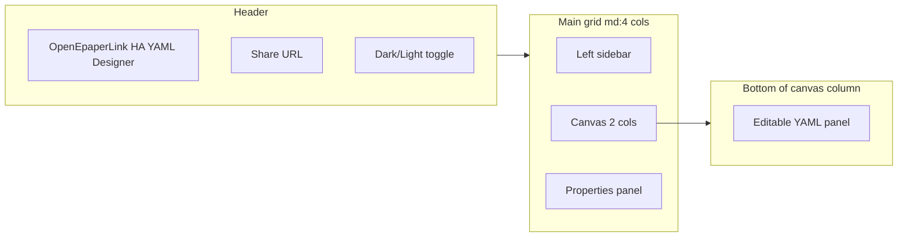
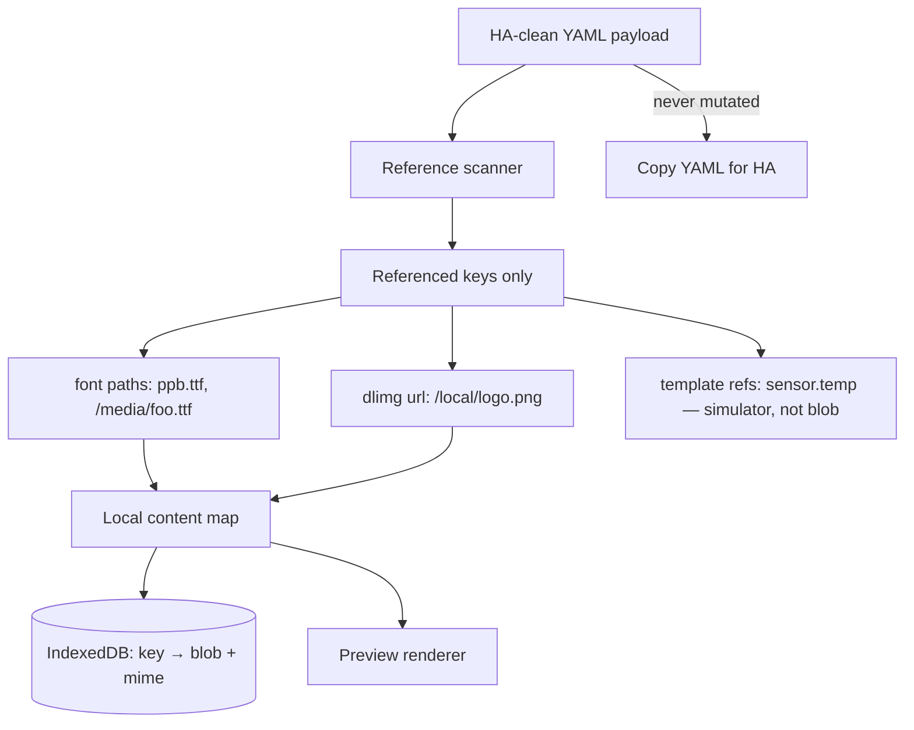
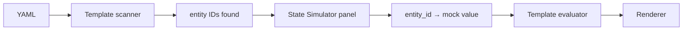
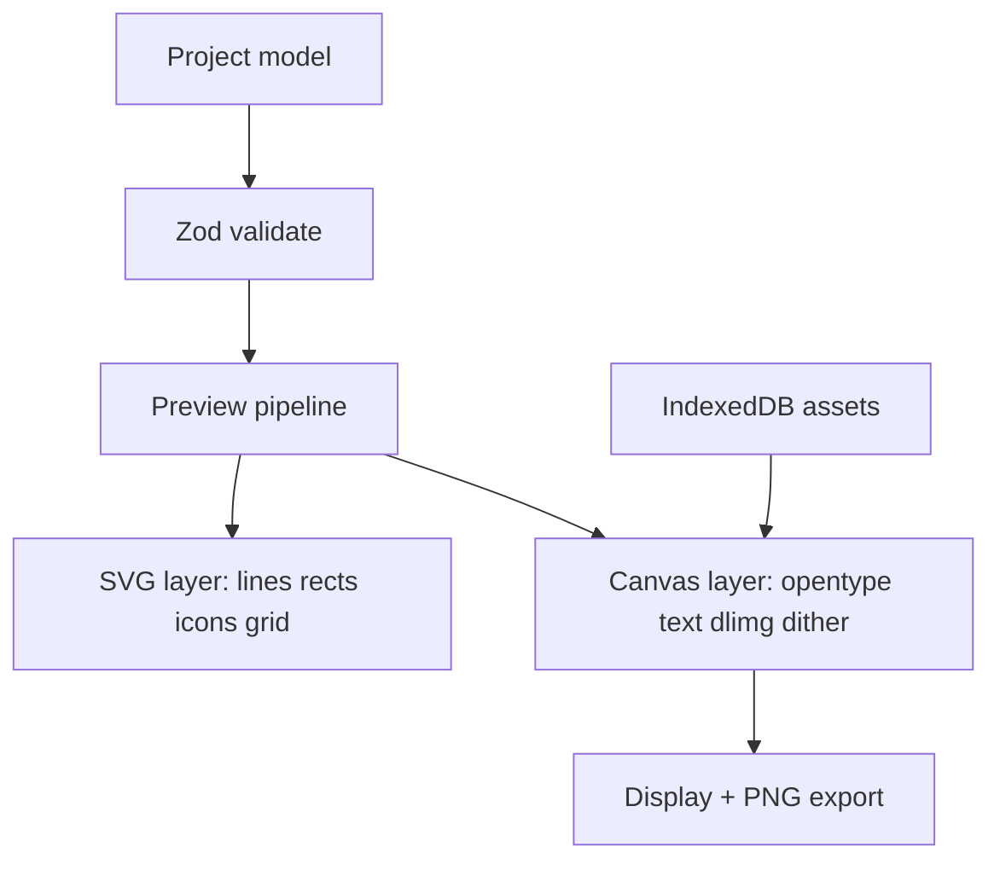
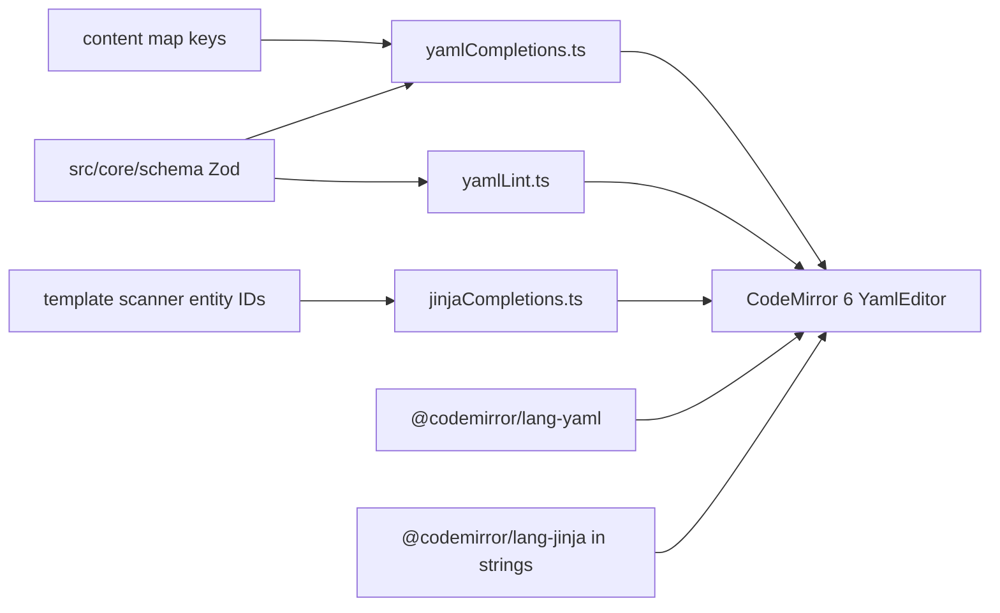
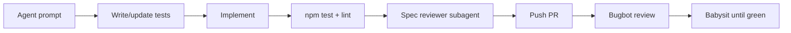

# OEPL YAML Designer — Feature Map & Build Plan

## 1. Existing reference designer analysis

Source available: minified production bundle only at `[esp32-sks-bus-doorphone/atc/oepl_yaml_designer/](esp32-sks-bus-doorphone/atc/oepl_yaml_designer/)` (React 19 + Vite build, Tailwind CDN, Pako). No TypeScript sources to publish.

### UI layout & look




| Zone              | Contents                                                                                                                                         |
| ----------------- | ------------------------------------------------------------------------------------------------------------------------------------------------ |
| **Header**        | App title, Share button (copies URL), dark/light mode                                                                                            |
| **Left sidebar**  | Load Example dropdown (17 designs), Add Element icon grid (16 types), Display Config (34 tag presets + custom W/H, visual rotation 0/90/180/270) |
| **Center canvas** | White e-paper preview on slate background, mouse coordinates overlay, Clear All, Snap On/Off, pan/zoom via SVG viewBox                           |
| **Right panel**   | Context form for selected element; Delete + Bring to Front                                                                                       |
| **Bottom panel**  | Live YAML editor, Copy YAML, Parse YAML and load to canvas                                                                                       |


**Visual style:** Slate/blue Tailwind palette, card panels with shadows, compact controls, dark mode via `class` strategy. Accent preview color mapped to magenta (`#FF00FF`) — not realistic red/yellow tag simulation.

### Implemented draw types (all 16 from spec)


| Type                | Canvas preview                               | Property editor                                                         | YAML round-trip                                                                      |
| ------------------- | -------------------------------------------- | ----------------------------------------------------------------------- | ------------------------------------------------------------------------------------ |
| `text`              | Approx bounding box + SVG `<text>`           | Full (anchor, font, stroke, parse_colors, max_width, truncate, visible) | Yes                                                                                  |
| `multiline`         | Line stack                                   | delimiter, offset_y, spacing                                            | Yes                                                                                  |
| `line`              | Line + endpoint handles                      | dashed, dash/space length                                               | Yes                                                                                  |
| `rectangle`         | Rect + resize handles                        | fill, outline, radius, corners                                          | Yes                                                                                  |
| `rectangle_pattern` | Grid of rects                                | x/y size, offset, repeat counts                                         | Yes                                                                                  |
| `polygon`           | Polygon + point count editor                 | points JSON array                                                       | Yes                                                                                  |
| `circle`            | Circle                                       | radius, fill, outline                                                   | Yes                                                                                  |
| `ellipse`           | Ellipse bbox                                 | fill, outline                                                           | Yes                                                                                  |
| `arc`               | Arc / pie slice                              | start/end angle, fill vs outline                                        | Yes                                                                                  |
| `icon`              | Embedded MDI SVG paths (subset)              | value, anchor, fill                                                     | Yes                                                                                  |
| `icon_sequence`     | Icon row/col                                 | direction, spacing, icons list                                          | Yes                                                                                  |
| `dlimg`             | Placeholder rect or clipboard preview        | url, xsize/ysize, resize_method, rotate                                 | Yes (used broken `preview_data_url` YAML comment — **stripped by HA on round-trip**) |
| `qrcode`            | **Fixed decorative pattern** (not scannable) | data, boxsize, border, module_count                                     | Yes                                                                                  |
| `plot`              | **Mock** axes/legends + sine-like line       | Full nested ylegend/yaxis/xlegend/xaxis/data JSON                       | Yes                                                                                  |
| `progress_bar`      | Bar + optional % text                        | direction, background, show_percentage                                  | Yes                                                                                  |
| `debug_grid`        | Grid overlay                                 | spacing, labels, dashed                                                 | Yes                                                                                  |


### Canvas interaction features

- Click to select; drag to move; 8-handle resize for bbox elements; line endpoint handles
- Snap to configurable grid (default ~10px, persisted in `localStorage`)
- Keyboard: Delete, Ctrl/Cmd+C/V copy/paste (offset +10px), arrow-key nudge
- Bring to front (no send-to-back, no layer list)
- Template values (`{{ ... }}`) shown as `[TPL]` / `URL [TPL]`; excluded from drag math
- Percentage coords (`"50%"`) parsed/stored but not draggable when templated

### YAML engine

- Custom line parser (not full YAML lib): handles HA-style blocks, plot nested objects, icon lists, comments preserved per-element (`_yaml_comments`)
- Bidirectional sync: visual edits → auto YAML; manual YAML → explicit Import
- Serializes plot sub-objects as JSON or indented blocks; quotes strings with special chars

### Share & persistence (existing)


| Feature           | Behavior                                                                                                                                  |
| ----------------- | ----------------------------------------------------------------------------------------------------------------------------------------- |
| **Share link**    | `?design=<pako-deflate + base64>` — **payload array only** (no canvas size, name, or assets)                                              |
| **localStorage**  | Dark mode, display width (default 384), height (default 184), snapping                                                                    |
| **dlimg preview** | Clipboard paste → `preview_data_url` on element; exported as YAML comment — **does not survive HA round-trip** (HA strips unknown fields) |
| **Templates**     | Shows `[TPL]` placeholder only — no mock entity values                                                                                    |
| **No**            | Project name, edit history, font/image library, hash routing, service options                                                             |


### Known gaps vs [supported_types.md](https://github.com/OpenEPaperLink/Home_Assistant_Integration/blob/main/docs/drawcustom/supported_types.md)


| Spec feature                                                        | Existing tool                                     |
| ------------------------------------------------------------------- | ------------------------------------------------- |
| Service options: `background`, `rotate`, `dither`, `ttl`, `dry-run` | Not modeled                                       |
| Halftone / dithered color preview                                   | Flat RGB approximations only                      |
| Hex colors (`#RGB`, `#RRGGBB`)                                      | Parsed; limited UI                                |
| `parse_colors` inline markup                                        | Editor toggle only; **not rendered**              |
| Text wrap / truncate / multiline `\n`                               | Not visually accurate                             |
| Real TTF fonts (`ppb.ttf`, custom paths)                            | CSS `fontFamily` string only — **no TTF loading** |
| `dlimg` from URL / HA paths / camera entities                       | Placeholder only (except clipboard preview)       |
| YAML / Jinja syntax highlighting + autocomplete                     | Plain textarea — no highlighting or completions   |
| Plot with real/sample history data                                  | Mock curve only                                   |
| QR codes                                                            | Placeholder bitmap                                |
| Plot `span_gaps`, `smooth`, `line_style`, `show_points`, etc.       | Stored in YAML; minimal preview                   |


---

## 2. Your requirements (new tool)

### Local content map (replaces YAML-comment preview hack)

**Why not embed preview data in YAML:** A prior closed-source designer stored clipboard images as `preview_data_url` and exported them as YAML comments. That fails in practice because Home Assistant strips anything it does not recognize when you paste YAML into automations/scripts — the preview is lost on the HA → designer round-trip.

**New approach — designer-only local content store:**




**Rules:**

- YAML exported for HA contains **only** valid drawcustom fields — no designer metadata, no comments for assets.
- Local map key = **exact string** from YAML (`/local/img1.png`, `ppb.ttf`, `https://example.com/x.png`).
- User uploads a file → bound to that key; renderer resolves `dlimg.url` / `font` through the map at preview time.
- Upload UI lives in **Content Manager**: lists all referenced keys, status (resolved / missing / bundled default), upload/replace/clear per key.
- Optional: import/export **asset bundle** (zip + manifest) to move substitutions between machines — separate from share link.
- Clipboard paste in Content Manager assigns blob to selected key (same UX as old tool, but storage is global per key, not per-element).

**Bundled defaults:** Ship `ppb.ttf` + `rbm.ttf` (verify license) under `public/fonts/`; map treats these keys as resolved without upload.

**Storage split:** IndexedDB (Dexie) for blobs + project snapshots; `localStorage` for prefs and history index.

### HA state simulator (template preview)

Problem: Old tool shows `[TPL]` for any `{{ ... }}` — useless for designing real dashboards.

**Design:**




- **Scan** payload for Jinja patterns: `states('sensor.x')`, `is_state('binary_sensor.door', 'on')`, `states('sensor.battery')|float`, color tags with embedded templates, etc.
- **State Simulator panel** (alongside Content Manager): table of discovered entities + editable mock values (string/number/bool); add manual entries for entities not yet referenced.
- **Evaluate** templates client-side with a **restricted, testable** evaluator (not full Jinja2 — implement the subset HA actually uses in drawcustom examples: `states`, `is_state`, `float` filter, simple `if/else`).
- Mock values persist **per project** in IndexedDB (included in project snapshot, **excluded** from share hash unless we add optional `mocks` in hash later — default: exclude, user re-enters mocks after opening shared link).
- Preview re-renders live when mock values change.
- TDD: fixture YAML files with templates + expected evaluated strings.

**Priority patterns to support (from spec):**

- `{{ states('sensor.temperature') }}`
- `{{ 'red' if is_state('binary_sensor.door', 'on') else 'black' }}`
- `{{ states('sensor.battery')|float < 20 }}` (conditionals in icon colors)
- `parse_colors` blocks with template-driven color names

### YAML + Jinja editor (syntax highlighting & autocomplete)

The bottom YAML panel is a primary editing surface — not a plain textarea. Match (and exceed) what HA Developer Tools → Template offers for editing experience.

**Stack (same family as [home-assistant/frontend](https://github.com/home-assistant/frontend)):**


| Package                                    | Role                                                     |
| ------------------------------------------ | -------------------------------------------------------- |
| **CodeMirror 6** + `@uiw/react-codemirror` | Editor widget in React shell                             |
| `@codemirror/lang-yaml`                    | YAML syntax highlighting                                 |
| `@codemirror/lang-jinja`                   | Jinja highlighting inside quoted YAML string values      |
| `@codemirror/autocomplete`                 | Completion provider API                                  |
| `@codemirror/lint`                         | Inline diagnostics from Zod validate + yaml parse errors |


**Highlighting:**

- Full payload document: list of draw elements + service options block
- **Nested Jinja mode** inside double-quoted YAML strings (where `{{ … }}` and `` appear) — same approach HA uses for template fields
- Dark/light theme aligned with app chrome (One Dark / custom slate theme)

**Autocomplete sources (schema-driven from `src/core/schema/` + live project context):**


| Context                   | Suggestions                                                                                                         |
| ------------------------- | ------------------------------------------------------------------------------------------------------------------- |
| Top-level / list item     | `type:` values — all 16 draw types                                                                                  |
| After `type: text` (etc.) | Property keys valid for that element type                                                                           |
| Enum fields               | `color`, `fill`, `outline`, `background` — spec color aliases; `font` — bundled + content-map keys                  |
| `icon` / `icon_sequence`  | MDI icon name search (`@mdi/js` metadata)                                                                           |
| Inside `{{ … }}`          | HA template functions: `states`, `is_state`, `state_attr`; filters: `float`, `int`; keywords: `if`, `else`, `endif` |
| Entity IDs in templates   | Entity IDs from template scanner + State Simulator mock list                                                        |
| Service options           | `background`, `rotate`, `dither`, `ttl`, `dry-run` keys and allowed values                                          |


**Lint / validation in editor:**

- Red squiggles on Zod schema violations (unknown keys, wrong types)
- Warn (not block) on missing content-map assets referenced in YAML
- Preserve template strings verbatim — autocomplete inserts must not corrupt `{{ … }}`

**Bidirectional sync:** visual edits update YAML; manual YAML edits require explicit **Import** (or debounced auto-import toggle) — editor stays source of truth until user confirms parse.

### Share via hash (without external content)

- URL format: `https://<user>.github.io/oepl-designer/#d=<compressed>`
- Payload (JSON before compression):

```json
{
  "v": 1,
  "name": "Doorphone status",
  "canvas": { "width": 296, "height": 128, "rotation": 0, "accent": "red" },
  "service": { "background": "white", "rotate": 0, "dither": 2 },
  "elements": [ /* drawcustom payload */ ]
}
```

- Use **pako deflate** + base64url (same proven approach as existing tool, moved to hash per your preference).
- On load: restore project metadata + elements; **re-bind** assets from local IndexedDB by path — shared links work across machines but previews need re-upload of same paths.
- Show banner listing missing assets after import.

### Edit history (20 projects)

- `localStorage` record: `{ id, name, updatedAt, canvas, elementCount, hashSnippet }` — **not** full YAML × 20 (size limit).
- Full snapshot in IndexedDB keyed by `id` (LRU eviction at 20).
- Header: project name field + Recent projects dropdown/modal.

---

## 3. Suggested additional features

Prioritized for a “really nice” designer:

**High value**

1. **Accent tag toggle** — preview as red-tag vs yellow-tag (maps `accent`/`half_accent` correctly).
2. **Dither preview modes** — ordered (d=2) and optional Floyd-Steinberg (d=1) on export/preview toggle so halftone colors look like the tag.
3. **Service options panel** — `background`, `rotate`, `dither` with note that rotate in service vs visual canvas rotation are distinct (keep existing tool’s helpful note).
4. **Undo/redo** — element + property changes (zustand temporal or custom stack).
5. **Layer panel** — reorder, hide (`visible`), lock, duplicate; replaces “bring to front only”.
6. ~~Template playground~~ → **HA State Simulator** (see §2) — first-class panel, not optional polish.
7. **Real QR rendering** — `qrcode` npm package.
8. **Plot sample data editor** — CSV paste or synthetic generator; preview `span_gaps`, `smooth`, step lines.
9. `**parse_colors` renderer** — parse `[red]text[/red]` in preview.
10. **PNG export** — dithered preview matching tag output (for sharing layouts without HA).
11. **YAML + Jinja CodeMirror editor** — syntax highlighting, schema autocomplete, inline lint (see §2).

**Medium value**
12. Alignment tools (left/center/right, distribute, match size).
13. Snap to canvas center/edges and other elements.
14. Schema-driven property forms with inline docs linking to spec anchors.
15. YAML validation panel (errors/warnings before copy) — complements inline CodeMirror lint.
16. Import/export **asset bundle** (zip of substitutions + manifest) — separate from share link; for moving between your machines.
17. PWA + offline shell (design without network after first load).

**Lower priority / later**
18. Multi-select and group move.
19. HA automation snippet generator wrapping payload in `open_epaper_link.drawcustom` service call.
20. Side-by-side diff of YAML versions from history.

---

## 4. UI framework trade-offs (React vs simpler)

This app has two very different layers:


| Layer                                                                | Complexity                           | Framework needed?                                  |
| -------------------------------------------------------------------- | ------------------------------------ | -------------------------------------------------- |
| **Core** (yaml, schema, renderer, dither, templates, asset resolver) | High — must be correct               | **No** — pure TypeScript, TDD with Vitest          |
| **Shell** (panels, forms, canvas chrome, drag/select)                | Medium-high — lots of interactive UI | Yes, unless you accept significant manual DOM work |


The sustainable split: **~70% of the value lives in framework-agnostic core modules**. UI choice mainly affects developer ergonomics and bundle size, not whether the designer works.

### Option A: React (+ Vite + TypeScript)


| Pros                                                                     | Cons                                                                |
| ------------------------------------------------------------------------ | ------------------------------------------------------------------- |
| Richest ecosystem for complex editors (CodeMirror bindings, dnd, forms)  | Largest runtime (~40–50 KB gzip react+react-dom)                    |
| `@testing-library/react` for component tests                             | More boilerplate (hooks, context, memo)                             |
| Same patterns as the reference designer — easy to compare feature parity | Easy to accidentally put logic in components (fight with TDD goals) |
| Huge hiring/docs surface                                                 | Slower initial render on low-end mobile                             |


**Best when:** you want fastest path to a polished multi-panel editor and may extend UI often.

### Option B: Preact (+ Vite + TypeScript)


| Pros                                                  | Cons                                              |
| ----------------------------------------------------- | ------------------------------------------------- |
| React-compatible API, **~4 KB** runtime               | Slightly fewer libraries target Preact explicitly |
| Can use `preact/compat` if a React-only dep is needed | Same component-model complexity as React          |
| Same Testing Library patterns                         | Niche — fewer Stack Overflow answers              |


**Best when:** you want React ergonomics with smaller GH Pages payload.

### Option C: Vanilla TypeScript (+ Vite, no UI framework)


| Pros                                                   | Cons                                                                 |
| ------------------------------------------------------ | -------------------------------------------------------------------- |
| Smallest bundle — only your code + Tailwind            | **Property panel, layer list, content manager = lots of manual DOM** |
| No virtual DOM abstraction — direct canvas integration | Undo/redo + form binding becomes custom infrastructure               |
| Forces core/UI separation (good for TDD)               | Harder to keep UI consistent as features grow                        |
| No framework upgrade churn                             | Reinventing patterns (state subscriptions, keyed lists)              |


**Best when:** bundle size is paramount and you accept slower UI feature velocity.

### Option D: Svelte (+ Vite)


| Pros                                        | Cons                                       |
| ------------------------------------------- | ------------------------------------------ |
| Less boilerplate than React for forms/lists | Different paradigm — not React-compatible  |
| Small runtime, compile-time reactivity      | Canvas/editor ecosystem smaller than React |
| Nice scoped CSS                             | Team familiarity variable                  |


**Best when:** you like Svelte and want lean components without React's weight.

### Recommendation for AI-based development (locked)

**Use React 19 + Vite + TypeScript** for the UI shell. You won't be coding yourself — the agent will — and that changes the calculus:


| Factor                       | Why React wins for AI development                                                                                                                         |
| ---------------------------- | --------------------------------------------------------------------------------------------------------------------------------------------------------- |
| **Training data**            | React is the most common UI framework in public code; agents produce correct components, hooks, and patterns far more reliably than Preact/Svelte/vanilla |
| **Library compatibility**    | CodeMirror, Testing Library, dnd-kit, Radix/shadcn patterns — all React-first; fewer compat hacks                                                         |
| **Reference implementation** | The reference designer is React — agent can diff behavior against a known working UI                                                                      |
| **Debugging**                | When something breaks, error messages and Stack Overflow coverage help the agent fix it faster                                                            |
| **Consistency**              | Schema-driven forms, property panels, modals — repetitive UI patterns React handles with predictable structure the agent can replicate                    |


**What does *not* change:** the **core layer stays pure TypeScript** (no React imports). That is where TDD matters most and where AI also works well (isolated functions, golden tests). The agent builds core first, then wires React components as thin adapters.

**Why not the alternatives for your case:**

- **Preact** — agent sometimes emits React-only APIs (`StrictMode`, specific hook deps); small savings (~40 KB) not worth friction for a desktop designer tool
- **Vanilla TS** — agent must hand-write hundreds of DOM update paths; high bug rate, inconsistent patterns across panels, slower iteration when you ask for new features
- **Svelte** — less training data; agent more likely to hallucinate syntax or mix React patterns

**Bundle size:** irrelevant for this use case. Target users open a designer in a desktop browser; 45 KB gzip React is fine on GH Pages.

**Guardrail for AI quality:** enforce `src/core/` has zero React imports (ESLint rule or path alias boundary). UI components only call core via typed functions. This keeps the "AI writes UI quickly, AI tests core rigorously" split clean.

**Phase 0 spike:** reduced to a **half-day sanity check** (one canvas interaction + one property form in React) — not a framework bake-off. Proceed unless it reveals a blocker.

**Decision recorded as ADR-006:** React for UI shell; core remains framework-agnostic.

---

## 5. Development approach: TDD + architecture docs

### TDD workflow

```
Red → Green → Refactor
```

**Test layers (CI must pass all before deploy):**


| Layer                        | Tool                 | What to test                                          |
| ---------------------------- | -------------------- | ----------------------------------------------------- |
| YAML parse/serialize         | Vitest               | Golden files from spec; round-trip equality           |
| Schema validation            | Vitest               | Invalid payloads rejected with clear errors           |
| Schema completion metadata   | Vitest               | All 16 types + enums exported for editor autocomplete |
| Template scanner + evaluator | Vitest               | `states`, `is_state`, conditionals, filters           |
| Content map resolver         | Vitest               | Key lookup, missing asset, bundled fallback           |
| Color/dither pipeline        | Vitest               | Pixel samples or checksums for known inputs           |
| Renderer                     | Vitest + canvas mock | Each element type against fixture PNG hash (optional) |
| UI smoke                     | Playwright           | Load app, add element, edit property, copy YAML       |


**Rule:** No feature merges without tests in the **core** layer first; UI tests follow for wiring.

### Architecture Decision Records (ADRs)

Maintain `docs/adr/` in repo (for future-you and contributors):


| ADR     | Topic                                                                             |
| ------- | --------------------------------------------------------------------------------- |
| ADR-001 | Core/UI separation — pure TS modules, no framework in renderer                    |
| ADR-002 | Local content map vs YAML-embedded preview (reject HA comments)                   |
| ADR-003 | IndexedDB schema (assets, projects, mocks)                                        |
| ADR-004 | Template evaluator scope (subset of Jinja, not full engine)                       |
| ADR-005 | Share hash format and excluded data                                               |
| ADR-006 | UI framework: **React** for shell (AI-maintainability); core stays framework-free |
| ADR-007 | Hybrid SVG + Canvas rendering                                                     |
| ADR-008 | TDD policy and CI gates                                                           |


Each ADR: context, decision, consequences, alternatives considered.

---

## 6. Recommended tooling & repo setup

New repo/directory: `**oepl-designer/`** at workspace root (greenfield — directory does not exist yet).


| Layer       | Choice                                                                                                                                        | Rationale                                                                                                                                         |
| ----------- | --------------------------------------------------------------------------------------------------------------------------------------------- | ------------------------------------------------------------------------------------------------------------------------------------------------- |
| Framework   | **React 19 + Vite + TypeScript**                                                                                                              | Best AI codegen reliability; matches reference designer patterns; see §4                                                                          |
| Styling     | **Tailwind CSS v4** (build-time)                                                                                                              | Match existing look; no CDN dependency in prod                                                                                                    |
| State       | **Zustand** + immer                                                                                                                           | Project, selection, history, UI prefs; simple API for AI to extend                                                                                |
| YAML        | **yaml** (eemeli)                                                                                                                             | Robust parse/stringify; comment preservation strategy documented                                                                                  |
| Schema      | **Zod** types generated from spec                                                                                                             | Single source of truth for forms + validation                                                                                                     |
| Fonts       | **opentype.js**                                                                                                                               | Load TTF from IndexedDB; metrics for anchor/wrap                                                                                                  |
| Canvas      | **Hybrid SVG + Canvas**                                                                                                                       | SVG shapes/icons; Canvas for text, images, dither compositing                                                                                     |
| Icons       | **@mdi/js**                                                                                                                                   | Full MDI library, tree-shaken                                                                                                                     |
| QR          | **qrcode**                                                                                                                                    | Real scannable codes                                                                                                                              |
| Compression | **pako**                                                                                                                                      | Share hash (proven)                                                                                                                               |
| Asset DB    | **Dexie** (IndexedDB)                                                                                                                         | Fonts/images; history snapshots                                                                                                                   |
| Editor      | **CodeMirror 6** (`@uiw/react-codemirror`, `@codemirror/lang-yaml`, `@codemirror/lang-jinja`, `@codemirror/autocomplete`, `@codemirror/lint`) | YAML panel: syntax highlight, embedded Jinja in strings, schema + HA template autocomplete, inline diagnostics — mirrors HA frontend editor stack |
| Tests       | **Vitest** (TDD, core-first) + **Playwright**                                                                                                 | Golden YAML fixtures; CI gate before deploy                                                                                                       |
| CI/CD       | **GitHub Actions** → `gh-pages`                                                                                                               | `peaceiris/actions-gh-pages` or native GHA pages deploy                                                                                           |


### Key files to create

```
oepl-designer/
  .github/workflows/deploy.yml   # npm test && npm run build
  docs/adr/                      # architecture decision records
  package.json
  vite.config.ts                 # base: '/oepl-designer/'
  src/
    core/                        # NO UI imports — TDD first
      schema/elements.ts
      yaml/{parse,serialize,validate}.ts
      templates/{scan,evaluate}.ts
      assets/{scanner,resolver}.ts
      renderer/{canvas,colors,dither,text,shapes,...}.ts
    storage/{db,history,preferences}.ts
    ui/                          # React shell only — thin adapters over core
      App.tsx
      components/{Canvas,PropertyPanel,YamlPanel,ContentManager,StateSimulator,...}
    ui/editor/                   # CodeMirror setup (UI only — completion data from core/schema)
      YamlEditor.tsx
      yamlLanguage.ts            # lang-yaml + jinja-in-string nested highlighter
      yamlCompletions.ts         # schema-driven property/type completions
      jinjaCompletions.ts        # states, is_state, filters, scanned entity IDs
      yamlLint.ts                # wires Zod validate + parse errors to @codemirror/lint
  tests/
    core/                        # golden YAML, template eval, renderer
    fixtures/                    # spec examples from supported_types.md
    e2e/                         # Playwright
  public/fonts/
```

### GitHub Pages setup

1. Repo `oepl-designer` on GitHub; enable Pages from Actions.
2. `vite.config.ts`: `base: process.env.GITHUB_ACTIONS ? '/oepl-designer/' : '/'` for local dev.
3. Workflow: `npm ci` → `npm test` (must pass) → `npm run build` → deploy `dist/`.
4. README: link to live demo, spec reference, asset substitution workflow.

### Rendering architecture (sustainable)




- Keep **rendering logic pure** (no React in renderer) → testable against golden YAML fixtures from spec examples.
- Property UI **generated from schema** → adding a new spec field is one schema edit, not N form edits; same schema feeds YAML autocomplete.

### CodeMirror editor architecture




- **Phase 1 dependency:** autocomplete and lint require Zod schemas + validate — implement completion provider interface in core (`src/core/schema/completions.ts`) as pure data; UI wires it into CodeMirror.
- **Phase 2 deliverable:** replace placeholder YAML textarea with full `YamlEditor` component.

---

## 7. Implementation phases

### Phase 0 — Bootstrap + ADRs

- ADR-001 through ADR-008 drafted (ADR-006 locks React)
- `**docs/spec/supported_types.md` vendored from upstream GitHub** (agents must not search workspace for it)
- Vitest harness + one golden YAML round-trip test
- Vite + React scaffold with ESLint rule: `src/core/` must not import React
- Half-day sanity check: canvas select + one property form wired to core

### Phase 1 — Core (TDD)

- Schema + YAML parse/serialize/validate (all 16 types) — tests from spec fixtures
- `**src/core/schema/completions.ts`** — completion metadata export (element types, per-type properties, enums) for editor; no CodeMirror imports
- Template scanner + evaluator (Nunjucks + HA mock context; see ADR-004)
- Content map resolver (key → blob)
- Renderer skeleton with tests per element type

### Phase 2 — UI shell + MVP parity

- Layout, canvas interaction (select, drag, resize, snap, keyboard)
- Property forms (schema-driven)
- **YAML panel (`YamlEditor`)** — CodeMirror 6 with `@codemirror/lang-yaml` + `@codemirror/lang-jinja` highlighting; schema autocomplete; Jinja autocomplete (`states`, `is_state`, filters, scanned entity IDs); inline lint from validate
- Content Manager + State Simulator panels
- Display presets, dark mode

### Phase 3 — Assets & fidelity

- IndexedDB persistence for content map
- opentype.js fonts; dlimg from local map
- Full MDI via `@mdi/js`; real QR codes
- Template evaluation wired to live preview

### Phase 4 — Differentiators + polish

- Project name + 20-item history
- Hash share (`#d=...`) excluding assets and mocks
- Accent/dither preview, service options, parse_colors
- Plot sample data, layer panel, undo/redo, PNG export

---

## 8. Parity checklist (must pass before calling v1 complete)

- All 16 draw types add/edit/render/export per spec
- Percentage coordinates + anchors (Pillow set)
- All color aliases including hex, halftone shortcuts, accent
- Plot nested objects (data, ylegend, yaxis, xlegend, xaxis) round-trip
- Template strings preserved verbatim in YAML (HA-clean export — no designer fields)
- Local content map resolves fonts/images by exact YAML path (no YAML embedding)
- HA state simulator evaluates templates for preview
- **YAML editor:** syntax highlighting (YAML + embedded Jinja), schema-driven autocomplete, inline validation diagnostics
- Share link restores name + canvas + elements (not assets or mocks)
- 20-project history with searchable names
- Core test suite passes in CI; ADRs document major decisions
- GH Pages deploy from clean source repo

---

## 9. Cursor execution playbook (how to build this with AI)

You won't code yourself — Cursor is the team. This section maps plan phases to Cursor features.

### Setup once (before Phase 0)


| Artifact                             | Purpose                                                          |
| ------------------------------------ | ---------------------------------------------------------------- |
| `.cursor/rules/core-boundary.mdc`    | `src/core/` must not import React; TDD required for core changes |
| `.cursor/rules/yaml-spec.mdc`        | Link to supported_types.md; HA-clean export rules                |
| `.cursor/agents/core-implementer.md` | Subagent: writes pure TS + Vitest only                           |
| `.cursor/agents/ui-wirer.md`         | Subagent: React shell, calls core APIs                           |
| `.cursor/agents/spec-reviewer.md`    | Subagent: diff vs supported_types.md                             |
| `docs/PLAN.md`                       | **Canonical plan in repo** — all agent prompts reference this (§2, §5–12) |
| `docs/spec/supported_types.md`       | Vendored drawcustom spec — element types and fields                       |
| `docs/adr/`                          | Architecture decisions the agent must read before big changes             |
| `tests/fixtures/`                    | Golden YAML from spec — agent's source of truth                           |


Commit rules and subagents to the repo so every agent session inherits them.

### Which Cursor mode for what


| Task                                                  | Mode / feature               | Why                                                             |
| ----------------------------------------------------- | ---------------------------- | --------------------------------------------------------------- |
| Architecture, feature map, trade-offs                 | **Plan mode** (this chat)    | Read-only exploration; produces plan you approve                |
| Scaffold repo, implement phase                        | **Agent mode**               | Full edit + terminal access                                     |
| "Does this match the spec?"                           | **Ask mode**                 | Read-only review without accidental edits                       |
| Visual spec review (element matrix, parity checklist) | **Canvas**                   | Rich layout for reviewing status tables                         |
| Complex algorithm (dither, template eval)             | **Best-of-N** (`/best-of-n`) | Same prompt → multiple models in isolated worktrees → pick best |
| Long-running phase while you sleep                    | **Cloud Agent**              | VM runs tests/build without your laptop                         |
| PR open → green CI → merge                            | **Bugbot + babysit skill**   | Auto-review comments; agent fixes CI loop                       |


### Agent workspace (all phases after Phase 0)

| Setting | Value |
|---------|--------|
| **Workspace root** | `oepl-designer/` (this repo — not parent `src/`) |
| **Plan file** | `docs/PLAN.md` — read relevant § before every task |
| **Spec file** | `docs/spec/supported_types.md` |
| **Do not use** | `~/.cursor/plans/…` — outside repo; may be unreadable |

**Standard opener for every Agent chat:**

> Read `docs/PLAN.md` §[N] and `docs/adr/ADR-00X`. Spec: `docs/spec/supported_types.md`. Follow `.cursor/rules/`. Workspace is this repo root.

### Phase-by-phase Cursor workflow

**Phase 0 — Bootstrap** ✅ complete (see §11 for commit prompt if not yet committed)

**Phase 1 — Core (highest quality leverage)**

Use **parallel local agents** on independent modules (each in its own worktree if using Cursor 3 `/worktree`):


| Agent session | Scope                        | Acceptance                                               |
| ------------- | ---------------------------- | -------------------------------------------------------- |
| A             | `yaml/` parse + serialize    | Golden fixtures round-trip                               |
| A2            | `schema/` + `completions.ts` | Completion metadata covers all 16 types; Vitest snapshot |
| B             | `templates/` scan + evaluate | Template test matrix passes                              |
| C             | `assets/` scanner + resolver | Key lookup tests                                         |
| D             | `renderer/` per element type | One test file per type                                   |


Prompt pattern for each:

> Read `docs/PLAN.md` §7 Phase 1. Implement `src/core/yaml/parse.ts`. TDD: fixtures in `tests/fixtures/spec/`. No React. Match `docs/spec/supported_types.md`. Run `npm test` before finishing.

**When to use Best-of-N:** dither pipeline, template evaluator, text layout with opentype — problems where approach isn't obvious. Prompt:

> `/best-of-n Implement ordered dither (d=2) for 4-color e-paper palette in src/core/renderer/dither.ts with Vitest pixel tests`

Compare outputs side-by-side; merge the winner or ask agent to combine best parts.

**Phase 2–4 — UI**

- Single agent per panel (YamlEditor, Content Manager, State Simulator, Canvas) to avoid context bloat.
- **YamlEditor session prompt:** see §16 in `docs/PLAN.md`
- After each panel: invoke **spec-reviewer** subagent: *"Review against `docs/PLAN.md` §2 and `docs/spec/supported_types.md`"*
- Use **split-to-prs** skill when one session grows too large — e.g. core PR #1, UI shell PR #2.

### Quality gates (non-negotiable)




Every merge requires: tests green, no React in core (lint), HA-clean YAML export unchanged.

### Prompting patterns that work for you

**Good** (bounded, testable):

> Add `rectangle_pattern` renderer. Tests first in `tests/core/renderer/rectangle-pattern.test.ts`. Use fixture `tests/fixtures/elements/rectangle-pattern.yaml`. Core only.

**Bad** (too broad):

> Build the whole designer UI.

**Good** (references plan):

> Read `docs/PLAN.md` §2. Implement Content Manager (local content map). IndexedDB via Dexie. UI in `src/ui/components/ContentManager/`.

### Cloud Agents (optional, high value)

Use when:

- Phase 1 core modules need 2+ hours of uninterrupted work
- You want a PR opened while away from desk
- CI/debug loop on GitHub (`@cursor` on PR)

Setup: configure `.cursor/environment.json` with `npm ci`, Node version, `npm test` as verify command. Cloud agent clones repo, implements, runs tests, opens PR.

### Automations (ongoing maintenance)

After v1 ships, Cursor Automations can:

- Nightly: run full test suite on main, open issue if red
- On PR: run parity checklist agent against changed renderer files
- Weekly: diff supported_types.md upstream for spec drift

Use the **automate** skill when ready to configure these.

### Session hygiene (since you don't code)

1. **One phase or module per chat** — long chats degrade quality
2. **Workspace:** repo root `oepl-designer/`; **plan:** always `docs/PLAN.md`
3. **Start each chat with**: "Read `docs/PLAN.md` §X and ADR-00Y. Current phase: …"
4. **End each chat with**: "Run tests, summarize what's done, copy next prompt from `docs/PLAN.md` §12–§16"
5. **Don't merge without green CI** — use babysit skill on the PR

### Suggested PR sequence (split-to-prs)

1. Scaffold + ADRs + CI
2. YAML engine + fixtures
3. Template evaluator
4. Content map + IndexedDB
5. Renderer (shapes)
6. Renderer (text/fonts)
7. Renderer (icons, dlimg, qrcode, plot)
8. React shell + canvas
9. **YamlEditor** — CodeMirror highlighting, YAML + Jinja autocomplete, lint
10. Content Manager + State Simulator
11. Share/history/polish

Each PR ≤ ~500 lines of meaningful diff → easier for you to spot-check in GitHub UI even without coding.

---

## 10. Phase 0 — ✅ complete

Phase 0 scaffold exists. If not committed yet, use §11.

---

## 11. Phase 0 commit prompt

**Workspace:** `oepl-designer/` · **Agent mode**

```
Read docs/PLAN.md §7 Phase 0.

Create initial git commit for Phase 0 scaffold (all tracked files except node_modules).
Message: "Phase 0: scaffold, ADRs, spec, golden YAML test, React shell"

Run npm test before committing. Do not push unless I ask.
```

---

## 12. Phase 1a — YAML schema + engine

**Workspace:** `oepl-designer/` · **Agent mode** · **Next step after Phase 0 commit**

```
Execute Phase 1a — YAML schema and engine.

Read:
- docs/PLAN.md §2, §5, §7 Phase 1
- docs/spec/supported_types.md
- docs/adr/ADR-001, ADR-008
- .cursor/rules/core-boundary.mdc, yaml-spec.mdc, tdd-required.mdc

Replace src/core/yaml/stub.ts with real implementation:

1. Add zod + npm dependency; schemas for all 16 draw types + service options in src/core/schema/
2. src/core/schema/completions.ts — completion metadata (types, properties, enums); no CodeMirror imports
3. parseYamlPayload / serializeYamlPayload / validatePayload in src/core/yaml/
4. HA-clean export: serialize never emits designer-only fields
5. TDD first: tests/fixtures/spec/ — one minimal fixture per element type from supported_types.md
6. tests/core/validate.test.ts + update yaml-roundtrip.test.ts
7. src/core/ must not import React; export from src/core/index.ts

Do NOT start templates/, assets/, renderer/, or UI editor yet.

Run npm test && npm run lint. Do not commit unless I ask.
When done: summarize + point me to docs/PLAN.md §13 for Phase 1b.
```

---

## 13. Phase 1b — Template scanner + evaluator

**After Phase 1a is committed.**

```
Execute Phase 1b — template scanner and evaluator.

Read docs/PLAN.md §2 (HA State Simulator), §5, docs/adr/ADR-004.

Implement in src/core/templates/:
- scanPayloadForTemplates() — find {{ ... }} and entity IDs (states, is_state, etc.)
- evaluateTemplate() — restricted HA subset (not full Jinja); use test mock context
- TDD: tests/core/templates/*.test.ts with fixture matrix from plan §2 priority patterns

Wire exports from src/core/index.ts. No React. npm test && npm run lint.
Do not commit unless I ask. Next: docs/PLAN.md §14.
```

---

## 14. Phase 1c — Asset scanner + content map resolver

**After Phase 1a is committed.** Can run parallel with §13 if separate worktrees.

```
Execute Phase 1c — asset reference scanner and content map resolver.

Read docs/PLAN.md §2 (Local content map), docs/adr/ADR-002, ADR-003.

Implement in src/core/assets/:
- scanPayloadForAssets() — font fields + dlimg.url; exact string keys
- resolveAsset(key) — lookup from in-memory map (IndexedDB UI comes Phase 3)
- TDD: tests/core/assets/*.test.ts

No React. No UI. npm test. Next: docs/PLAN.md §15.
```

---

## 15. Phase 1d — Renderer skeleton

**After Phase 1a is committed.**

```
Execute Phase 1d — renderer skeleton (shapes first).

Read docs/PLAN.md §5–6, docs/adr/ADR-007.

Implement src/core/renderer/ — pure TS, no React:
- Color mapping (accent, halftone shortcuts, hex)
- One render function + Vitest test per element type; start with line, rectangle, circle, text stub
- Use fixtures from tests/fixtures/spec/

npm test. Do not commit unless I ask. Next: Phase 2 per docs/PLAN.md §7.
```

---

## 16. Phase 2 — YamlEditor prompt

```
Execute Phase 2 YamlEditor panel.

Read docs/PLAN.md §2 (YAML+Jinja editor), §7 Phase 2, CodeMirror architecture diagram.

Implement src/ui/editor/YamlEditor.tsx:
- CodeMirror 6 + @codemirror/lang-yaml + @codemirror/lang-jinja
- Autocomplete from src/core/schema/completions.ts
- Jinja completions from template scanner entity IDs
- Inline lint via validatePayload
- Dark theme; thin UI — no business logic in component

Use ui-wirer patterns. npm test && npm run lint.
```

